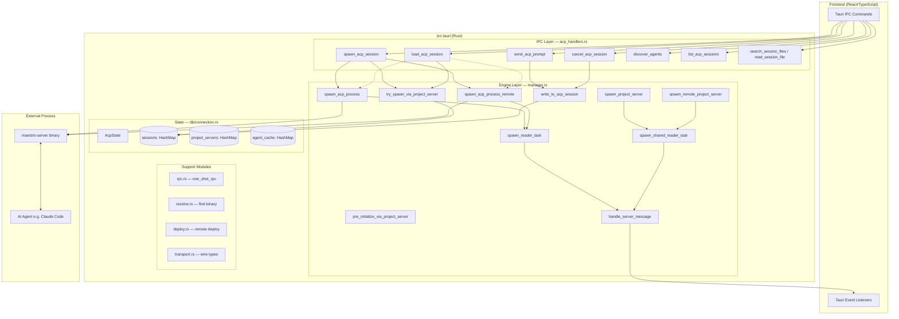
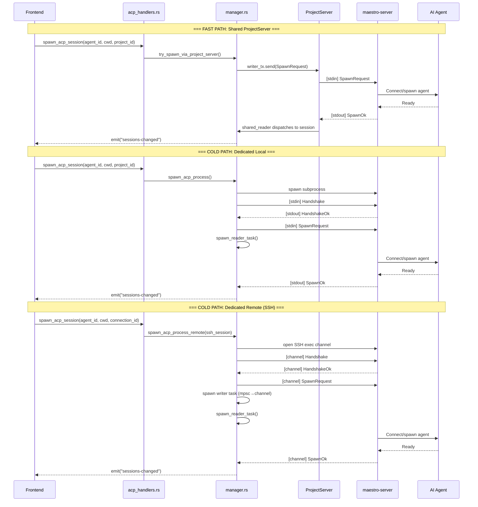
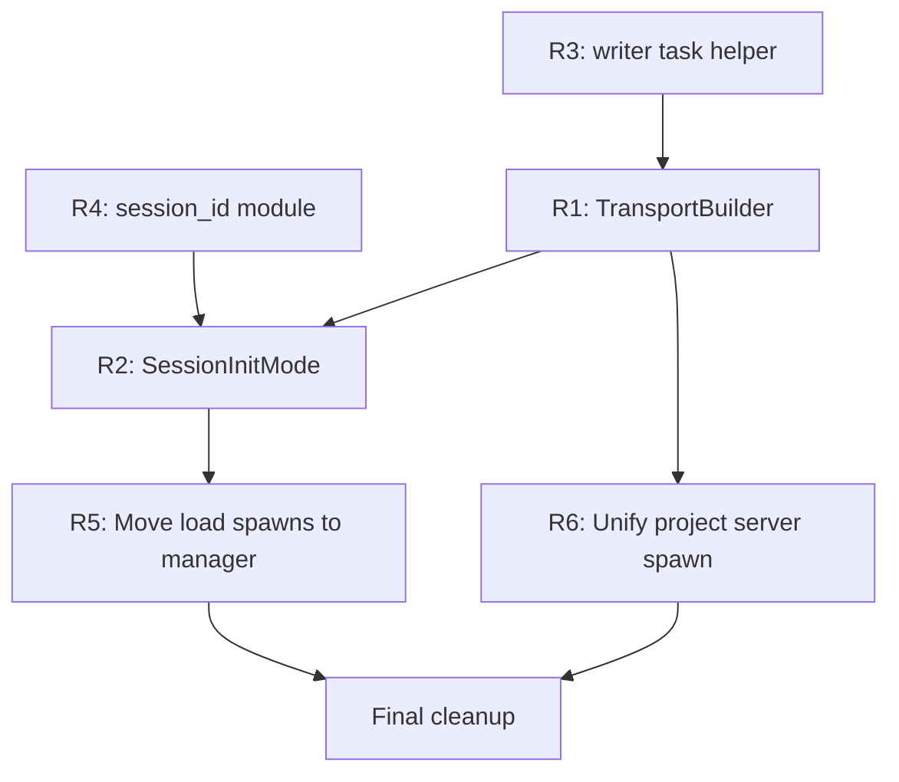

# ACP System Architecture Analysis

## Context

The ACP (Agent Control Protocol) subsystem is the backbone of Maestro's AI agent session management. It handles spawning, communicating with, and lifecycle-managing `maestro-server` processes that bridge Tauri (the desktop app) and AI agents (like Claude Code). Two files form its core:

- **`src-tauri/src/acp/manager.rs`** (1334 lines) — the "engine": process lifecycle, transport abstraction, reader tasks, message routing
- **`src-tauri/src/ipc/acp_handlers.rs`** (1300 lines) — the "controller": IPC commands exposed to the frontend, DTOs, session orchestration

Together they total ~2600 lines with significant structural duplication. This analysis catalogues what each file does, maps the architecture visually, identifies concrete duplication, and recommends consolidation paths.

---

## 1. Module Map

```
src-tauri/src/acp/
├── mod.rs          — re-exports public API from manager.rs
├── manager.rs      — process spawn, transport, reader tasks, message routing
├── transport.rs    — re-exports wire types from `maestro-protocol` crate
├── registry.rs     — DiscoveredAgent, AgentDiscoveryResult, cache entry types
├── resolve.rs      — resolve_server_path (find maestro-server binary)
├── deploy.rs       — ensure_remote_server (deploy maestro-server to SSH host)
└── rpc.rs          — one_shot_rpc (ephemeral spawn→handshake→request→response)

src-tauri/src/ipc/
└── acp_handlers.rs — #[tauri::command] IPC handlers, DTOs, load/list orchestration
```

---

## 2. Architecture Overview



---

## 3. Session Lifecycle with Three Transport Modes



---

## 4. Message Flow Between Components


---

## 5. File-by-File Breakdown

### manager.rs — The Engine (1334 lines)

| Section | Lines | Responsibility |
|---------|-------|----------------|
| Types: `AcpTransportWriter`, `ProjectServer`, `SessionCapabilitiesCache`, `AgentCache` | 24–67 | Core data structures |
| `AcpProcess` struct + metadata fields | 69–114 | Per-session state container |
| `AcpProcessParams` | 116–134 | Builder-pattern input struct |
| `serialize_message` | 136–144 | Frame encoding (4-byte LE length prefix + JSON) |
| `AcpReadSource` + `next_message` | 149–177 | Transport-agnostic read abstraction (local/SSH) |
| `perform_handshake` | 180–195 | Handshake response validation with 10s timeout |
| `try_parse_acp_frame` | 198–209 | Low-level framing parser |
| `try_spawn_via_project_server` | 223–281 | Fast-path: route SpawnRequest through shared server |
| `emit_cached_capabilities` | 284–305 | Emit cached models/modes/capabilities after session create |
| `spawn_acp_process` | 307–386 | Cold path: spawn dedicated local subprocess |
| `spawn_acp_process_remote` | 396–487 | Cold path: spawn dedicated remote (SSH) subprocess |
| `ReaderTaskContext` | 489–504 | Struct holding all Arc-cloned references for reader |
| `AcpProcess::create` | 506–563 | Allocates Arc-wrapped caches, returns (AcpProcess, ReaderTaskContext) |
| `spawn_reader_task` | 565–606 | Per-session background tokio task reading messages |
| `handle_server_message` | 610–750 | Central message dispatcher (emits events, updates caches) |
| `write_to_acp_session` / `write_to_acp_session_raw` | 753–787 | Write abstraction over all transports |
| `apply_capabilities_to_caches` | 789–817 | Update models/modes/caps caches + emit events |
| `upsert_session_alias` | 819–832 | SQLite alias persistence |
| `log_id_from_session_id` / `extract_session_log_id` | 835–853 | Parse "session-42" → 42 |
| `update_agent_cache_from_response` | 857–904 | Update project-level agent cache on SpawnOk/SessionLoadOk |
| `handle_shared_server_message` | 908–1059 | Route multiplexed messages to correct session |
| `spawn_shared_reader_task` | 1061–1104 | Shared reader for ProjectServer |
| `spawn_project_server` | 1108–1190 | Spawn local shared ProjectServer |
| `pre_initialize_via_project_server` | 1195–1250 | Send PreInitialize + await oneshot response |
| `spawn_remote_project_server` | 1254–1334 | Spawn remote shared ProjectServer via SSH |

### acp_handlers.rs — The Controller (1300 lines)

| Section | Lines | Responsibility |
|---------|-------|----------------|
| DTO types (`AcpModelInfo`, `AcpSessionModelState`, `AcpPromptCapabilities`) | 13–34 | Frontend-facing types (specta-exported) |
| `session_id_for` | 50–52 | Format log_id → "session-{id}" |
| `spawn_acp_session` | 72–151 | IPC: orchestrate new session (fast path → cold path) |
| `send_prompt_impl` / `send_acp_prompt` / `send_acp_prompt_structured` | 153–189 | IPC: send prompts |
| `respond_acp_permission` | 202–215 | IPC: permission response |
| `respond_acp_elicitation` | 220–233 | IPC: elicitation response |
| `cancel_acp_session` | 251–272 | IPC: cancel + cleanup |
| `interrupt_acp_turn` | 281–290 | IPC: soft interrupt |
| `set_acp_model` / `get_acp_models` | 295–335 | IPC: model get/set |
| `set_acp_mode` / `get_acp_modes` | 355–395 | IPC: mode get/set |
| `get_acp_capabilities` | 400–421 | IPC: capabilities query |
| `prefetch_agent_discovery` / `query_list_agents` / `discover_agents` | 427–520 | Agent discovery + cache |
| `search_session_files` / `read_session_file` | 527–606 | IPC: file operations via session transport |
| `get_acp_session_meta` | 619–632 | IPC: session metadata |
| `get_active_sessions` | 638–691 | IPC: list all live sessions |
| `list_acp_sessions` | 698–777 | IPC: list agent's stored sessions (with alias overlay) |
| `rename_acp_session` | 784–813 | IPC: rename with alias persistence |
| `close_acp_session` | 818–841 | IPC: close stored session |
| `try_session_load_via_project_server` | 843–898 | Fast-path: route SessionLoad through shared server |
| `load_acp_session` | 903–948 | IPC: orchestrate session load (fast path → cold path) |
| `query_session_list` / `query_session_close` | 954–995 | One-shot RPC helpers |
| `spawn_loaded_acp_session` | 1003–1087 | Cold path: spawn dedicated local for session load |
| `spawn_loaded_acp_session_remote` | 1089–1176 | Cold path: spawn dedicated remote for session load |
| `drain_acp_replay` | 1189–1213 | IPC: flush replay buffer to frontend |
| `get_cached_agent_models` | 1219–1235 | IPC: query agent model cache |
| Tests | 1238–1300 | Unit tests for message structure |

---

## 6. Duplication Catalog

### Pattern A: Process Spawn + Handshake + Initial Request + Reader Setup

This exact sequence appears **4 times** across both files:

| Instance | File | Lines | Transport | Initial Request |
|----------|------|-------|-----------|-----------------|
| `spawn_acp_process` | manager.rs | 307–386 | Local | SpawnRequest |
| `spawn_acp_process_remote` | manager.rs | 396–487 | Remote SSH | SpawnRequest |
| `spawn_loaded_acp_session` | acp_handlers.rs | 1003–1087 | Local | SessionLoadRequest |
| `spawn_loaded_acp_session_remote` | acp_handlers.rs | 1089–1176 | Remote SSH | SessionLoadRequest |

**What varies:**
1. Transport setup (local: `Command::new` / remote: `ssh.open_exec_channel`)
2. Initial request message type (Spawn vs SessionLoad)
3. A few `AcpProcessParams` fields (`initial_acp_session_id`, `enable_replay_buffer`, `project_id`, task metadata)

**What is identical:**
- Resolve binary path
- Spawn process/channel
- Build HandshakeRequest with PROTOCOL_VERSION
- Write handshake + flush
- Create AcpReadSource
- Call perform_handshake
- Write initial request + flush
- Create oneshot cancel channel
- Call AcpProcess::create with params
- Insert into sessions map
- Call spawn_reader_task

### Pattern B: try_spawn_via_project_server vs try_session_load_via_project_server

| | manager.rs (lines 223–281) | acp_handlers.rs (lines 843–898) |
|---|---|---|
| Look up project_id | same | same |
| Get writer_tx from project_servers | same | same |
| Build request message | `SpawnRequest{agent_id, session_id, cwd}` | `SessionLoadRequest{agent_id, session_id, resume_session_id, cwd}` |
| Serialize + send | same | same (+ register before send) |
| AcpProcess::create | `enable_replay_buffer: false` | `enable_replay_buffer: true` |
| emit_cached_capabilities | same | same |
| Insert into sessions | same | same |

The only structural differences:
1. Request type (1 line)
2. `enable_replay_buffer` flag
3. `initial_acp_session_id` parameter
4. Load version registers session BEFORE sending (to avoid race)

### Pattern C: Remote Writer Task Boilerplate

Appears 3 times with nearly identical code:

```rust
tokio::spawn(async move {
    use tokio::io::AsyncWriteExt;
    let mut writer = write_half.make_writer();
    while let Some(bytes) = write_rx.recv().await {
        if writer.write_all(&bytes).await.is_err() { break; }
        let _ = writer.flush().await;
    }
});
```

Locations:
1. `manager.rs` line 449–458 (`spawn_acp_process_remote`)
2. `manager.rs` line 1295–1304 (`spawn_remote_project_server`)
3. `acp_handlers.rs` line 1138–1147 (`spawn_loaded_acp_session_remote`)

A 4th variant for local stdin exists at manager.rs line 1152–1159 (`spawn_project_server`).

### Pattern D: Handshake Write + Flush (6 occurrences)

Each writes the same HandshakeRequest with different writer types and error messages:

1. `manager.rs:347` — `write_to_acp_session_raw(&mut stdin_writer, &handshake)`
2. `manager.rs:426–429` — `write_message(&mut writer, &handshake) + flush()` (remote)
3. `manager.rs:1143–1145` — same as #1 (project server local)
4. `manager.rs:1279–1283` — same as #2 (remote project server)
5. `acp_handlers.rs:1039–1042` — `write_message + flush` (load local)
6. `acp_handlers.rs:1113–1117` — `write_message + flush` (load remote)

### Pattern E: session_id_for / log_id_from_session_id

- `session_id_for(log_id)` → defined in `acp_handlers.rs:50`
- `log_id_from_session_id(session_id)` → defined in `manager.rs:835`

These are inverse functions that belong together but live in different files. The handler file calls `session_id_for` while the manager parses back with `log_id_from_session_id`. They form a tight coupling that crosses the file boundary.

### Pattern F: Spawn Project Server Local vs Remote

| | `spawn_project_server` (1108–1190) | `spawn_remote_project_server` (1254–1334) |
|---|---|---|
| Idempotent check | same | same |
| Resolve path / open channel | local Command | SSH exec |
| Handshake write + flush | same (different writer type) | same |
| Handshake read + validate | same | same |
| Create writer mpsc channel | same | same |
| Spawn writer task | same (stdin vs SSH channel) | same |
| Create pre_init_pending map | same | same |
| Build ProjectServer struct | `child: Some(child)` | `child: None` |
| Re-check under lock | same | same |
| Spawn shared reader task | same | same |

---

## 7. Complexity Analysis

### Essential Complexity (inherent to the problem)

1. **Three transport modes** — Local subprocess, SSH exec channel, and shared ProjectServer each have genuinely different I/O primitives
2. **Two session types** — Fresh spawn vs. session resume (load) differ in request type and replay buffering semantics
3. **Multiplexing** — Shared server must demux responses to individual sessions by parsing session_id from messages
4. **Cache warming** — PreInitialize must complete before sessions can start on shared servers
5. **Race conditions** — Load sessions must be registered before sending the request (to catch early responses in replay buffer)
6. **Lifecycle cleanup** — Reader tasks must clean up sessions on process death, including cascading removal for shared servers

### Accidental Complexity (introduced by implementation choices)

1. **Cartesian product explosion** — `{Spawn, Load} × {Local, Remote, Shared}` = 6 paths, but 4 are written as full copy-paste functions
2. **No transport builder** — Transport setup (spawn/connect → handshake → create channel) is repeated instead of abstracted
3. **No request-mode trait/enum** — SpawnRequest vs SessionLoadRequest share the same flow but differ in one message; this isn't parameterized
4. **Writer task not extracted** — The `while recv → write_all → flush` loop is trivially extractable
5. **Split session_id functions** — `session_id_for` and `log_id_from_session_id` are inverses split across files
6. **Handler file spawns processes** — `spawn_loaded_acp_session` / `spawn_loaded_acp_session_remote` in the IPC handler file duplicates logic that belongs in manager.rs
7. **Handshake not part of transport construction** — Every call site manually writes handshake + validates response

---

## 8. Refactoring Recommendations

### R1: Extract a `TransportBuilder` that encapsulates spawn + handshake

```rust
// Pseudocode
enum TransportTarget {
    Local,
    Remote { ssh: Arc<RemoteSshSession>, path: String },
}

struct EstablishedTransport {
    source: AcpReadSource,
    writer: TransportWriterHandle,  // enum of BufWriter<ChildStdin> or mpsc::Sender
    child: Option<Child>,
}

impl TransportTarget {
    async fn establish(self, app_handle: &AppHandle) -> Result<EstablishedTransport, String> {
        // 1. Resolve binary / open channel
        // 2. Write handshake
        // 3. Read + validate HandshakeOk
        // 4. Return ready-to-use transport
    }
}
```

**Impact:** Eliminates Pattern D (6 occurrences) and the spawn boilerplate from Pattern A (4 occurrences).

### R2: Parameterize initial request as `SessionInitMode`

```rust
enum SessionInitMode {
    Spawn { agent_id: String, session_id: String, cwd: String },
    Load { agent_id: String, session_id: String, resume_session_id: String, cwd: String },
}
```

A single `start_session(transport, init_mode, params)` function replaces all 4 spawn functions (Pattern A) and both `try_*_via_project_server` functions (Pattern B).

### R3: Extract `spawn_writer_task` helper

```rust
fn spawn_remote_writer_task(write_half: ChannelWriteHalf) -> mpsc::Sender<Vec<u8>> {
    let (tx, mut rx) = mpsc::channel(32);
    tokio::spawn(async move {
        let mut writer = write_half.make_writer();
        while let Some(bytes) = rx.recv().await {
            if writer.write_all(&bytes).await.is_err() { break; }
            let _ = writer.flush().await;
        }
    });
    tx
}
```

**Impact:** Eliminates Pattern C (3+ occurrences).

### R4: Move session_id_for into a shared utility module

Both `session_id_for` and `log_id_from_session_id` should live in a single `session_id` module in `acp/`, imported by both files.

### R5: Move spawn_loaded_* functions from acp_handlers.rs into manager.rs

The handler file should only orchestrate (decide which path, gather params), not contain low-level process management. The cold-path spawn functions for session load (`spawn_loaded_acp_session`, `spawn_loaded_acp_session_remote`) should move to manager.rs and be unified with the existing spawn functions via `SessionInitMode`.

### R6: Consolidate project server spawn (local vs remote)

With `TransportBuilder`, `spawn_project_server` and `spawn_remote_project_server` collapse into a single function that accepts a `TransportTarget`.

---

## 9. Estimated Line Reduction

| Refactoring | Lines Saved (est.) |
|-------------|-------------------|
| R1 (TransportBuilder) | ~120 lines (duplicated setup) |
| R2 (SessionInitMode unification) | ~200 lines (4 functions → 1) |
| R3 (writer task extraction) | ~30 lines |
| R4 (session_id module) | ~5 lines (clarity, not volume) |
| R5 (move load spawns to manager) | ~170 lines removed from handlers |
| R6 (project server unification) | ~80 lines |
| **Total** | **~600 lines (~23% reduction)** |

Post-refactoring, the two files would shrink to approximately:
- `manager.rs`: ~900 lines (from 1334)
- `acp_handlers.rs`: ~700 lines (from 1300)

---

## 10. Dependency Graph for Refactoring Order



**Recommended order:** R4 → R3 → R1 → R2 → R5/R6 (can be parallel)

Each step is independently shippable and testable.
