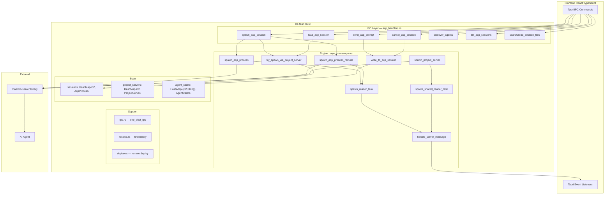
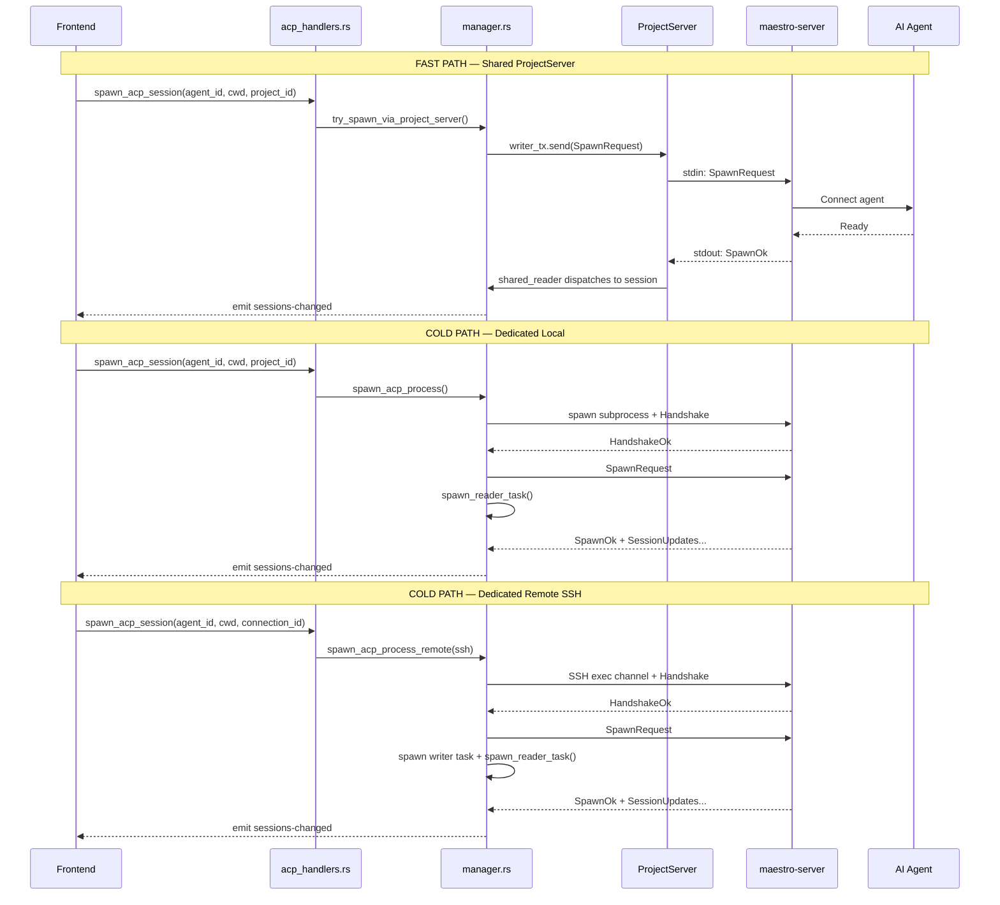
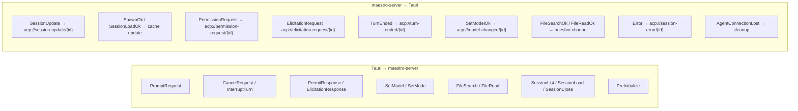

# ACP System Architecture Analysis

## Context

ACP (Agent Control Protocol) subsystem = Maestro's backbone for AI agent session management. Spawns, communicates with, and lifecycle-manages `maestro-server` processes that bridge Tauri desktop app ↔ AI agents.

Two core files:
- **`src-tauri/src/acp/manager.rs`** (1334 lines) — "engine": process lifecycle, transport abstraction, reader tasks, message routing
- **`src-tauri/src/ipc/acp_handlers.rs`** (1300 lines) — "controller": IPC commands to frontend, DTOs, session orchestration

~2600 lines total with significant structural duplication.

---

## 1. Module Map

```
src-tauri/src/acp/
├── mod.rs          — re-exports public API from manager + registry
├── manager.rs      — process spawn, transport, reader tasks, message routing (1334 lines)
├── transport.rs    — re-exports wire types from `maestro-protocol` crate (25 lines)
├── registry.rs     — DiscoveredAgent, AgentDiscoveryResult, cache entry types (35 lines)
├── resolve.rs      — resolve_server_path (find maestro-server binary) (49 lines)
├── deploy.rs       — ensure_remote_server (deploy to SSH host via SFTP) (121 lines)
└── rpc.rs          — one_shot_rpc (ephemeral spawn→handshake→request→response) (193 lines)

src-tauri/src/ipc/
└── acp_handlers.rs — #[tauri::command] IPC handlers, DTOs, load/list orchestration (1300 lines)
```

Wire protocol lives in separate `maestro-protocol` crate: 4-byte LE length-prefixed JSON frames over stdin/stdout (or SSH channel). Max 16MB per message.

---

## 2. Architecture Overview



---

## 3. Three Transport Modes × Two Session Types

The system has **3 transport modes**:
1. **Shared ProjectServer** (fast path) — one `maestro-server` per project, multiplexes sessions via `session_id`
2. **Dedicated Local** (cold path) — fresh `maestro-server` subprocess per session
3. **Dedicated Remote SSH** (cold path) — `maestro-server` on remote host via SSH exec channel

And **2 session types**:
1. **Spawn** — new agent session (`SpawnRequest`)
2. **Load** — resume existing agent session (`SessionLoadRequest`, with replay buffer)

This creates a 3×2 matrix = 6 code paths. Currently 4 are written as separate functions + 2 fast-path helpers.



---

## 4. Message Flow



---

## 5. Key Data Structures (manager.rs)

| Struct | Purpose |
|--------|---------|
| `AcpTransportWriter` | Enum: `Local(BufWriter<ChildStdin>)` / `RemoteSsh(mpsc::Sender)` / `SharedServer(mpsc::Sender)` |
| `ProjectServer` | Shared maestro-server per project: child + writer_tx + pre_init_pending map |
| `AcpProcess` | Per-session state: writer, child, caches (models/modes/caps), metadata, replay buffer |
| `AcpProcessParams` | Builder input for `AcpProcess::create` |
| `AcpReadSource` | Read abstraction: `Local{BufReader}` / `Remote{ChannelReadHalf, msg_buf}` |
| `ReaderTaskContext` | All Arc-cloned refs passed to background reader task |

---

## 6. File Breakdown

### manager.rs (1334 lines)

| Section | Lines | What |
|---------|-------|------|
| Types + structs | 24–134 | `AcpTransportWriter`, `ProjectServer`, `AcpProcess`, `AcpProcessParams` |
| Frame parsing | 136–209 | `serialize_message`, `AcpReadSource`, `perform_handshake`, `try_parse_acp_frame` |
| Fast-path spawn | 223–305 | `try_spawn_via_project_server`, `emit_cached_capabilities` |
| Cold-path spawn | 307–487 | `spawn_acp_process` (local), `spawn_acp_process_remote` (SSH) |
| Reader infrastructure | 489–750 | `ReaderTaskContext`, `AcpProcess::create`, `spawn_reader_task`, `handle_server_message` |
| Write infrastructure | 753–787 | `write_to_acp_session`, `write_to_acp_session_raw` |
| Cache + helpers | 789–904 | `apply_capabilities_to_caches`, `upsert_session_alias`, `log_id_from_session_id`, `update_agent_cache_from_response` |
| Shared reader | 908–1104 | `handle_shared_server_message`, `spawn_shared_reader_task` |
| Project servers | 1108–1334 | `spawn_project_server`, `pre_initialize_via_project_server`, `spawn_remote_project_server` |

### acp_handlers.rs (1300 lines)

| Section | Lines | What |
|---------|-------|------|
| DTOs | 13–34 | `AcpModelInfo`, `AcpSessionModelState`, `AcpPromptCapabilities` |
| Session spawn | 50–151 | `session_id_for`, `spawn_acp_session` (orchestrator: fast→cold) |
| Prompt/response | 153–233 | `send_acp_prompt`, `respond_acp_permission`, `respond_acp_elicitation` |
| Session control | 251–395 | `cancel`, `interrupt`, `set/get_model`, `set/get_mode` |
| Discovery | 427–520 | `prefetch_agent_discovery`, `query_list_agents`, `discover_agents` |
| File ops | 527–606 | `search_session_files`, `read_session_file` |
| Session management | 619–841 | `get_meta`, `get_active_sessions`, `list_acp_sessions`, `rename`, `close` |
| Session load | 843–1176 | `try_session_load_via_project_server`, `load_acp_session`, `spawn_loaded_*` (4 functions) |
| Replay + cache | 1189–1235 | `drain_acp_replay`, `get_cached_agent_models` |
| Tests | 1238–1300 | Message structure roundtrip tests |

---

## 7. Duplication Catalog

### A. Process Spawn + Handshake + Reader Setup (4 copies)

| Function | File | Lines | Transport | Initial Request |
|----------|------|-------|-----------|-----------------|
| `spawn_acp_process` | manager.rs | 307–386 | Local | SpawnRequest |
| `spawn_acp_process_remote` | manager.rs | 396–487 | Remote SSH | SpawnRequest |
| `spawn_loaded_acp_session` | acp_handlers.rs | 1003–1087 | Local | SessionLoadRequest |
| `spawn_loaded_acp_session_remote` | acp_handlers.rs | 1089–1176 | Remote SSH | SessionLoadRequest |

**Identical in all 4:** resolve binary → spawn/connect → write handshake → verify handshake → write initial request → create cancel channel → `AcpProcess::create` → insert into sessions map → `spawn_reader_task`.

**Differs:** transport setup, request message type, ~3 `AcpProcessParams` fields.

### B. Fast-path Helpers (2 copies)

| Function | File | Request Type |
|----------|------|-------------|
| `try_spawn_via_project_server` | manager.rs:223 | SpawnRequest |
| `try_session_load_via_project_server` | acp_handlers.rs:843 | SessionLoadRequest |

Same structure: check project_servers → get writer_tx → serialize request → create AcpProcess → emit cached capabilities → insert into sessions. Differs in: request type, `enable_replay_buffer`, `initial_acp_session_id`, registration order (load registers before sending to catch early replies).

### C. Remote Writer Task (3 copies)

```rust
tokio::spawn(async move {
    let mut writer = write_half.make_writer();
    while let Some(bytes) = write_rx.recv().await {
        if writer.write_all(&bytes).await.is_err() { break; }
        let _ = writer.flush().await;
    }
});
```

At: manager.rs:449, manager.rs:1295, acp_handlers.rs:1138.

### D. Handshake Write + Flush (6 occurrences)

Build `HandshakeRequest{PROTOCOL_VERSION}` → `write_message` → `flush`. At 6 different call sites.

### E. session_id_for ↔ log_id_from_session_id (split inverses)

- `session_id_for(log_id: i32) → String` in acp_handlers.rs:50
- `log_id_from_session_id(session_id: &str) → Option<i32>` in manager.rs:835

Tightly coupled inverse functions split across files.

### F. Project Server Spawn Local vs Remote (2 copies)

`spawn_project_server` (1108–1190) and `spawn_remote_project_server` (1254–1334): identical flow, differs only in process creation (Command vs SSH exec) and `child` field.

---

## 8. Complexity Analysis

### Essential (inherent to problem)
- 3 transport modes with genuinely different I/O primitives
- 2 session types with different semantics (replay buffering for load)
- Multiplexing on shared server (demux by session_id)
- Race condition: load sessions must register before sending (to catch early responses)
- Lifecycle cleanup cascading (reader task → session removal → event emission)

### Accidental (removable via refactoring)
- **Cartesian explosion**: {Spawn,Load} × {Local,Remote,Shared} = 6 paths written as separate functions
- **No transport builder**: setup + handshake repeated everywhere
- **No request-mode parameterization**: Spawn vs Load differ by one message type
- **Writer task not extracted**: trivial `recv → write_all → flush` loop × 3
- **Handler file spawns processes**: `spawn_loaded_*` in IPC layer duplicates manager logic
- **Split inverse functions**: `session_id_for` / `log_id_from_session_id` in different files

---

## 9. Refactoring Recommendations

### R1: TransportBuilder — encapsulate spawn + handshake

```rust
enum TransportTarget {
    Local,
    Remote { ssh: Arc<RemoteSshSession>, path: String },
}

struct EstablishedTransport {
    source: AcpReadSource,
    writer: TransportWriterHandle,
    child: Option<Child>,
}

impl TransportTarget {
    async fn establish(self, app_handle: &AppHandle) -> Result<EstablishedTransport, String> {
        // resolve binary / open channel → handshake → return ready transport
    }
}
```

Eliminates Pattern D (6 handshake sites) + spawn boilerplate from Pattern A.

### R2: SessionInitMode — parameterize initial request

```rust
enum SessionInitMode {
    Spawn { agent_id: String, session_id: String, cwd: String, ... },
    Load { agent_id: String, session_id: String, resume_session_id: String, cwd: String },
}
```

Single `start_session(transport, init_mode, params)` replaces all 4 cold-path functions (Pattern A) and both fast-path helpers (Pattern B).

### R3: Extract `spawn_writer_task` helper

Trivial extraction of the `recv → write_all → flush` loop. Eliminates Pattern C.

### R4: Move `session_id_for` + `log_id_from_session_id` together

Both inverse functions in one place (e.g., `acp/session_id.rs` or top of `manager.rs`).

### R5: Move `spawn_loaded_*` from handlers to manager

Handler file should orchestrate (pick path, gather params), not contain process management. These functions merge with existing spawn functions via R2.

### R6: Unify project server spawn

With R1's `TransportTarget`, `spawn_project_server` and `spawn_remote_project_server` collapse into one function.

### Execution order

```
R4 (trivial) → R3 (trivial) → R1 (TransportBuilder) → R2 (SessionInitMode) → R5+R6 (cleanup)
```

Each step independently shippable. Estimated savings: ~600 lines (~23% reduction).

---

## Verification

- `cargo check` after each refactoring step
- `cargo test` — existing tests in acp_handlers.rs validate message roundtrip
- Manual test: spawn local ACP session, load existing session, verify SSH path if available
- Verify frontend receives all events unchanged (session-update, permission-request, etc.)
