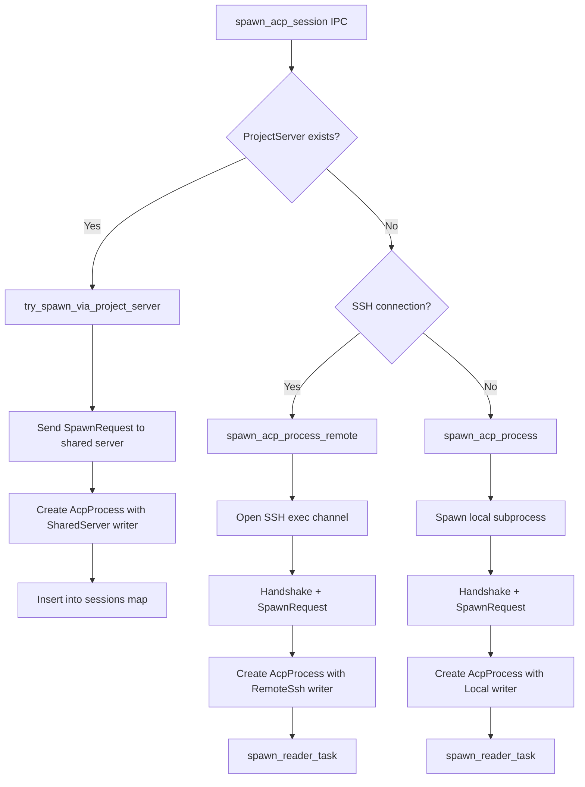
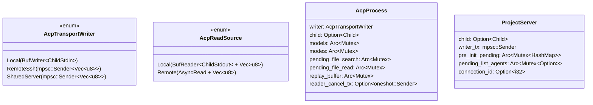

# Analysis: ACP Handler & Manager Complexity

## Context

`acp_handlers.rs` (1334 lines) and `acp/manager.rs` (1423 lines) are the two largest files in the Tauri backend. They manage the lifecycle of AI agent sessions — spawning processes, multiplexing messages, caching state, and bridging the frontend to maestro-server. The user observed duplication and overly complicated logic.

---

## Architecture Overview

```mermaid
graph TD
    subgraph "Frontend (React/TypeScript)"
        UI[React Components]
    end

    subgraph "IPC Layer (acp_handlers.rs)"
        H[Tauri IPC Commands]
    end

    subgraph "Manager Layer (manager.rs)"
        M[Process Lifecycle & Transport]
        PS[ProjectServer - shared server]
        AP[AcpProcess - per-session state]
        RT[Reader Tasks]
    end

    subgraph "maestro-server (separate binary)"
        MS[stdin/stdout bridge]
        AC[AgentConnection - agent subprocess]
    end

    subgraph "ACP Agent (e.g., Claude Code)"
        AG[Agent Process]
    end

    UI -->|invoke()| H
    H -->|"calls functions"| M
    M -->|"framed JSON on stdin"| MS
    MS -->|"ACP protocol"| AG
    AG -->|"ACP responses"| MS
    MS -->|"framed JSON on stdout"| RT
    RT -->|"Tauri events"| UI
```

---

## Session Spawn Flow (The Most Complex Path)



---

## Transport Types (Why Three Writers Exist)



---

## Identified Duplication (6 Major Patterns)

### Pattern 1: Local vs Remote Spawn (~90% identical)

| Function | Lines | What it does |
|----------|-------|-------------|
| `spawn_acp_process` | 312-391 | Spawn local subprocess, handshake, SpawnRequest, create AcpProcess |
| `spawn_acp_process_remote` | 401-492 | Same thing but via SSH exec channel |
| `spawn_loaded_acp_session` (handlers) | 1036-1120 | Resume local session — same structure |
| `spawn_loaded_acp_session_remote` (handlers) | 1122-1209 | Resume remote session — same structure |
| `spawn_project_server` | 1183-1272 | Spawn shared local server |
| `spawn_remote_project_server` | 1336-1422 | Spawn shared remote server |

**Root cause:** No transport abstraction at spawn time. Each function inlines the transport-specific setup then does identical post-setup work.

### Pattern 2: Cache Access Boilerplate (3x identical in handlers)

`get_acp_models`, `get_acp_modes`, `get_acp_capabilities` — same lock-clone-map-to-DTO pattern. Could be one generic function.

### Pattern 3: Writer Task (mpsc drain loop, 3x identical)

```rust
while let Some(bytes) = write_rx.recv().await {
    if writer.write_all(&bytes).await.is_err() { break; }
    let _ = writer.flush().await;
}
```

Appears at lines 454, 1227, and 1377 in manager.rs.

### Pattern 4: Resolve maestro_path + get SSH session (4x in handlers)

Same cache lookup + SSH session fetch duplicated across spawn, list, close, and load operations.

### Pattern 5: File search/read via oneshot (2x identical structure in handlers)

Both functions: lock sessions → extract pending channel Arc → create oneshot → store sender → write request → await with timeout.

### Pattern 6: "Fast path then cold path" structure

Both `spawn_acp_session` and `load_acp_session` in handlers have identical branching: try ProjectServer → if not, check SSH? → spawn remote or local.

---

## Architectural Confusion Points

### 1. Three Meanings of "Session ID"

| Name | Type | Where | Example |
|------|------|-------|---------|
| `log_id` | i32 | Tauri-internal, DB key | `42` |
| `session_id` | String | maestro-protocol transport | `"session-42"` |
| `acp_session_id` | String | Agent's native UUID | `"a1b2c3..."` |

These get conflated in function signatures. `close_acp_session` takes `session_id: String` (agent-native) while `cancel_acp_session` takes `log_id: i32`.

### 2. Handler Layer Leaks Into Manager Concerns

`acp_handlers.rs` contains `spawn_loaded_acp_session` and `try_session_load_via_project_server` which directly use `AcpReadSource`, `perform_handshake`, `serialize_message`, and `spawn_reader_task`. These are manager-level concerns living in the IPC handler file.

### 3. No `AcpManager` Struct

Despite the filename, `manager.rs` has no `AcpManager` struct. All functions are free-standing, taking `&Arc<AppState>`. State is scattered across 4 maps in `AcpState`.

### 4. Mixed Mutex Types

- `app_state.acp.sessions` → `tokio::sync::Mutex` (async)
- `AcpProcess.models/modes/etc` → `std::sync::Mutex` (blocking)

Intentional (inner locks have tiny critical sections) but adds cognitive load.

### 5. One-Shot RPC Module vs Shared Server

`rpc.rs` spawns a **temporary** maestro-server for single operations (list sessions, close session, discover agents). This exists alongside `ProjectServer` (long-lived). So the same operations can flow through either path depending on whether a ProjectServer exists.

---

## Refactoring Plan: Detailed Mapping

Each refactoring step maps to specific duplication patterns (P1-P6) and architectural confusion points (C1-C5).

---

### Refactoring 1: Transport Factory (kills P1 + P3, reduces C2)

**Problem:** 6 functions duplicate "set up transport, handshake, then do identical work." Only difference = how bytes get to/from maestro-server.

**Solution:** Extract a `TransportHandle` that encapsulates the opened connection:

```rust
// In manager.rs (or new transport.rs)
pub struct TransportHandle {
    pub writer: AcpTransportWriter,
    pub source: AcpReadSource,
    pub child: Option<Child>,  // None for remote/shared
}

/// Open a local or remote transport to a maestro-server instance.
pub async fn open_transport(
    target: TransportTarget,
    app_state: &Arc<AppState>,
) -> Result<TransportHandle, String> { ... }

pub enum TransportTarget {
    Local,
    Remote { ssh: &RemoteSshSession, server_path: &str },
}
```

The factory handles:
- Spawning subprocess / opening SSH channel
- Creating writer task (mpsc drain loop — **kills P3**, only written once)
- Performing handshake
- Returning ready-to-use handle

**After:** All 6 spawn functions collapse into callers of `open_transport` + operation-specific logic:

| Before (6 functions) | After |
|---|---|
| `spawn_acp_process` + `spawn_acp_process_remote` | One `spawn_acp_session_cold(target, params)` |
| `spawn_loaded_acp_session` + `spawn_loaded_acp_session_remote` | One `load_acp_session_cold(target, params)` |
| `spawn_project_server` + `spawn_remote_project_server` | One `spawn_project_server(target, project_id)` |

**Addresses:**
- **P1** (local vs remote spawn) — eliminated entirely
- **P3** (writer task mpsc drain) — written once inside `open_transport` for Remote/Shared
- **C2** (handler leaks into manager) — `spawn_loaded_*` moves to manager.rs

---

### Refactoring 2: Move Session-Load to Manager (kills C2, reduces P1/P6)

**Problem:** `spawn_loaded_acp_session` and `spawn_loaded_acp_session_remote` live in `acp_handlers.rs` (lines 1036-1209) but directly use manager internals: `AcpReadSource`, `perform_handshake`, `serialize_message`, `spawn_reader_task`.

**Solution:** Move both into `manager.rs` as:

```rust
// In manager.rs
pub async fn load_acp_session_cold(
    agent_id: &str,
    cwd: &str,
    log_id: i32,
    acp_session_id: &str,
    target: TransportTarget<'_>,
    app_state: &Arc<AppState>,
    session_name: Option<String>,
) -> Result<(), String> { ... }
```

Handler `load_acp_session` becomes:
1. Try fast path via project server (already exists)
2. Call `crate::acp::load_acp_session_cold(target, ...)` for cold path

**Addresses:**
- **C2** (handler leaks) — eliminated; handlers only construct messages + delegate
- **P1** (local/remote duplication) — unified via transport factory
- **P6** (fast/cold branching) — cold path is now one function call

---

### Refactoring 3: `resolve_remote_context` Helper (kills P4)

**Problem:** This exact block appears 4 times in handlers:
```rust
let maestro_path = {
    let cache = app_state.acp.discovery_cache.lock().await;
    cache.get(&Some(conn_id))
        .and_then(|e| e.maestro_server_path.clone())
        .ok_or_else(|| format!("maestro-server path not cached for connection {}...", conn_id))?
};
let ssh = app_state.ssh.get_session(conn_id).await
    .ok_or_else(|| format!("No active SSH session for connection_id {}...", conn_id))?;
```

**Solution:** One helper in handlers (or a method on `AppState`):

```rust
/// Resolve SSH session + maestro-server path for a remote connection.
async fn resolve_remote_context(
    app_state: &AppState,
    conn_id: i32,
) -> Result<(RemoteSshSession, String), String> {
    let maestro_path = app_state.acp.discovery_cache.lock().await
        .get(&Some(conn_id))
        .and_then(|e| e.maestro_server_path.clone())
        .ok_or_else(|| format!("maestro-server path not cached for connection {conn_id}. Reconnect to refresh."))?;
    let ssh = app_state.ssh.get_session(conn_id).await
        .ok_or_else(|| format!("No active SSH session for connection_id {conn_id}. Connect first."))?;
    Ok((ssh, maestro_path))
}
```

**Addresses:**
- **P4** (4x identical remote context resolution) — eliminated

---

### Refactoring 4: Generic Session Cache Accessor (kills P2)

**Problem:** `get_acp_models`, `get_acp_modes`, `get_acp_capabilities` are structurally identical:
```rust
let X_arc = { sessions.lock().get(&log_id).map(|s| Arc::clone(&s.X)) };
let cloned = X_arc.lock()?.clone();
Ok(cloned.map(|v| map_to_dto(v)))
```

**Solution:** Extract a generic helper:

```rust
async fn get_session_cache<T, U>(
    app_state: &AppState,
    log_id: i32,
    field: impl Fn(&AcpProcess) -> &Arc<std::sync::Mutex<Option<T>>>,
    map: impl FnOnce(T) -> U,
) -> Result<Option<U>, String>
where
    T: Clone,
{
    let arc = {
        let sessions = app_state.acp.sessions.lock().await;
        sessions.get(&log_id).map(|s| Arc::clone(field(s)))
    };
    let Some(arc) = arc else { return Ok(None) };
    let cloned = arc.lock().map_err(|e| format!("Lock poisoned: {e}"))?.clone();
    Ok(cloned.map(map))
}
```

Each IPC command becomes a one-liner calling this helper with the appropriate field selector and DTO mapper.

**Addresses:**
- **P2** (3x identical cache access boilerplate) — eliminated

---

### Refactoring 5: Generic Oneshot File Operation (kills P5)

**Problem:** `search_session_files` and `read_session_file` have identical structure:
1. Lock sessions → extract `cwd` + `pending_X` Arc
2. Create oneshot channel → store sender in pending mutex
3. Write request message
4. Await with 15s timeout

**Solution:**

```rust
async fn session_file_rpc<T>(
    app_state: &AppState,
    log_id: i32,
    pending_field: impl Fn(&AcpProcess) -> &Arc<std::sync::Mutex<Option<oneshot::Sender<Result<T, String>>>>>,
    build_request: impl FnOnce(&str) -> MaestroRpcMessage,  // takes cwd
) -> Result<T, String> {
    let (cwd, pending) = {
        let sessions = app_state.acp.sessions.lock().await;
        let s = sessions.get(&log_id).ok_or_else(|| format!("No ACP session for log_id {log_id}"))?;
        (s.cwd.clone(), Arc::clone(pending_field(s)))
    };
    let (tx, rx) = oneshot::channel();
    { *pending.lock().map_err(|_| "lock poisoned")? = Some(tx); }
    write_to_acp_session(app_state, log_id, &build_request(&cwd)).await?;
    tokio::time::timeout(Duration::from_secs(15), rx)
        .await.map_err(|_| "File operation timed out")?
        .map_err(|_| "Response channel closed")?
}
```

**Addresses:**
- **P5** (2x identical file RPC pattern) — eliminated

---

### Refactoring 6: Extract `project_server.rs` (reduces C3 + C5)

**Problem:** `manager.rs` is 1423 lines containing two distinct subsystems:
- Per-session lifecycle (`AcpProcess`, spawn, read, write)
- Shared server lifecycle (`ProjectServer`, spawn, shared reader routing, pending RPC dispatch)

These have separate concerns but share the file, making `manager.rs` a god-module.

**Solution:** Extract into `src-tauri/src/acp/project_server.rs`:

```
project_server.rs contains:
├── ProjectServer struct
├── spawn_project_server() / spawn_remote_project_server()  [unified via R1]
├── spawn_shared_reader_task()
├── handle_shared_server_message()
├── query_list_agents_via_project_server()
├── pre_initialize_via_project_server()
├── find_project_server_for_connection()
```

`manager.rs` retains:
```
├── AcpProcess struct + create()
├── AcpTransportWriter / AcpReadSource
├── spawn_acp_session_cold() [unified from R1]
├── load_acp_session_cold() [moved from handlers via R2]
├── spawn_reader_task() + handle_server_message()
├── write_to_acp_session()
├── perform_handshake() / serialize_message() / try_parse_acp_frame()
```

**Addresses:**
- **C3** (no AcpManager struct) — While we don't add a struct, splitting makes each file's responsibility clear. The "manager" is now truly about per-session lifecycle.
- **C5** (one-shot RPC vs shared server confusion) — ProjectServer is isolated; `rpc.rs` stays as the one-shot fallback path. Separation makes the two strategies visible.

---

### Addressing Remaining Confusion Points

#### C1: Three Meanings of "Session ID"

**Action:** Rename parameters in function signatures for clarity:

| Current | Rename to | Meaning |
|---------|-----------|---------|
| `session_id: String` in protocol messages | `transport_session_id` | `"session-{log_id}"` |
| `acp_session_id: String` in handlers | `agent_session_id` | Agent's native UUID |
| `log_id: i32` | keep as-is | Tauri-internal key |

Also rename `session_id_for(log_id)` → `transport_id_for(log_id)` to make the mapping explicit.

**Addresses:** C1 — naming disambiguation

#### C4: Mixed Mutex Types

**Action:** No code change needed — this is intentional design (inner caches are tiny, never held across await). Add one doc comment on `AcpProcess` explaining the rationale:

```rust
/// Per-session caches use `std::sync::Mutex` (not tokio) because critical sections
/// are sub-microsecond (clone a small struct). The outer `sessions` map uses
/// `tokio::sync::Mutex` because it may be held across async operations.
```

**Addresses:** C4 — cognitive load reduced via documentation

#### P6: Fast/Cold Path Branching

**Action:** Already addressed by R1+R2. After refactoring, handler code becomes:

```rust
pub async fn spawn_acp_session(...) -> Result<i32, String> {
    // ... resolve branch, SHA, log_id ...
    
    if try_spawn_via_project_server(...).await? {
        emit("sessions-changed"); return Ok(log_id);
    }
    
    let target = match connection_id {
        Some(id) => { let (ssh, path) = resolve_remote_context(&app_state, id).await?; TransportTarget::Remote { ssh, path } }
        None => TransportTarget::Local,
    };
    spawn_acp_session_cold(target, params).await?;
    emit("sessions-changed");
    Ok(log_id)
}
```

One branching point (local vs remote) reduced to target construction. No more duplicated post-branch logic.

---

## Summary: Coverage Matrix

| Duplication/Confusion | Addressed by | Eliminated? |
|---|---|---|
| P1: Local vs Remote Spawn (6 functions) | R1 (Transport Factory) + R2 (Move to Manager) | Yes — 6 → 3 functions |
| P2: Cache Access Boilerplate (3x) | R4 (Generic Accessor) | Yes — 3 → 1 helper |
| P3: Writer Task mpsc Loop (3x) | R1 (inside open_transport) | Yes — 3 → 1 |
| P4: Resolve Remote Context (4x) | R3 (Helper Function) | Yes — 4 → 1 |
| P5: File Search/Read Oneshot (2x) | R5 (Generic File RPC) | Yes — 2 → 1 helper |
| P6: Fast/Cold Path Branching (2x) | R1+R2 (unified cold path) | Yes — branching simplified |
| C1: Session ID Confusion | Rename parameters | Reduced — naming clarity |
| C2: Handler Leaks Manager Logic | R2 (Move to Manager) | Yes — clean boundary |
| C3: No AcpManager Struct / God-module | R6 (Extract project_server.rs) | Reduced — clear file split |
| C4: Mixed Mutex Types | Doc comment | Reduced — explicit rationale |
| C5: One-Shot RPC vs Shared Server | R6 (Separation) | Reduced — two strategies visible |

---

## Execution Order

Refactorings have dependencies. Recommended order:

1. **R3** (resolve_remote_context helper) — smallest, no structural change, immediate win
2. **R4** (generic cache accessor) — isolated to handlers, no cross-file impact
3. **R5** (generic file RPC) — isolated to handlers
4. **R1** (transport factory) — biggest structural change, enables R2 and R6
5. **R2** (move session-load to manager) — depends on R1 existing
6. **R6** (extract project_server.rs) — final split, depends on R1 reducing shared surface

Each step: `cargo check` → `cargo test` → verify UI spawn/cancel works.

---

## Net Result

| Metric | Before | After |
|--------|--------|-------|
| `acp_handlers.rs` lines | ~1334 | ~800 (load logic moved out, helpers extracted) |
| `manager.rs` lines | ~1423 | ~900 (project_server extracted, spawn unified) |
| New `project_server.rs` | — | ~450 |
| Total function count | ~30 pub functions across both | ~20 (deduplication) |
| Duplicated code blocks | 20+ instances | ~3 remaining (truly distinct paths) |

---

## Verification

After each refactoring step:
- `cargo check` in `src-tauri/` — catches type errors from moves
- `cargo test` in `src-tauri/` — catches logic regressions
- Manual test: spawn local session, spawn remote session, cancel, load session
- `pnpm tauri:gen` — ensure TS bindings still generate (IPC signatures unchanged)
