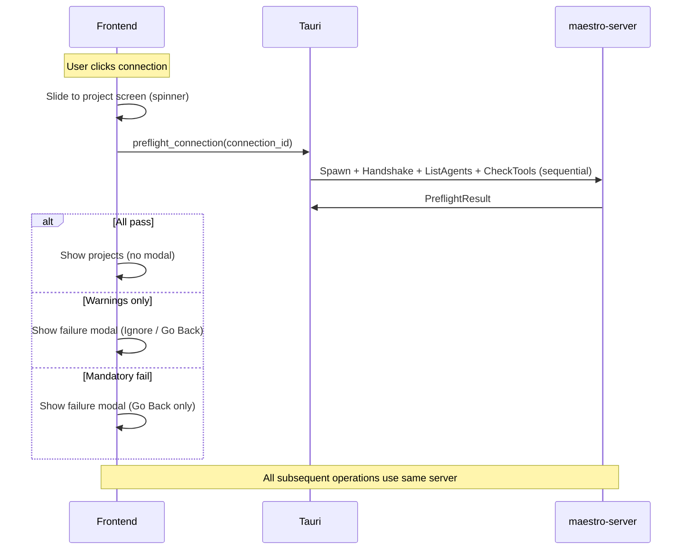

# Preflight UX Redesign — Inline Loading + Failure-only Modal

## Context

Previous preflight implementation used a blocking modal that flashed briefly on already-checked connections and had transitions too fast for users to read. Redesign eliminates modal on happy path — checks run inline in project screen. Modal only appears when issues found.

Backend work (connection server, CheckTools protocol, sequential ListAgents→CheckTools) already done. This plan covers frontend UX changes only.

**Design preview**: `.claude/preflight-ux-preview.html`

---

## Architecture Decisions

| Decision | Choice |
|----------|--------|
| Happy path | No modal. Inline spinner → projects appear |
| Failure path | Modal listing only failed/warned checks |
| Ignore (warnings only) | Remembered for session. Badge on header |
| Mandatory fail | No Ignore button. Go Back only |
| Already checked | Skip checks entirely. Instant project display |
| Project path validation | Runs in parallel with tool checks |
| State 1 display | Spinner + "Checking environment…" only. No per-check list |

---

## Implementation

### Step 1: Add preflight state to ConnectionContext

**File: `src/contexts/ConnectionContext.tsx`**

Add to context state:
```typescript
preflightStatus: "idle" | "checking" | "passed" | "failed";
preflightResult: PreflightResult | null;
ignoredWarnings: boolean;  // session-scoped, resets on app restart
```

Add actions:
- `startPreflight(connectionId)` — sets status to "checking", calls IPC, transitions to "passed"/"failed"
- `ignoreWarnings()` — sets `ignoredWarnings = true`, allows project display
- `resetPreflight()` — on Go Back, clear state

### Step 2: Rewrite ProjectList to gate on preflight

**File: `src/components/project-picker/ProjectList.tsx`**

- Read `preflightStatus` from context
- If `"checking"`: render centered spinner + "Checking environment…" (no project list, buttons disabled)
- If `"passed"` (or `ignoredWarnings`): render project list normally, buttons enabled
- If `"failed"`: render dimmed project list behind modal overlay

Project path validation (`removeProjectsWithMissingPath` or equivalent) runs as part of preflight — its results feed into the project list that appears after checks pass.

### Step 3: Rewrite PreflightModal → failure-only modal

**File: `src/components/project-picker/PreflightModal.tsx`**

Complete rewrite. Only renders when `preflightStatus === "failed"`:
- Title: "Environment Issues"
- Body: list of ONLY failed/warned checks (hide passed ones)
  - Red XCircle for mandatory failures (maestro-server, git)
  - Yellow AlertTriangle for warnings (missing optional tools)
  - Each row: icon + tool name + detail text
- Footer:
  - "Go Back" always present
  - "Ignore" only shown when no mandatory failures (hidden entirely otherwise)
- On "Ignore": call `ignoreWarnings()` → modal closes, projects appear, badge shows on header
- On "Go Back": call `resetPreflight()` → slide back to connection list

### Step 4: Trigger preflight on connection click

**File: `src/components/project-picker/ConnectionList.tsx`**

Change `onConnectionClick`:
- If connection server already exists (preflight previously passed): slide to projects instantly
- Otherwise: set `activeConnection` + call `startPreflight(connectionId)` → slides to project screen showing spinner

### Step 5: Connection header badge

**File: `src/components/project-picker/ConnectionHeader.tsx`**

- If `ignoredWarnings && preflightResult` has failed checks:
  - Show amber `AlertTriangle` icon next to connection name
  - Popover on click listing warning details

### Step 6: Agent gating in spawn dialog

**File: `src/components/execution/SpawnSessionDialog.tsx`**

- Cross-reference agent `spawn_deps` with `preflightResult.tool_checks`
- Agents needing unavailable tools: disabled + tooltip "Requires {tool} (not available)"

---

## Files to Modify

| File | Action |
|------|--------|
| `src/contexts/ConnectionContext.tsx` | Add preflight state + actions |
| `src/components/project-picker/ProjectList.tsx` | Gate on preflightStatus, show spinner or projects |
| `src/components/project-picker/PreflightModal.tsx` | Rewrite: failure-only modal |
| `src/components/project-picker/ConnectionList.tsx` | Trigger preflight on click |
| `src/components/project-picker/ConnectionHeader.tsx` | Add warning badge |
| `src/components/execution/SpawnSessionDialog.tsx` | Disable agents with missing deps |

---

## Verification

1. Click connection → slides to project screen with spinner
2. Checks pass → projects appear, buttons enabled. No modal.
3. Checks have warnings → modal shows only failures. "Ignore" dismisses. Badge appears.
4. Mandatory fail → modal shows. No Ignore button. Only Go Back.
5. Already-checked connection → instant project display (no spinner)
6. Ignore remembered for session → no modal on subsequent navigation
7. Agent with missing tool → disabled in spawn dialog with tooltip
8. `pnpm test` + `pnpm tsc --noEmit` pass

---

## Backend (already done)

- Protocol: `CheckTools`/`CheckToolsOk` messages, `spawn_deps` on `DiscoveredAgent`
- Server: `ConnectionServer` per connection, sequential ListAgents→CheckTools
- IPC: `preflight_connection` command, `one_shot_rpc` deleted
- All callers route through connection server

## Reference Diagram (new flow)


