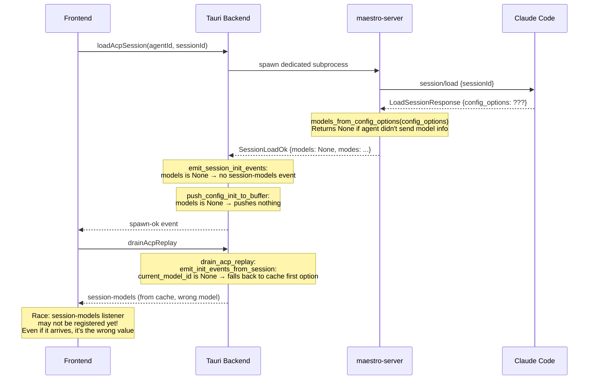
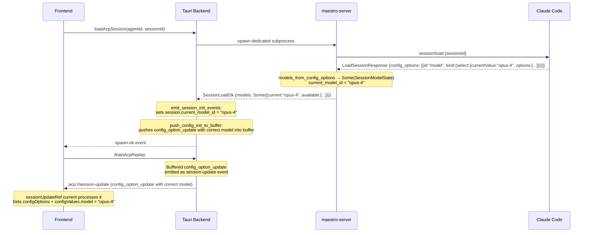

# Review: Session Resume Model Fix

## Context

When resuming a history session, the composebar shows wrong model (both selected and available list). Two fixes were applied. Neither had visible effect. This review explains why and identifies the real gap.

## The Two Fixes

### Fix 1: `push_config_init_to_buffer` (manager.rs)

**What it does:** After `SessionLoadOk` arrives, pushes a `config_option_update` event into the replay buffer so the frontend receives it during drain.

**Why it's needed:** There's a race condition — `emit_session_init_events` fires a direct `session-models` event, but the frontend listener for that event is registered in an async `useEffect`. During resume, the drain fires before that listener is ready. The buffer-based approach uses `sessionUpdateRef.current` which is set synchronously and is always ready.

**Why it had no effect:** It reads from `load_ok.models` which is `None` because the `unstable_session_model` feature is not enabled. The function exits early with empty `config_options`.

### Fix 2: `models_from_config_options` (session_handler.rs)

**What it does:** Extracts model info from `LoadSessionResponse.config_options` (the stable ACP field) as a fallback when `load_response.models` is `None` (gated behind disabled feature).

**Why it's needed:** maestro-server's `Cargo.toml` enables only `unstable_elicitation`, NOT `unstable_session_model`. So `LoadSessionResponse.models` doesn't exist at compile time. The only stable path for model info is `config_options`.

**Why it may have no effect:** If the agent (Claude Code) doesn't include model config in its `LoadSessionResponse.config_options` during `session/load`, this returns `None` too.

## Sequence Diagrams

### Current Broken Flow (Cold Path Resume)

### What SHOULD Happen (if agent sends config_options)

## Root Cause Analysis

The fixes are architecturally correct but depend on an assumption:

> **Claude Code sends model info in `LoadSessionResponse.config_options` during `session/load`**

If it doesn't, the entire pipeline has no model data to propagate. The fallback in `emit_init_events_from_session` then picks the first option from agent cache — which may be stale or wrong.

## Verdict on Changes

| Change | Keep? | Reason |
|--------|-------|--------|
| `push_config_init_to_buffer` | **Yes** | Fixes race condition. Without it, even correct model data would be lost during drain. |
| `models_from_config_options` | **Yes** | Required. `unstable_session_model` feature is disabled — this is the ONLY way to extract models from `LoadSessionResponse`. |

Both fixes are necessary preconditions. But they're not sufficient if the agent doesn't cooperate.

## Investigation Needed

**Critical question:** Does Claude Code actually include model config in `config_options` when responding to `session/load`?

To verify:
1. Add temporary debug logging to `session_handler.rs` at the point where `LoadSessionResponse` is received
2. Print `load_response.config_options` to see what the agent actually sends
3. If `config_options` is `None` or empty, the fix needs a different approach

**Alternative fix if agent doesn't send config_options:**
- The fast path calls `emit_cached_capabilities` which seeds from agent cache
- The cold path does NOT call this
- Solution: on cold path, after `SessionLoadOk`, if `models` is still `None`, seed from agent discovery cache (same as fast path does)

## Recommended Next Step

Add a `dbg!()` or `eprintln!()` in `session_handler.rs` right after receiving `LoadSessionResponse` to print `config_options`. Resume a session and check stderr. This tells us definitively whether the agent sends model info or not.

If it doesn't → implement the "seed from agent cache on cold path" fallback.
