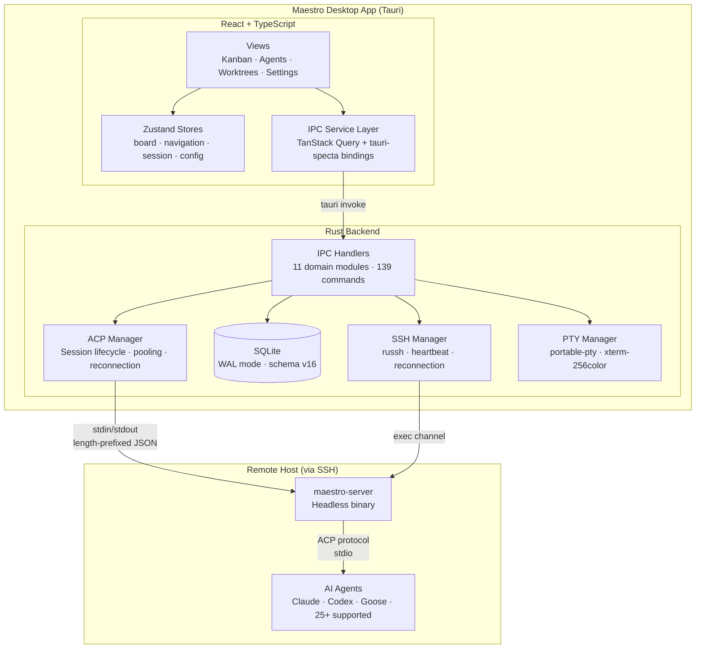
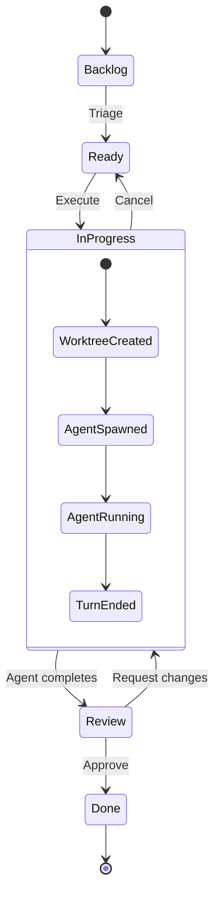
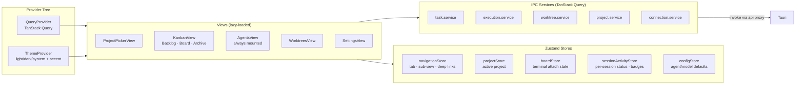
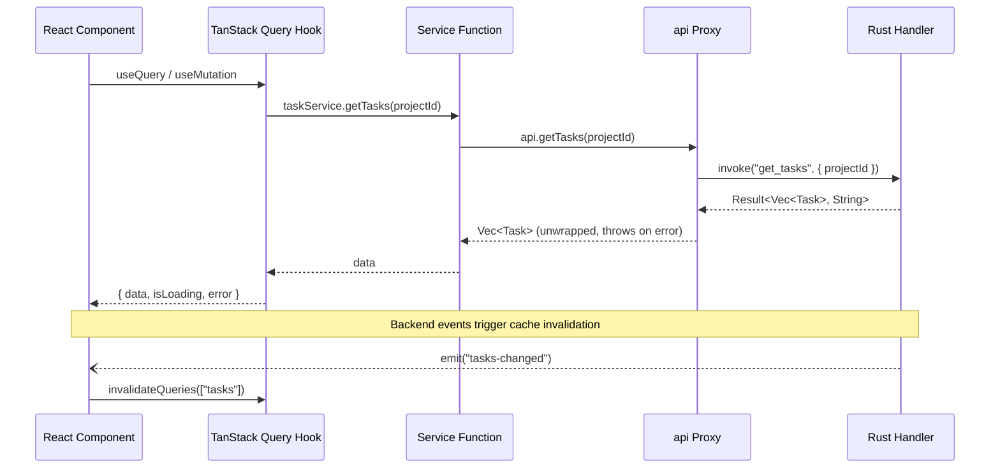
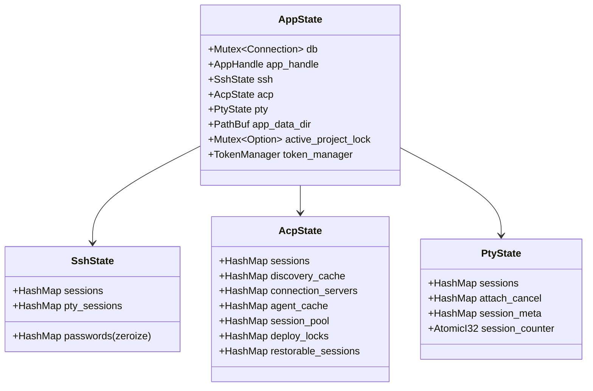
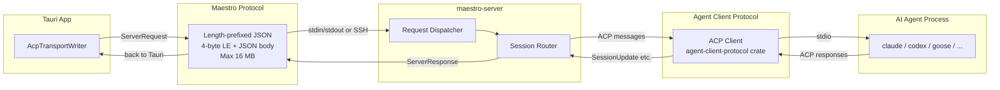
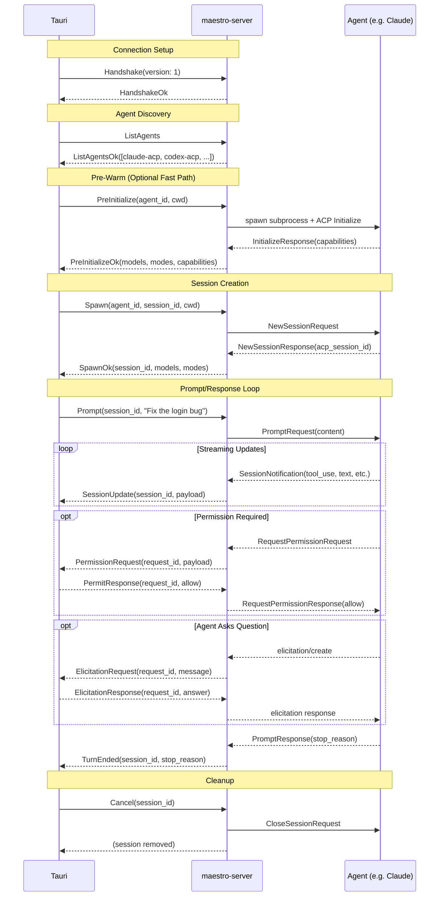
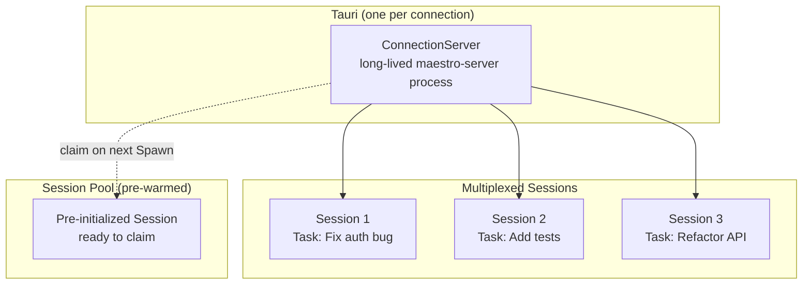
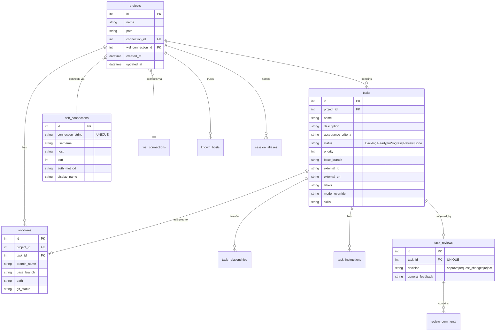
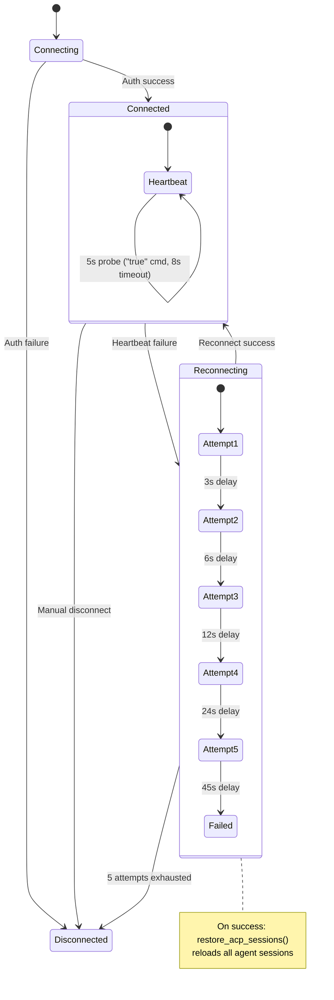

# Maestro — Architecture & Core Features

> Tauri desktop app orchestrating autonomous AI coding agents across local, SSH, and WSL connections. React + TypeScript frontend, Rust backend, with a headless server binary for remote execution.

---

## System Overview



---

## Core Features

### 1. Kanban Task Management

Users manage coding tasks on a Kanban board with columns: **Backlog → Ready → InProgress → Review → Done**. Tasks carry metadata like acceptance criteria, priority, base branch, skills, model overrides, and external ticket links (Jira, Linear, GitHub, Azure DevOps).



### 2. Autonomous Agent Execution

When a user executes a task, Maestro:
1. Creates/finds a git worktree for isolation
2. Spawns an AI agent session (via ACP)
3. Streams real-time activity (tool use, file edits, terminal output)
4. Handles permission prompts and elicitation questions
5. Presents diffs for code review when complete

### 3. Multi-Connection Support

| Connection Type | Transport | Use Case |
|----------------|-----------|----------|
| **Local** | Direct subprocess | Development on local machine |
| **SSH** | russh exec channel | Remote server development |
| **WSL** | WSL distro bridge | Windows ↔ Linux development |

### 4. Git Worktree Isolation

Each task runs in its own git worktree — a separate checkout of the repository. This enables:
- Multiple agents working on different tasks simultaneously
- Clean diffs per task
- Safe rollback (delete worktree)
- Staging, committing, shelving, and discarding changes per worktree

### 5. Real-Time Agent Monitoring

The Agent Monitor displays live activity for each session:
- Streaming markdown messages from the agent
- Tool call results and file modifications
- Permission prompts (approve/deny/modify)
- Elicitation prompts (agent asks user questions)
- Terminal output from agent-spawned subprocesses
- Token usage tracking

### 6. Code Review Flow

When an agent completes its work:
- Diff panel shows file-by-file changes
- Users can add inline review comments
- Three review decisions: **Approve**, **Request Changes**, **Reject**
- Approved work can be committed from within Maestro

---

## Frontend Architecture



### Navigation Model

No client-side router. Zustand `navigationStore` drives conditional rendering in `App.tsx` with `framer-motion` slide transitions. Deep linking via discriminated union targets:

```typescript
type NavigationTarget =
  | { taskId: string }      // → kanban + open task detail
  | { agentId: string }     // → agents + select session  
  | { worktreeId: string }  // → worktrees + select worktree
  | { view: ViewType }      // → specific tab
```

### IPC Pattern



Key patterns:
- **Proxy-based Result unwrapping** — `api.*` calls throw on error instead of returning Result unions
- **Event-driven invalidation** — Tauri events (`tasks-changed`, `sessions-changed`, etc.) trigger query invalidation, not polling
- **Hierarchical query keys** — enable surgical cache invalidation (`["tasks", "list", { projectId }]`)

---

## Rust Backend Architecture

### AppState — Central God-Struct



### IPC Handler Domains

| Module | Commands | Domain |
|--------|----------|--------|
| `project_handlers` | CRUD, git init, clone, locks | Project management |
| `task_handlers` | CRUD, relationships, instructions, branches | Task management |
| `worktree_handlers` | Create/delete/list, staging, commit, stash | Git worktrees |
| `execution_handlers` | PTY spawn, attach/detach, resize | Terminal sessions |
| `acp_handlers` | Spawn, prompt, cancel, permission, model/mode | Agent sessions |
| `review_handlers` | Diff, save review, approve/reject | Code review |
| `settings_handlers` | App/project/task settings | Configuration |
| `filesystem_handlers` | Directory listing, file picker | File browser |
| `ssh_handlers` | SSH connect, status, WSL | Connections |
| `sftp_handlers` | Upload/download | File transfer |
| `ticketing_handlers` | Provider creds, issue fetching | External tickets |

---

## Communication Protocol

### Two-Tier Protocol Bridge



### Message Flow — Full Session Lifecycle



### Connection Server Multiplexing



One `ConnectionServer` (a long-lived `maestro-server` process) per connection type (Local / SSH / WSL) multiplexes all agent sessions over a single process. Pre-warmed sessions in the pool enable instant session startup.

---

## Database Schema (v16)



---

## SSH & Reconnection



Authentication methods: **Password** (OS keyring or in-memory with zeroize), **SSH Key** (ed25519, RSA, ECDSA + optional passphrase), **SSH Agent** (Unix socket or Windows named pipe).

---

## Agent Ecosystem

Maestro supports **25+ AI agents** via the embedded registry (`registry.json`):

| Agent | Distribution | Notes |
|-------|-------------|-------|
| Claude (claude-acp) | npx | Primary agent |
| Codex (codex-acp) | npx | OpenAI agent |
| Goose | binary / uvx | Block agent |
| OpenCode | binary | Terminal-native |
| Cursor | binary | IDE agent |
| Gemini | binary | Google agent |
| GitHub Copilot CLI | binary | GitHub agent |
| Amp | binary | Sourcegraph |
| Auggie | npx | Augment Code |
| Kilo | binary | Anthropic mini |
| + 15 more | various | See registry.json |

Detection methods:
- **`DetectInstalledAgents`** — batch `which` + config directory checks
- **`DetectProjectAgents`** — scans working directory for agent marker files

---

## Key Architectural Patterns

| Pattern | Where | Why |
|---------|-------|-----|
| **Event-driven cache sync** | Frontend | Tauri events invalidate TanStack Query caches — no polling for most data |
| **Connection-server pooling** | ACP Manager | One maestro-server per connection multiplexes all sessions — avoids per-session process overhead |
| **Session pre-warming** | ACP Manager | Background pre-spawn sessions for instant user experience |
| **Two-tier protocol bridge** | maestro-server | Maestro protocol (simple JSON) wraps ACP protocol (full-featured) cleanly |
| **Proxy Result unwrapping** | Frontend IPC | TypeScript Proxy auto-unwraps `Result<T, E>` → clean `Promise<T>` ergonomics |
| **Zustand + Immer** | State management | Direct mutations proxied to immutable updates — safe and ergonomic |
| **Graceful degradation** | SSH reconnection | Heartbeat → exponential backoff → session restore on reconnect |
| **Framed RPC** | Protocol | 4-byte LE length + JSON body — simple, debuggable, 16MB cap |
| **Compile-time registry** | Agent discovery | `include_str!` embeds registry — no runtime config file needed |
| **Destructive migration** | Database | Drop-and-recreate on schema bump — acceptable for dev-phase app |

---

## Directory Structure Summary

```
maestro/
├── src/                          # React frontend
│   ├── views/                    #   Route views (5)
│   ├── components/               #   UI components by domain
│   │   ├── ui/                   #     shadcn/ui primitives (50+)
│   │   ├── kanban/               #     Board, columns, cards
│   │   ├── task/                 #     Task form, detail, context menu
│   │   ├── execution/            #     Agent monitor, terminals, worktrees
│   │   │   └── activity/         #       Live agent activity feed
│   │   ├── project-picker/       #     Connection + project selection
│   │   └── common/               #     Shared (header, settings, theme)
│   ├── services/                 #   IPC service layer (6 domains)
│   ├── store/                    #   Zustand stores (6)
│   ├── contexts/                 #   React contexts (2)
│   ├── providers/                #   Provider components (2)
│   ├── types/                    #   Generated bindings (tauri-specta)
│   └── utils/                    #   Hooks, helpers, constants
├── src-tauri/src/                # Rust backend (Tauri)
│   ├── ipc/                      #   Command handlers (11 modules)
│   ├── models/                   #   Data models (ts-rs derive)
│   ├── db/                       #   SQLite schema, storage, migrations
│   ├── acp/                      #   ACP session management
│   ├── ssh/                      #   SSH connections + reconnection
│   ├── process/                  #   PTY + remote process spawning
│   └── streaming/                #   WebSocket streaming adapter
├── maestro-server/src/           # Headless server binary
│   ├── main.rs                   #   Dispatch loop (stdin/stdout)
│   ├── session_handler.rs        #   ACP protocol bridge
│   ├── registry.rs               #   Agent discovery (embedded JSON)
│   ├── agent.rs                  #   Subprocess spawning
│   ├── sessions.rs               #   Session state + routing
│   ├── detection.rs              #   Installed agent detection
│   ├── terminal.rs               #   Agent terminal management
│   └── file_ops.rs               #   Secure file search/read
├── maestro-protocol/src/         # Shared wire-format types
│   └── lib.rs                    #   MaestroRpcMessage, framing
└── .maestro/                     # Per-project storage
    ├── settings.json             #   Project config
    ├── state.json                #   Runtime state
    └── bin/                      #   Bundled maestro-server
```
