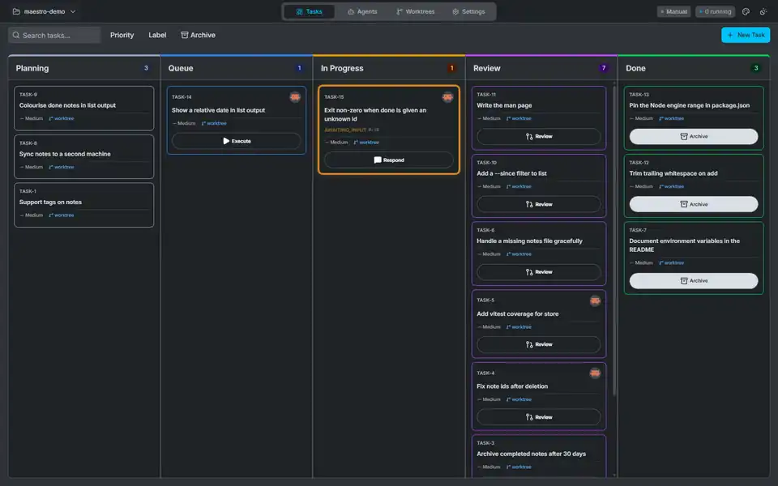
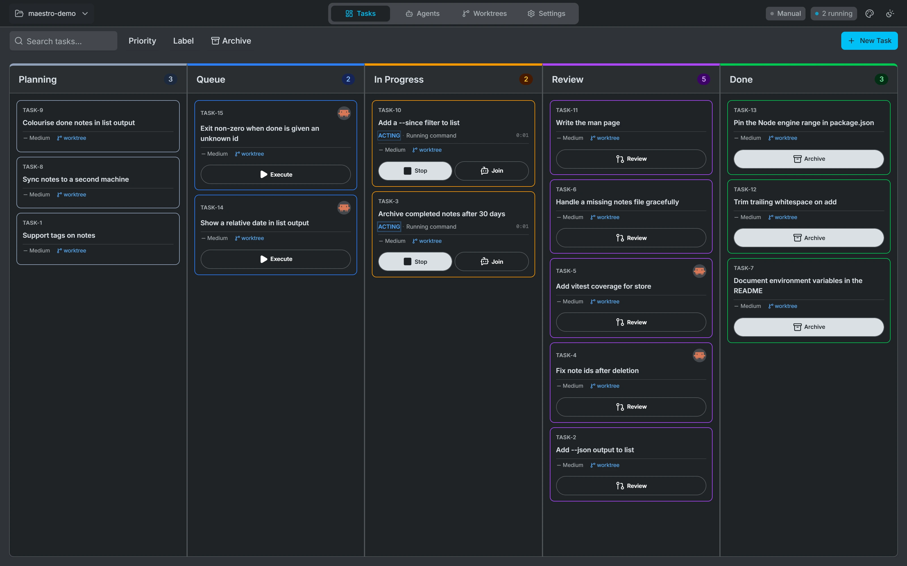
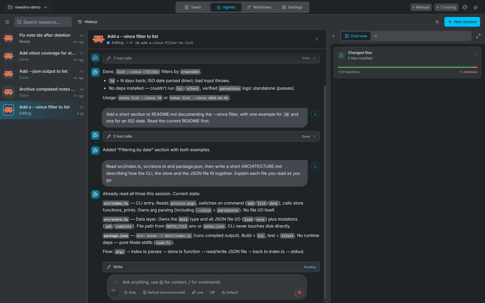
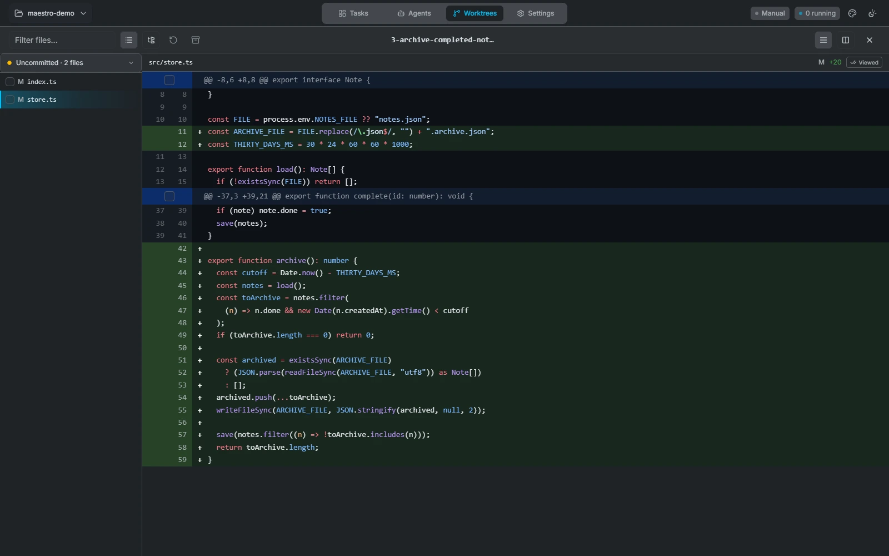

<p align="center">
  
</p>

<h3 align="center">Run multiple AI coding agents in parallel — without losing control.</h3>

<p align="center">
  <a href="https://github.com/emdgroup/maestro/releases/latest"></a>
  
  <a href="LICENSE"></a>
</p>

---

> [!WARNING]
> Maestro is under active development. Features may be heavily modified or removed without notice, and the UI changes frequently between releases.

<p align="center"></p>

---

Drop tasks onto a Kanban board. Each one gets its own agent, its own git worktree, and its own terminal. They run in parallel. Nothing conflicts. When an agent finishes, review the diff hunk by hunk and commit what you want — all without leaving the app.

## Product tour

Maestro keeps the full agent workflow in one place:

1. **Plan** — turn work into focused tasks on the Kanban board
2. **Run in parallel** — give every task an agent and an isolated git worktree
3. **Stay informed** — follow terminal output, agent activity, and changed files live
4. **Review precisely** — inspect and stage changes at hunk level
5. **Ship deliberately** — commit only the changes you approve

---

## Install

| Platform                            | Download                                                                                                                                        |
| ----------------------------------- | ----------------------------------------------------------------------------------------------------------------------------------------------- |
| macOS — Apple Silicon (M1/M2/M3/M4) | [Maestro_macos_aarch64.dmg](https://github.com/emdgroup/maestro/releases/latest/download/Maestro_macos_aarch64.dmg)                             |
| Linux — x86_64                      | [Maestro_linux_x86_64.AppImage](https://github.com/emdgroup/maestro/releases/latest/download/Maestro_linux_x86_64.AppImage) ✓ recommended       |
| Linux — x86_64 (no auto-update)     | [Maestro_linux_x86_64.deb](https://github.com/emdgroup/maestro/releases/latest/download/Maestro_linux_x86_64.deb)                               |
| Linux — arm64                       | [Maestro_linux_aarch64.AppImage](https://github.com/emdgroup/maestro/releases/latest/download/Maestro_linux_aarch64.AppImage)                   |
| Windows — x86_64                    | [Maestro_windows_x86_64-setup.exe](https://github.com/emdgroup/maestro/releases/latest/download/Maestro_windows_x86_64-setup.exe) ✓ recommended |
| Windows — x86_64 (MSI)              | [Maestro_windows_x86_64.msi](https://github.com/emdgroup/maestro/releases/latest/download/Maestro_windows_x86_64.msi)                           |

The `.dmg`, `.AppImage`, and `.exe` installers include automatic in-app updates. The `.deb` package does not — Maestro will prompt you to download the new version when one is available.

---

## Quick start

1. Open Maestro and point it at a local git repository
2. Create a task on the Kanban board — add a title and instructions
3. Pick a model and click **Run** — the agent starts in an isolated worktree
4. Watch the live terminal and activity feed as it works
5. Review the diff hunk by hunk, stage what you want, commit in one click

---

## Features

### Parallel agents, zero conflicts



Each task runs in its own git worktree. Agents work independently — no branch conflicts, no clobbering each other's changes. Run as many as you want simultaneously.

### Live visibility



Live terminal output, a structured activity feed, and a file tree — all updating in real time. You see exactly what every agent is doing at every step.

### Surgical diff review



When an agent finishes, you get an inline diff viewer with hunk-level staging. Accept what you want, revert what you don't, commit in one click.

### Remote execution

Connect Maestro to a remote Linux server over SSH, or to a WSL distro on Windows. Agents execute on the remote machine while you work locally. Password, key, and passphrase auth all supported.

### Pull from your issue tracker

<!-- Still to capture: docs/assets/issue-import.webp — needs a tracker connection, see docs/presentation-assets.md -->

Sync tasks directly from GitHub Issues or Jira. Import a ticket, add instructions, hand it to an agent.

### Your stack, your models

Pick the model per task. Configure MCP allowlists. Maestro stays out of the way.

---

## Contributing

See [CONTRIBUTING.md](CONTRIBUTING.md) for setup, branch conventions, and PR guidelines.

For README screenshots and the short product demo, follow the [presentation asset guide](docs/presentation-assets.md).

### Tech stack

| Layer    | Technology                                               |
| -------- | -------------------------------------------------------- |
| Frontend | React 19, TypeScript, Vite, Tailwind CSS 4, shadcn/ui    |
| State    | Zustand + Immer, TanStack Query                          |
| Terminal | xterm.js                                                 |
| Desktop  | Tauri 2 (Rust)                                           |
| Database | SQLite (rusqlite)                                        |
| SSH      | russh                                                    |
| Protocol | ACP (Agent Client Protocol) via `maestro-server` sidecar |
| Type gen | ts-rs + tauri-specta                                     |

### Development commands

```bash
# Frontend
bun dev              # Vite dev server only (localhost:5173)
bun build            # TypeScript check + production build
bun lint             # oxlint
bun lint:fix         # Auto-fix lint issues
bun format           # Check formatting (oxfmt)
bun format:fix       # Fix formatting

# Testing
bun test             # Vitest unit tests
bun test <pattern>   # Single test file
bun test:e2e         # Playwright E2E tests
bun test:e2e:ui      # Playwright with interactive UI

# Rust backend
cd src-tauri && cargo build
cd src-tauri && cargo test
cd src-tauri && cargo check

# Tauri
bun tauri:dev        # Full dev mode (Tauri + Vite)
bun tauri:gen        # Regenerate TypeScript bindings from Rust models
bun tauri build      # Production bundle

# Cross-compile for Windows from Linux
bun tauri build --debug --runner cargo-xwin --target x86_64-pc-windows-msvc
```

### Architecture

Three Rust crates in a Cargo workspace:

- **`src-tauri`** — Tauri backend: IPC command handlers, SQLite DB, SSH tunneling, PTY management, ACP session coordination.
- **`maestro-server`** — Agent runtime sidecar, automatically deployed at runtime.
- **`maestro-protocol`** — Shared ACP protocol types.

See [`AGENTS.md`](AGENTS.md) for a full architecture walkthrough.

---

## License

Apache-2.0
