<p align="center">
  
</p>

<h3 align="center">Run multiple AI coding agents in parallel — without losing control.</h3>

<p align="center">
  <a href="https://github.com/emdgroup/maestro/releases/latest"></a>
  
  <a href="LICENSE"></a>
</p>

---

> [!WARNING]
> Maestro is under active development. Features may be heavily modified or removed without notice, and the UI changes frequently between releases.

<p align="center">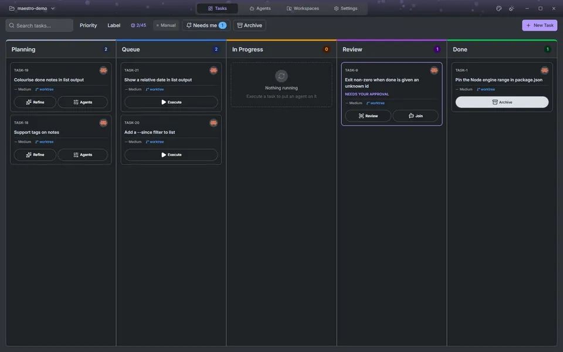</p>

---

Maestro is a desktop app that runs coding agents against your repositories. Tasks live on a Kanban board. Each one moves through refinement, planning, implementation and review, and a different agent can own each stage. Implementation happens in its own git worktree, so several tasks run at once without touching each other's files. You watch every session live, comment on the diff, and decide how the work lands: merge it, push it, or open a pull request.

Maestro brings no agent of its own. It drives the one you already use (Claude Code, Codex, Gemini CLI, GitHub Copilot, Cursor, OpenCode, goose, Cline and many others that support the [Agent Client Protocol](https://agentclientprotocol.com/) — on your laptop, on a server over SSH, in WSL, or in a container.

---

## Install

| Platform                            | Download                                                                                                                                        |
| ----------------------------------- | ----------------------------------------------------------------------------------------------------------------------------------------------- |
| macOS — Apple Silicon (M1/M2/M3/M4) | [Maestro_macos_aarch64.dmg](https://github.com/emdgroup/maestro/releases/latest/download/Maestro_macos_aarch64.dmg)                             |
| Linux — x86_64                      | [Maestro_linux_x86_64.AppImage](https://github.com/emdgroup/maestro/releases/latest/download/Maestro_linux_x86_64.AppImage) ✓ recommended       |
| Linux — x86_64 (no auto-update)     | [Maestro_linux_x86_64.deb](https://github.com/emdgroup/maestro/releases/latest/download/Maestro_linux_x86_64.deb)                               |
| Linux — arm64                       | [Maestro_linux_aarch64.AppImage](https://github.com/emdgroup/maestro/releases/latest/download/Maestro_linux_aarch64.AppImage) ✓ recommended     |
| Windows — x86_64                    | [Maestro_windows_x86_64-setup.exe](https://github.com/emdgroup/maestro/releases/latest/download/Maestro_windows_x86_64-setup.exe) ✓ recommended |
| Windows — x86_64 (no auto-update)   | [Maestro_windows_x86_64.msi](https://github.com/emdgroup/maestro/releases/latest/download/Maestro_windows_x86_64.msi)                           |

The `.dmg`, `.AppImage` and `-setup.exe` builds update themselves in-app. The `.deb` and `.msi` do not: Maestro tells you when a new version exists and you download it.

**No Maestro account is required.** There is no Maestro service to register for or sign in to.

---

## Before you start

### A coding agent

Install and authenticate the agent you want to use before pointing Maestro at it. Maestro launches it, but the subscription, model access and usage charges stay with the agent's provider. Some agents launch through `npx` or `uvx` rather than a standalone binary, so depending on your choice you may also need [Node.js](https://docs.npmjs.com/cli/v11/commands/npx) or [uv](https://docs.astral.sh/uv/guides/tools/).

The agent picker lists the agents bundled in Maestro's registry. For one it does not ship — a local model behind Ollama, an in-house ACP adapter, a listed agent with a different endpoint — add it in `~/.maestro/custom-agents.json`. Run `/maestro-custom-agents` in any agent session and the agent writes the file for you, or follow [docs/custom-agents.md](docs/custom-agents.md).

### Git, ideally

Maestro runs in a plain folder, but the workflow below assumes a git repository. Git is what makes worktrees, parallel tasks, the diff review and the merge, push and pull-request actions possible. Without it, agents edit the folder directly and finished tasks go straight to **Done**.

### Where secrets live

Maestro keeps no remote or integration credentials in its database. SSH passwords, key passphrases and issue-tracker or code-hosting tokens go into your operating system's keychain when you choose to save them. If the keychain is unavailable, integration tokens fall back to an encrypted local file with a visible warning; SSH secrets are never stored that way. Your agent's own credentials are the agent's business, not Maestro's.

---

## How a task moves

Every task crosses the board left to right: **Planning → Queue → In progress → Review → Done**. Each stage can have its own agent, model and permissions, configured once per project as an _agent profile_ (Settings → Agents). Stages without a profile are skipped, and any task can skip Planning or Review individually from its **Agents** button.

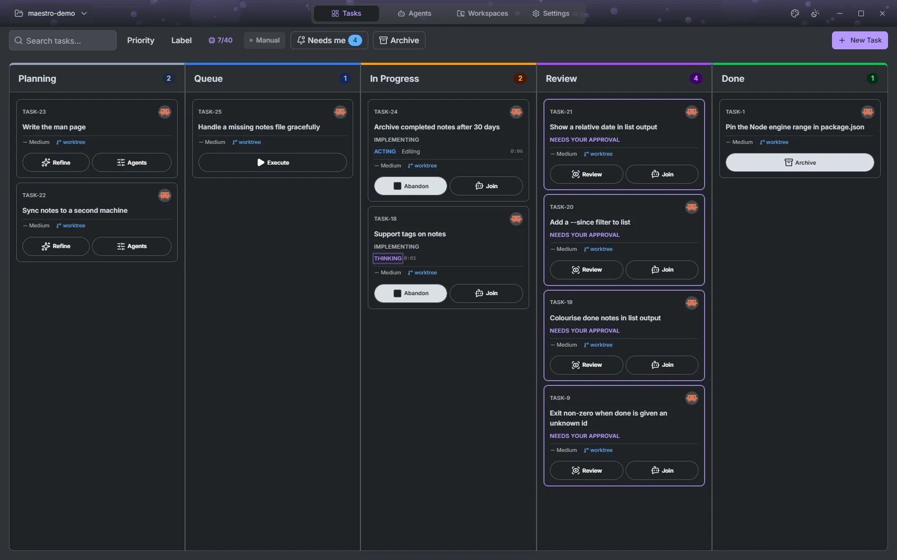

### Planning

A new task is a title and a description. Pull one in from your issue tracker, or write it by hand. If the description is thin, press **Refine**: a read-only Refiner agent reads the repository and proposes a better one, which you accept or discard. Nothing runs until you move the card.

### Queue

Drag a card to Queue and Maestro starts it as soon as there is room. **Auto** starts everything eligible; **Manual** starts only tasks you deferred yourself. Room is measured per connection, either from free memory or as a fixed number of agents, and a session parked in Review still holds its slot until you deal with it.

### In progress

If the project has a Planner profile, the Planner runs first, read-only, and stops at the plan gate. You can annotate the plan passage by passage, send the notes back for another round, or start implementing. Approving starts a fresh Coder session with the plan text.

The Coder gets a workspace of its own. The default is a new worktree on a new branch; you can instead point a task at the repository directory or reuse a worktree another task left behind. Two tasks running at once are two worktrees, so neither sees the other's edits.

While it runs you see the full session: every tool call, permission prompt and question in the stream, and a side panel beside it.

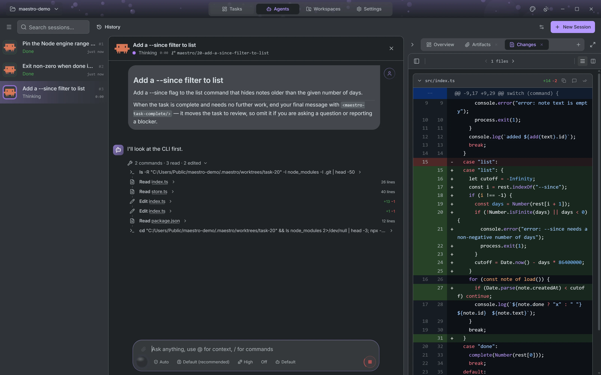

The side panel is a tab strip. Some tabs open themselves when the agent produces something, the rest you add:

- **Overview** and **Plan**: what the task is, and the plan when a Planner wrote one, with passage-level annotations.
- **Changes**: the diff so far, updating as the agent edits.
- **Files**: the workspace tree with an editor. Change a file yourself, create one, show hidden files, open it in your OS or download it.
- **Terminal**: a shell in the workspace, as many as you want.
- **Subagents** and **Artifacts**: nested agents the main one spawned, and files it handed back.
- **Canvas**: see below.

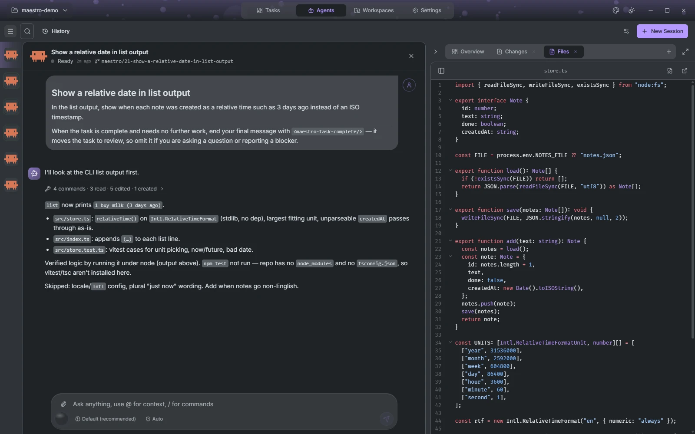

The canvas is where an agent shows work instead of describing it. Maestro installs the `maestro-output` skill on every connection, and with it an agent renders tables, charts, dashboards and real UI controls in your theme. Click a component or drag a rectangle over it to attach a note, and the note goes back to the agent anchored to what you pointed at.

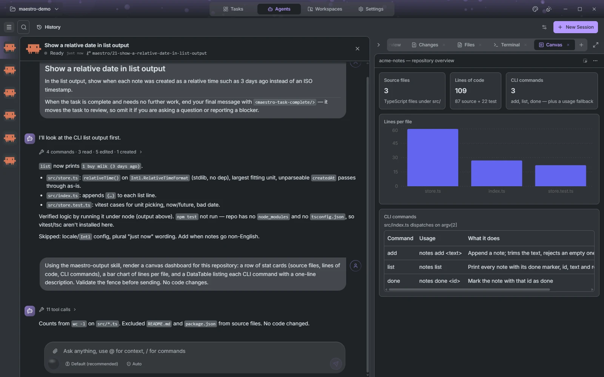

The stream itself renders more than text. Mermaid diagrams, SVG, images, KaTeX and chemical structures all draw inline, so an answer can be a flowchart or a formula rather than a description of one.

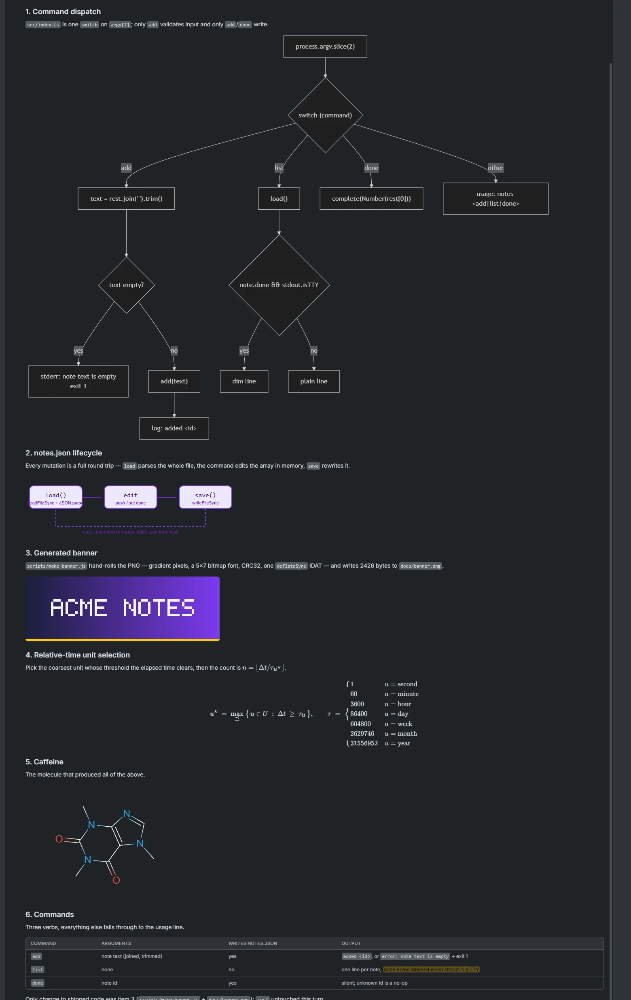

**Abandon** on a running card tears down the session, deletes the worktree and its branch, and puts the task back in Planning as if it had never run.

### Review

When the Coder's turn ends with changes, the task moves to Review. If the project has a Reviewer profile, that agent goes first: read-only, with your project's review instructions, and it may send the work back to the Coder for rework up to three times without you.

Then it is your turn. The diff opens unified or split, expands context from any hunk header, and takes comments on a line or a range of lines. **Rework** sends those comments back to the Coder as one prompt. **Approve** asks how the work should land. The push and pull-request choices appear once the project has a remote:

| Choice                     | Result                                                                   |
| -------------------------- | ------------------------------------------------------------------------ |
| Commit + Merge             | Merged into the base branch, worktree removed, task Done                 |
| Commit only                | Committed on its branch, task Done                                       |
| Commit + Push              | Pushed to the remote unmerged, task Done                                 |
| Commit + Open pull request | Pushed and opened on the forge; the task stays in Review until it merges |

A reviewer that can write is not a reviewer, so every role except the Coder runs under a permission mode that refuses writes. That is enforced by the agent's session mode, not by a prompt asking nicely.

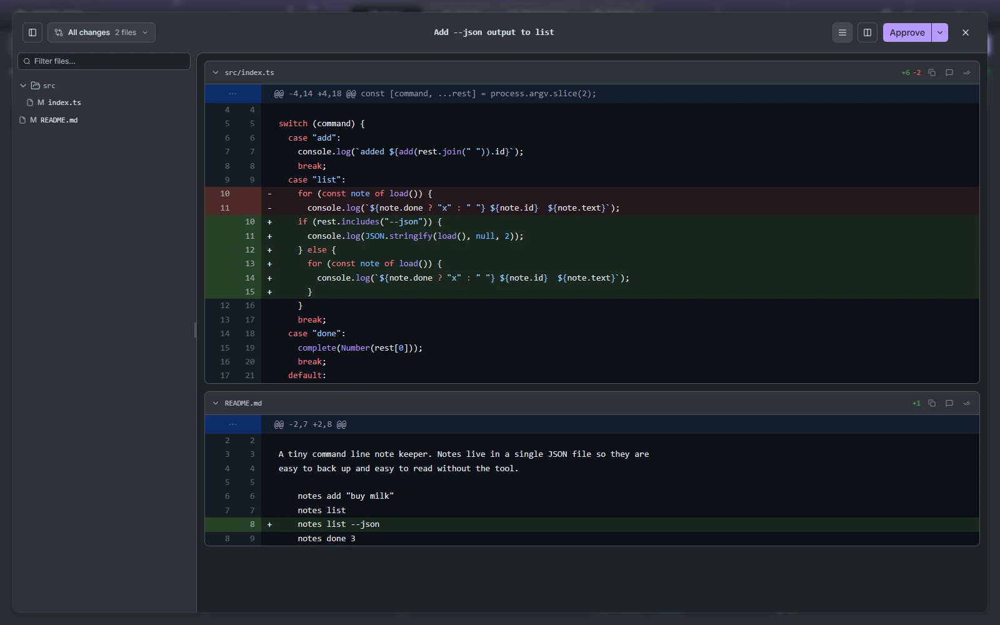

### Done

A task is Done with a record of how: merged, merged through a pull request, committed locally, or finished with no changes.

---

## Around the board

### Worktrees and pull requests

The Worktrees view lists every worktree of the project with what is using it, how far it is ahead of or behind its upstream, and the pull request on its branch. Push and pull are one click on those counts. Open pull requests are listed alongside, so you can start a session on any of them, including one from a contributor's fork. Stale `maestro/` branches are pruned from here too.

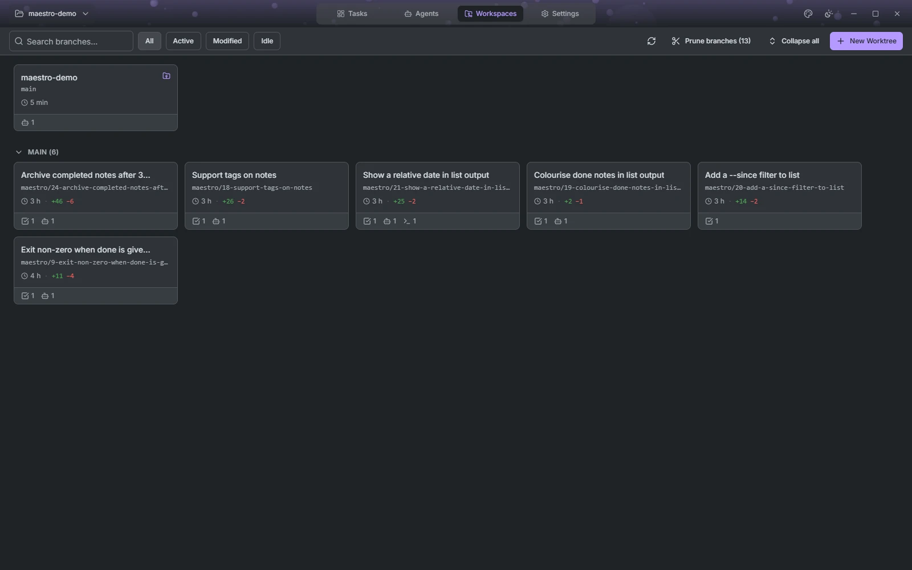

### Connections

| Connection | Where the agent runs                                          | Authentication                                   |
| ---------- | ------------------------------------------------------------- | ------------------------------------------------ |
| Local      | Your machine                                                  | —                                                |
| SSH        | A remote Linux host                                           | Key, key with passphrase, password, or SSH agent |
| WSL        | A distro on your Windows machine; stopped distros are started | —                                                |
| Container  | A running Docker, Podman or nerdctl container on your machine | —                                                |

Maestro deploys its own small server binary to the remote on first use, so the remote needs nothing but the agent. Connections are added from the start screen, before a project is chosen.

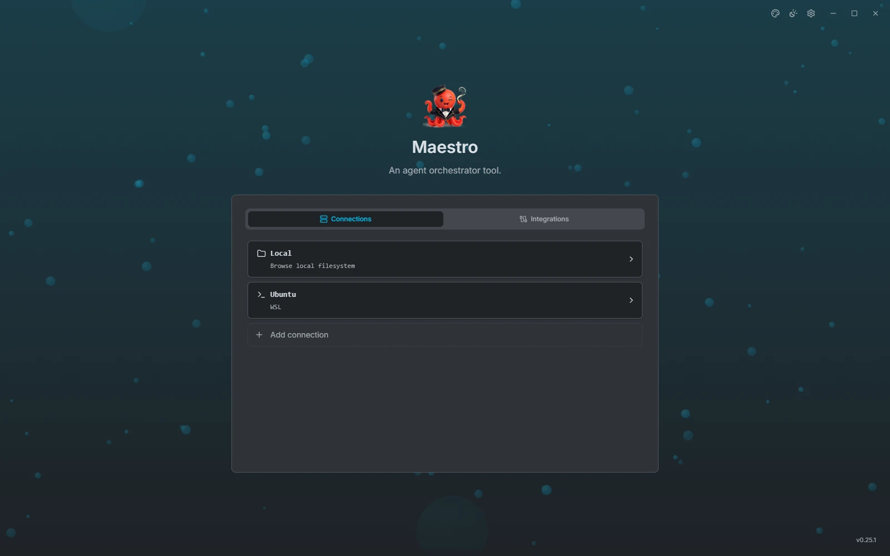

### Integrations

Issue tracking brings work in; code hosting sends it out. Each is configured per project.

| Provider     | Import issues | Open pull requests                          |
| ------------ | ------------- | ------------------------------------------- |
| GitHub       | ✓             | ✓                                           |
| GitLab       | ✓             | ✓                                           |
| Gitea        | ✓             | ✓                                           |
| Forgejo      | ✓             | ✓                                           |
| Azure DevOps | ✓             | ✓                                           |
| Bitbucket    | —             | ✓ (no CI status or pull-request search yet) |
| Jira Cloud   | ✓             | —                                           |
| Linear       | ✓             | —                                           |

Import is one way: an imported task carries its ticket key, but Maestro does not write status back to the tracker. Credentials are added once, on the start screen's Integrations tab, and every project can then pick a provider.

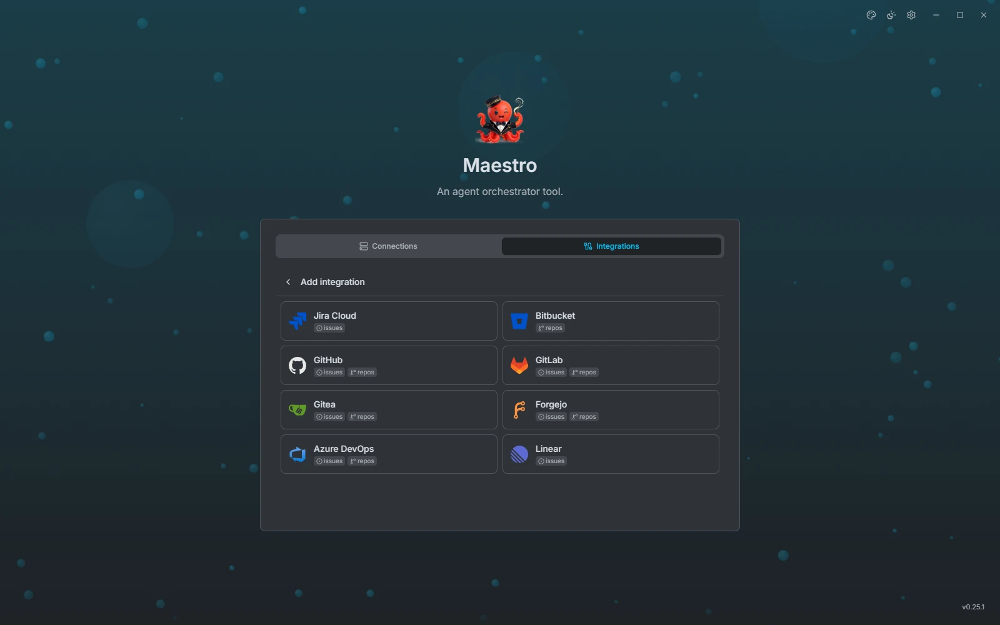

### Settings

Settings open before a project does, from the sidebar. Project pages cover git and code hosting, issue tracking, agent profiles and the project's own accent colour. App pages cover appearance (theme, scale, reduced motion, terminal colours, and whether to keep the system title bar), running-agent limits per connection, desktop notifications when an agent finishes, needs you or fails, and diagnostics with the log level and directory. Everything saves as you change it.

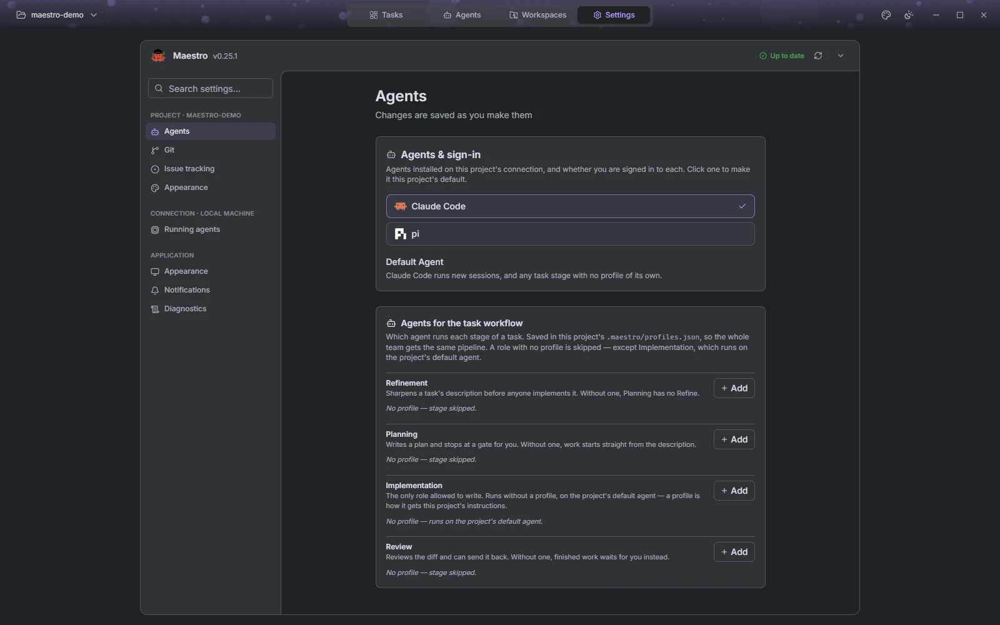

---

## Contributing

See [CONTRIBUTING.md](CONTRIBUTING.md) for setup, branch conventions and PR guidelines, and [`AGENTS.md`](AGENTS.md) for the architecture walkthrough. README screenshots are captured from a real build; see the [presentation asset guide](docs/presentation-assets.md).

### Tech stack

| Layer    | Technology                                               |
| -------- | -------------------------------------------------------- |
| Frontend | React 19, TypeScript, Vite, Tailwind CSS 4, shadcn/ui    |
| State    | Zustand + Immer, TanStack Query                          |
| Terminal | xterm.js                                                 |
| Desktop  | Tauri 2 (Rust)                                           |
| Database | SQLite (rusqlite)                                        |
| SSH      | russh                                                    |
| Protocol | ACP (Agent Client Protocol) via `maestro-server` sidecar |
| Type gen | ts-rs + tauri-specta                                     |

### Development commands

```bash
bun run tauri:dev            # Full dev mode (Tauri + Vite), data in .maestro/dev-data
bun run dev                  # Vite dev server only (localhost:5173)
bun run build                # TypeScript check + production build
bun run test                 # Vitest unit tests (bun run test <pattern> for one file)
bun run test:e2e             # Build the real binary and drive it with WebdriverIO (needs a display)
bun run lint                 # oxlint
bun run format               # oxfmt check; format:fix to apply
bun run format:rust          # rustfmt check; format:rust:fix to apply
bun run tauri:gen            # Regenerate TypeScript bindings from Rust models
bun run tauri build          # Production bundle

cd src-tauri && cargo test   # Rust tests; on Windows: MAESTRO_TEST_MANIFEST=1 cargo test --lib
```

Use `bun run <script>`, not `bun <script>`: `bun test` and `bun build` are Bun's own commands, not this project's.

### Architecture

Three Rust crates in a Cargo workspace:

- **`src-tauri`** — Tauri backend: IPC command handlers, SQLite, SSH, PTY management, ACP session coordination. Organised by domain, not by layer.
- **`maestro-server`** — Agent runtime sidecar, deployed to each connection at runtime.
- **`maestro-protocol`** — Shared message types between the two.

---

## Special thanks

Maestro talks to every agent it supports over the [Agent Client Protocol (ACP)](https://agentclientprotocol.com/), an open standard from [Zed Industries](https://zed.dev/) ([agentclientprotocol](https://github.com/zed-industries/agent-client-protocol)).

This one protocol is the sole reason that Maestro can exist !

Thanks to the ACP maintainers and to the agent authors who ship ACP support.

---

## License

Apache-2.0
