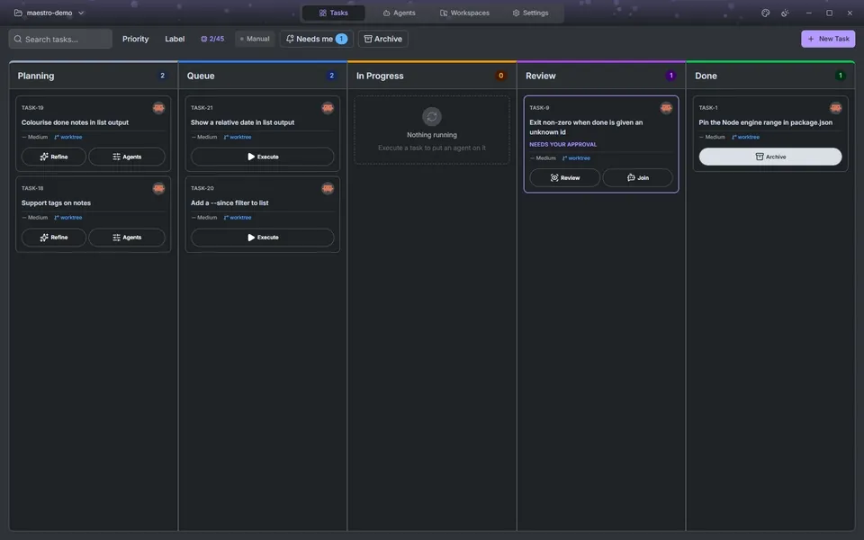

<p align="center">
  
</p>

<h3 align="center">Run multiple AI coding agents in parallel — without losing control.</h3>

<p align="center">
  <a href="https://github.com/emdgroup/maestro/releases/latest"></a>
  
  <a href="LICENSE"></a>
</p>

---

> [!WARNING]
> Maestro is under active development. Features may be heavily modified or removed without notice, and the UI changes frequently between releases.

<p align="center"></p>

---

Maestro is a desktop app that runs coding agents against your repositories. Tasks live on a Kanban board. Each one moves through refinement, planning, implementation and review, and a different agent can own each stage. Implementation happens in its own git worktree, so several tasks run at once without touching each other's files. You watch every session live, comment on the diff, and decide how the work lands: merge it, push it, or open a pull request.

Maestro brings no agent of its own. It drives the one you already use (Claude Code, Codex, Gemini CLI, GitHub Copilot, Cursor, OpenCode, goose, Cline and many others that support the [Agent Client Protocol](https://agentclientprotocol.com/) — on your laptop, on a server over SSH, in WSL, or in a container.

---

## Install

| Platform                            | Download                                                                                                                                        |
| ----------------------------------- | ----------------------------------------------------------------------------------------------------------------------------------------------- |
| macOS — Apple Silicon (M1/M2/M3/M4) | [Maestro_macos_aarch64.dmg](https://github.com/emdgroup/maestro/releases/latest/download/Maestro_macos_aarch64.dmg)                             |
| Linux — x86_64                      | [Maestro_linux_x86_64.AppImage](https://github.com/emdgroup/maestro/releases/latest/download/Maestro_linux_x86_64.AppImage) ✓ recommended       |
| Linux — x86_64 (no auto-update)     | [Maestro_linux_x86_64.deb](https://github.com/emdgroup/maestro/releases/latest/download/Maestro_linux_x86_64.deb)                               |
| Linux — arm64                       | [Maestro_linux_aarch64.AppImage](https://github.com/emdgroup/maestro/releases/latest/download/Maestro_linux_aarch64.AppImage) ✓ recommended     |
| Windows — x86_64                    | [Maestro_windows_x86_64-setup.exe](https://github.com/emdgroup/maestro/releases/latest/download/Maestro_windows_x86_64-setup.exe) ✓ recommended |
| Windows — x86_64 (no auto-update)   | [Maestro_windows_x86_64.msi](https://github.com/emdgroup/maestro/releases/latest/download/Maestro_windows_x86_64.msi)                           |

The `.dmg`, `.AppImage` and `-setup.exe` builds update themselves in-app. The `.deb` and `.msi` do not: Maestro tells you when a new version exists and you download it.

**No Maestro account is required.** There is no Maestro service to register for or sign in to.

---

## Features

| Feature             | What it gives you                                                                             |
| ------------------- | --------------------------------------------------------------------------------------------- |
| Kanban pipeline     | Tasks move through refine, plan, code and review, with a different agent for each stage       |
| Parallel worktrees  | Every task works on its own branch, so several agents run at once without conflicts           |
| Live sessions       | Every tool call, permission prompt and question as it happens, with files, diff and terminals |
| Diff review         | Comment on lines, send the work back, then merge, push or open a pull request                 |
| Canvas              | Agents show dashboards, charts and UI mockups you can annotate, not just text                 |
| Automations         | Agents run on a schedule, from a webhook or on demand, even with no window open               |
| Collections         | Prompts, skills, MCP servers and automation templates, managed in one place for every agent   |
| Any ACP agent       | Claude Code, Codex, Gemini CLI, Copilot, Cursor, OpenCode and more, or your own               |
| Remote connections  | Run agents locally, over SSH, in WSL or in a container                                        |
| Integrations        | Import issues from GitHub, GitLab, Jira, Linear and others; open pull requests on your forge  |
| Persistent sessions | Sessions keep running when you close the window and pick up again when you return             |

The full guide, from setting up an agent to how a task moves across the board, is on the [Maestro website](https://emdgroup.github.io/maestro/guide/getting-started). Release notes are in the [changelog](https://emdgroup.github.io/maestro/changelog).

---

## Contributing

See [CONTRIBUTING.md](CONTRIBUTING.md) for setup, branch conventions and PR guidelines, and [`AGENTS.md`](AGENTS.md) for the architecture walkthrough. README and website screenshots are captured from a real build; see the [presentation asset guide](docs/presentation-assets.md).

### Tech stack

| Layer    | Technology                                                |
| -------- | --------------------------------------------------------- |
| Frontend | React 19, TypeScript, Vite, Tailwind CSS 4, shadcn/ui     |
| State    | Zustand + Immer, TanStack Query                           |
| Terminal | xterm.js                                                  |
| Desktop  | Tauri 2 (Rust)                                            |
| Database | SQLite (rusqlite)                                         |
| SSH      | russh                                                     |
| Protocol | ACP (Agent Client Protocol) via resident `maestro-server` |
| Type gen | ts-rs + tauri-specta                                      |

### Development commands

```bash
bun run tauri:dev            # Full dev mode (Tauri + Vite), data in .maestro/dev-data
bun run dev                  # Vite dev server only (localhost:5173)
bun run build                # TypeScript check + production build
bun run test                 # Vitest unit tests (bun run test <pattern> for one file)
bun run test:e2e             # Build the real binary and drive it with WebdriverIO (needs a display)
bun run lint                 # oxlint
bun run format               # oxfmt check; format:fix to apply
bun run format:rust          # rustfmt check; format:rust:fix to apply
bun run tauri:gen            # Regenerate TypeScript bindings from Rust models
bun run tauri build          # Production bundle

cd src-tauri && cargo test   # Rust tests; on Windows: MAESTRO_TEST_MANIFEST=1 cargo test --lib
```

Use `bun run <script>`, not `bun <script>`: `bun test` and `bun build` are Bun's own commands, not this project's.

### Architecture

Three Rust crates in a Cargo workspace:

- **`src-tauri`** — Tauri backend: IPC command handlers, SQLite, SSH, PTY management, ACP session coordination. Organised by domain, not by layer.
- **`maestro-server`** — Resident agent runtime, deployed to each connection at runtime. It also runs automations.
- **`maestro-protocol`** — Shared message types between the two.

---

## Special thanks

Maestro talks to every agent it supports over the [Agent Client Protocol (ACP)](https://agentclientprotocol.com/), an open standard from [Zed Industries](https://zed.dev/) ([agentclientprotocol](https://github.com/zed-industries/agent-client-protocol)).

This one protocol is the sole reason that Maestro can exist !

Thanks to the ACP maintainers and to the agent authors who ship ACP support.

---

## License

Apache-2.0
