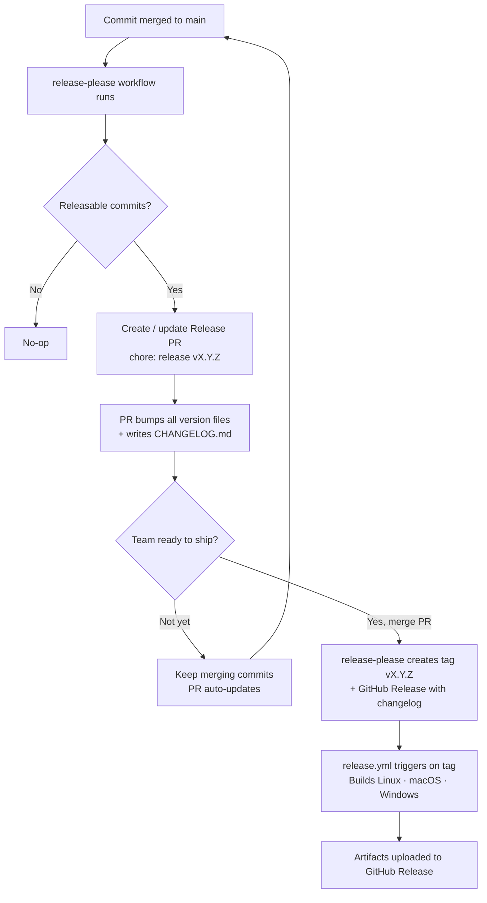

# How to release

## Conventional commits

This repository uses [conventional commits](https://www.conventionalcommits.org/en/v1.0.0/). Each commit message must be structured as follows:

```
<type>[optional scope]: <description>

[optional body]

[optional footer(s)]
```

Commit messages are the basis of the release strategy. They are automatically parsed during CI/CD to:

- determine the next version number (patch, minor, or major)
- populate the changelog

It is therefore important **to think carefully about commit messages** before pushing, so that users reading the changelog can understand the impact of each change.

### Version bump rules

| Commit type                                    | Version bump              | Example                                   |
| ---------------------------------------------- | ------------------------- | ----------------------------------------- |
| `fix:`                                         | Patch (`0.2.1` → `0.2.2`) | `fix: correct task status not persisting` |
| `feat:`                                        | Minor (`0.2.1` → `0.3.0`) | `feat: add worktree diff viewer`          |
| `BREAKING CHANGE:` in footer                   | Major (`0.2.1` → `1.0.0`) | any type + `BREAKING CHANGE: ...`         |
| `chore:`, `refactor:`, `docs:`, `ci:`, `test:` | No release                | internal changes, not user-facing         |

## release-please

[release-please](https://github.com/googleapis/release-please) handles versioning and changelog generation.

### How it works

Unlike fully-automated tools, release-please uses a **Release PR** model: a pull request accumulates all unreleased changes, and merging it triggers the actual release. This gives the team control over release timing.



### What gets bumped automatically

When the Release PR is merged, the following files are updated in a single commit — **no manual version editing needed**:

- `package.json`
- `src-tauri/tauri.conf.json`
- `src-tauri/Cargo.toml`
- `maestro-server/Cargo.toml`
- `maestro-protocol/Cargo.toml`

### Workflow summary

1. Merge conventional commits to `main` as usual
2. A Release PR titled `chore: release vX.Y.Z` appears (or updates) automatically
3. Review the PR — it shows the CHANGELOG diff and version bumps
4. Merge when ready to ship
5. CI builds and publishes the release for all platforms

## Tips for writing good commit messages

- Commit messages generate the changelog — **write for the user reading the release notes**, not for the reviewer reading the diff
- Use `fix`/`feat` only when the change is user-visible; use `chore`/`refactor`/`ci` for internal changes
- Pull requests must be squashed (1 PR = 1 commit on `main`)
- Keep each commit focused on a single change; do not bundle unrelated fixes
- Add `BREAKING CHANGE: <description>` in the commit footer to trigger a major version bump

### Do

```sh
feat: add keyboard shortcut to open task detail
fix: prevent terminal from flickering on resize
chore: upgrade Tauri to 2.2.0
```

### Don't

```sh
fix: fix stuff
feat: various improvements
fix: fix bug in component
```
