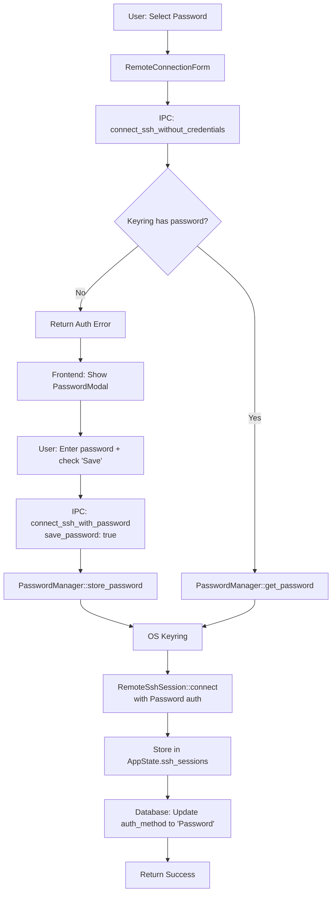
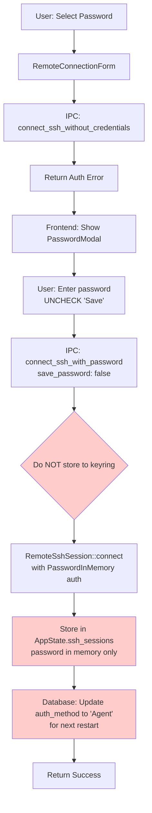
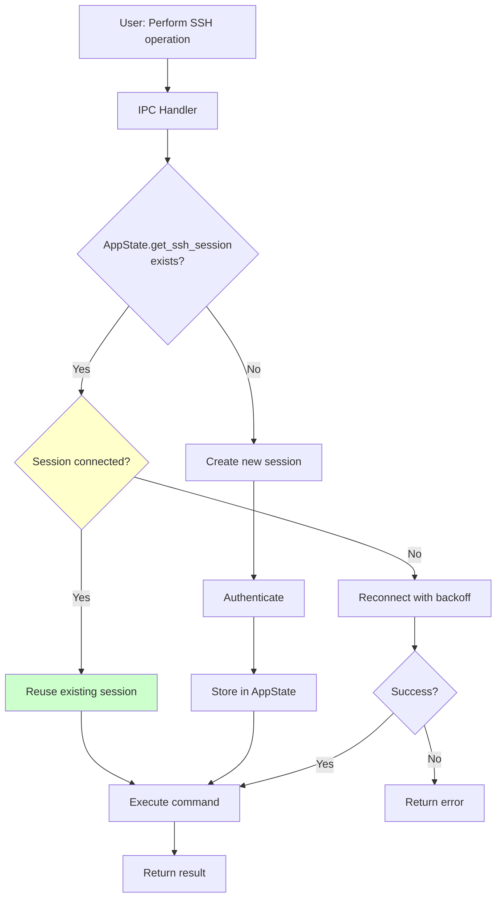
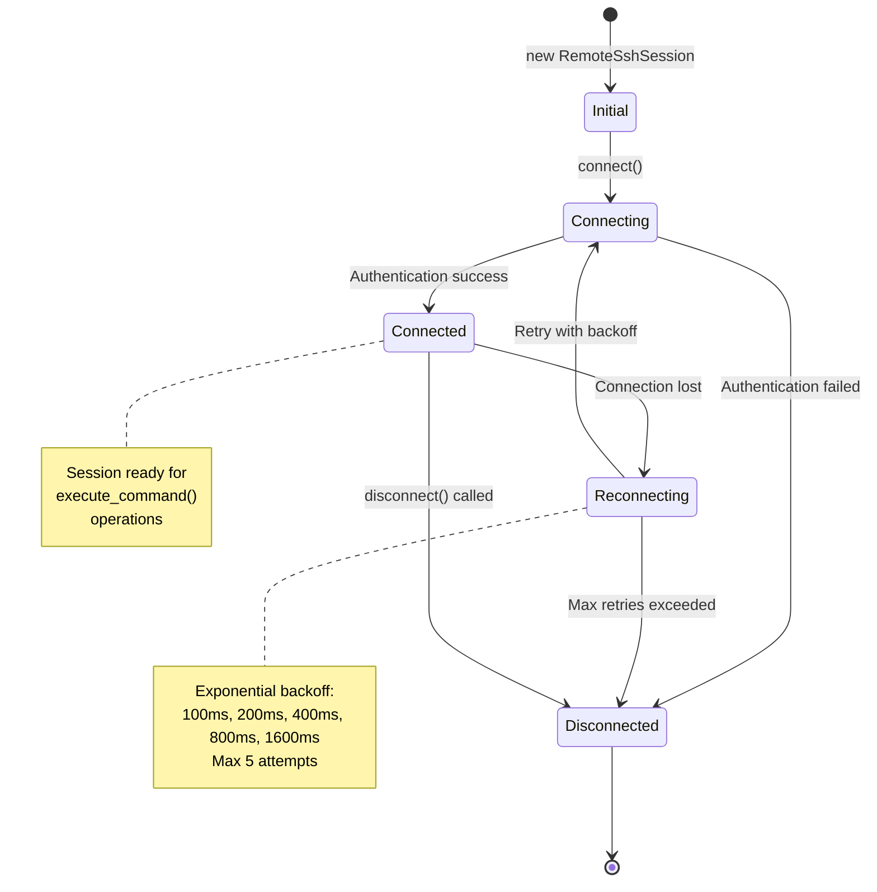
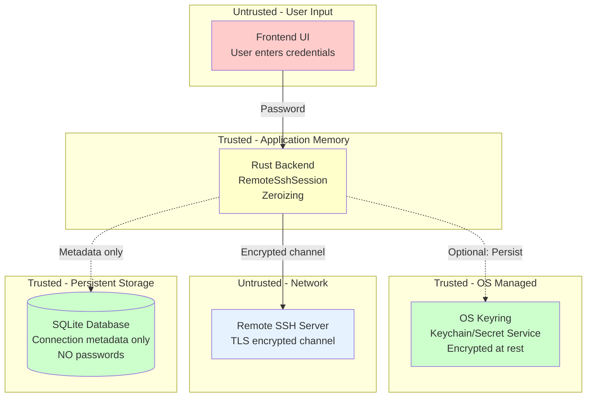

# SSH Architecture Documentation

## System Architecture Overview

This document provides visual representations of the SSH implementation architecture, showing how components interact across frontend, backend, and external systems.

---

## High-Level Architecture Diagram

```mermaid
graph TB
    subgraph "Frontend (React + TypeScript)"
        UI[User Interface]
        RCF[RemoteConnectionForm]
        PM[PasswordModal]
        RPL[RemoteProjectsList]
        CL[ConnectionList]

        UI --> RCF
        UI --> PM
        UI --> RPL
        UI --> CL
    end

    subgraph "IPC Layer (Tauri)"
        IPC[Tauri IPC Bridge]
    end

    subgraph "Backend (Rust)"
        subgraph "IPC Handlers"
            SSH_H[ssh_handlers.rs]
            SSH_H1["get_ssh_connections()"]
            SSH_H2["save_ssh_connection()"]
            SSH_H3["connect_ssh_without_credentials()"]
            SSH_H4["connect_ssh_with_password()"]
            SSH_H5["list_remote_directories()"]
            SSH_H6["delete_ssh_connection()"]
            SSH_H7["rename_ssh_connection()"]

            SSH_H --> SSH_H1
            SSH_H --> SSH_H2
            SSH_H --> SSH_H3
            SSH_H --> SSH_H4
            SSH_H --> SSH_H5
            SSH_H --> SSH_H6
            SSH_H --> SSH_H7
        end

        subgraph "SSH Core"
            RSS[RemoteSshSession]
            RSS_C["connect()"]
            RSS_E["execute_command()"]
            RSS_D["disconnect()"]
            RSS_R["reconnect_if_needed()"]

            RSS --> RSS_C
            RSS --> RSS_E
            RSS --> RSS_D
            RSS --> RSS_R
        end

        subgraph "Password Management"
            PM_MGR[PasswordManager]
            PM_S["store_password()"]
            PM_G["get_password()"]
            PM_D["delete_password()"]

            PM_MGR --> PM_S
            PM_MGR --> PM_G
            PM_MGR --> PM_D
        end

        subgraph "Application State"
            AS[AppState]
            AS_DB["db: Mutex&lt;Connection&gt;"]
            AS_SSH["ssh_sessions: HashMap&lt;i64, RemoteSshSession&gt;"]

            AS --> AS_DB
            AS --> AS_SSH
        end

        subgraph "Models"
            M_SSH["SshConfig"]
            M_CONN["SshConnection"]
            M_AUTH["SshAuthMethod"]
            M_ERR["SshError"]
        end

        SSH_H --> RSS
        SSH_H --> PM_MGR
        SSH_H --> AS
        RSS --> M_AUTH
        SSH_H --> M_SSH
        SSH_H --> M_CONN
        RSS --> M_ERR
    end

    subgraph "External Systems"
        KEYRING[OS Keyring<br/>Keychain/Secret Service/Credential Manager]
        SSH_SERVER[Remote SSH Server]
        DATABASE[(SQLite Database<br/>ssh_connections table)]
    end

    RCF -.->|"invoke()"| IPC
    PM -.->|"invoke()"| IPC
    RPL -.->|"invoke()"| IPC
    CL -.->|"invoke()"| IPC

    IPC -.->|Tauri Command| SSH_H

    PM_MGR -.->|keyring crate| KEYRING
    RSS -.->|ssh2 crate| SSH_SERVER
    AS_DB -.->|rusqlite| DATABASE

    style KEYRING fill:#ffe6e6
    style SSH_SERVER fill:#e6f3ff
    style DATABASE fill:#f0e6ff
    style RSS fill:#ffffcc
    style PM_MGR fill:#ccffcc
    style AS fill:#ffccff
```



---

## Component Layer Breakdown

### Frontend Layer (TypeScript/React)

| Component | File | Responsibility |
|-----------|------|----------------|
| **RemoteConnectionForm** | `src/components/RemoteConnectionForm.tsx` | SSH connection configuration UI, auth method selection |
| **PasswordModal** | `src/components/PasswordModal.tsx` | Password input with save/don't save checkbox |
| **RemoteProjectsList** | `src/components/RemoteProjectsList.tsx` | Display remote projects, trigger connections |
| **ConnectionList** | `src/components/ConnectionList.tsx` | Manage saved SSH connections (rename, delete) |

### IPC Layer (Tauri Commands)

| Command | Function | File | Parameters | Returns |
|---------|----------|------|------------|---------|
| `get_ssh_connections` | List all saved connections | `ipc/ssh_handlers.rs:10` | None | `Vec<SshConnection>` |
| `save_ssh_connection` | Save new connection | `ipc/ssh_handlers.rs:42` | connection details | `i64` (connection_id) |
| `connect_ssh_without_credentials` | Connect using saved credentials | `ipc/ssh_handlers.rs:88` | connection_id | `Result<i64, String>` |
| `connect_ssh_with_password` | Connect with password | `ipc/ssh_handlers.rs:170` | connection_id, password, save_password | `Result<i64, String>` |
| `list_remote_directories` | List directories on remote | `ipc/ssh_handlers.rs:264` | connection_id, path | `Vec<String>` |
| `delete_ssh_connection` | Delete saved connection | `ipc/ssh_handlers.rs:297` | connection_id | `Result<(), String>` |
| `rename_ssh_connection` | Rename connection | `ipc/ssh_handlers.rs:329` | connection_id, display_name | `Result<(), String>` |

### Backend Core (Rust)

#### SSH Session Management

| Module | File | Key Functions | Responsibility |
|--------|------|---------------|----------------|
| **RemoteSshSession** | `ssh/session.rs` | `connect()`, `execute_command()`, `disconnect()`, `reconnect_if_needed()` | Persistent SSH connection, state machine, auto-reconnect |
| **PasswordManager** | `ssh/password_manager.rs` | `store_password()`, `get_password()`, `delete_password()` | OS keyring integration via `keyring` crate |
| **SshClient** | `ssh/client.rs` | `new()`, `set_session()`, `get_session()` | Low-level SSH2 wrapper (minimal) |
| **SshError** | `ssh/error.rs` | Error type definitions | SSH-specific error handling |

#### Application State

| Component | File | Type | Responsibility |
|-----------|------|------|----------------|
| **AppState** | `db/connection.rs:45` | Struct | Global app state container |
| `db` | `db/connection.rs:47` | `Mutex<Connection>` | SQLite database connection |
| `ssh_sessions` | `db/connection.rs:49` | `HashMap<i64, RemoteSshSession>` | Active SSH sessions (in-memory) |

#### Data Models

| Type | File | Purpose |
|------|------|---------|
| **SshConfig** | `models/project.rs:24` | SSH connection configuration |
| **SshAuthMethod** | `models/project.rs:5` | Authentication method enum (Agent, KeyFile, Password, PasswordInMemory) |
| **SshConnection** | `models/project.rs:84` | Saved connection metadata |
| **GitConnection** | `models/connection.rs:9` | Local vs Remote connection routing |

### External Systems

| System | Interface | Purpose |
|--------|-----------|---------|
| **OS Keyring** | `keyring` crate | Secure password storage (Keychain/Secret Service/Credential Manager) |
| **Remote SSH Server** | `ssh2` crate (libssh2) | SSH protocol, authentication, command execution |
| **SQLite Database** | `rusqlite` | Persist connection metadata, auth method, last used timestamps |

---

## Authentication Method Data Flow

### Agent/KeyFile Authentication


### Password Authentication (Saved)



### Password Authentication (Not Saved)



### Session Reuse



---

## SSH State Machine



---

## File Structure Map

```
gsd-demo/
├── src-tauri/src/
│   ├── ssh/
│   │   ├── mod.rs                    # Module exports
│   │   ├── session.rs                # RemoteSshSession (connection lifecycle)
│   │   ├── password_manager.rs       # OS keyring integration
│   │   ├── client.rs                 # Low-level SSH wrapper
│   │   └── error.rs                  # SSH error types
│   │
│   ├── ipc/
│   │   ├── mod.rs                    # Module exports
│   │   ├── ssh_handlers.rs           # Tauri SSH IPC commands
│   │   └── handlers.rs               # Other IPC handlers
│   │
│   ├── models/
│   │   ├── mod.rs                    # Module exports
│   │   ├── project.rs                # SshConfig, SshAuthMethod, SshConnection
│   │   └── connection.rs             # GitConnection enum
│   │
│   ├── db/
│   │   ├── mod.rs                    # Module exports
│   │   ├── connection.rs             # AppState, get_git_connection()
│   │   └── schema.rs                 # Database schema including ssh_connections table
│   │
│   ├── lib.rs                        # Library entry point
│   └── main.rs                       # Tauri app entry, register SSH commands
│
└── src/
    ├── components/
    │   ├── RemoteConnectionForm.tsx  # SSH connection configuration UI
    │   ├── PasswordModal.tsx         # Password prompt with save option
    │   ├── RemoteProjectsList.tsx    # List remote projects, trigger connections
    │   └── ConnectionList.tsx        # Manage saved SSH connections
    │
    └── types/
        └── bindings.ts               # Auto-generated TypeScript types from Rust
```

---

## Key Dependencies

### Rust Crates

| Crate | Version | Purpose | Used In |
|-------|---------|---------|---------|
| `ssh2` | Latest | SSH protocol implementation (libssh2 wrapper) | `session.rs` |
| `keyring` | Latest | Cross-platform OS keyring access | `password_manager.rs` |
| `zeroize` | Latest | Secure memory clearing for sensitive data | `password_manager.rs` |
| `rusqlite` | Latest | SQLite database access | `ssh_handlers.rs`, `connection.rs` |
| `serde` | Latest | Serialization/deserialization | All model types |
| `tokio` | Latest | Async runtime | `ssh_handlers.rs`, `session.rs` |
| `tauri` | 2.x | IPC bridge, app framework | `ssh_handlers.rs`, `main.rs` |

### TypeScript/React

| Package | Purpose | Used In |
|---------|---------|---------|
| `@tauri-apps/api` | Tauri IPC client | All frontend components |
| `react` | UI framework | All components |
| `sonner` | Toast notifications | Error display |
| `lucide-react` | Icons (Eye, EyeOff) | PasswordModal |

---

## Data Flow Summary

### Initial Connection Setup

```
User Input → RemoteConnectionForm → IPC → save_ssh_connection → SQLite
         → connect_ssh_without_credentials → (Auth) → AppState.ssh_sessions
```

### Password Prompt Flow

```
Auth Fail → IPC Error → PasswordModal → User Input → connect_ssh_with_password
         → PasswordManager → OS Keyring (optional) → RemoteSshSession → Success
```

### Command Execution

```
User Action → IPC → get_ssh_session (reuse) → execute_command → SSH Server → Result
```

### Session Lifecycle

```
Connect → Store in AppState → Reuse for operations → (Disconnect or App Exit) → Cleanup
```

---

## Security Boundaries



**Security Principles**:
1. **Never log passwords** - All logging masks sensitive data
2. **Zeroize on drop** - Passwords cleared from memory when no longer needed
3. **OS keyring only** - Never store passwords in app files or SQLite
4. **TLS encryption** - All SSH traffic encrypted (ssh2 library)
5. **Minimal persistence** - PasswordInMemory never touches disk

---

## Performance Considerations

### Connection Pooling

- **Session Reuse**: `AppState.ssh_sessions` HashMap caches connections
- **Benefit**: Eliminate redundant authentication handshakes
- **Lifetime**: Until app exit or explicit disconnect

### Reconnection Strategy

- **Exponential Backoff**: 100ms → 200ms → 400ms → 800ms → 1600ms
- **Max Retries**: 5 attempts before failure
- **Transient Errors Only**: Only retry `ConnectionError`, not `AuthenticationError`

### Database Query Optimization

- **Indexed Lookups**: `connection_string` unique index for fast retrieval
- **Connection Pooling**: Single `Mutex<Connection>` for all queries
- **Prepared Statements**: All queries use parameterized statements

---

## Testing Strategy

### Unit Tests

- `PasswordManager` keyring operations (mock keyring)
- `SshError` transient/permanent classification
- `SshAuthMethod` serialization/deserialization

### Integration Tests

- Full connection flow (all 4 auth methods)
- Session reuse verification
- Reconnection with simulated network failures
- Password persistence (save vs don't save)

### Manual Testing Checklist

- [ ] Agent auth with running SSH agent
- [ ] Key file auth with valid/invalid paths
- [ ] Password auth with correct/incorrect passwords
- [ ] Save password and verify keyring storage
- [ ] Don't save password and verify auth_method reset
- [ ] Session reuse across multiple operations
- [ ] Reconnection after network disruption
- [ ] Connection deletion and keyring cleanup

---

## Troubleshooting Guide

### Connection Fails Immediately

**Check**:
- SSH server reachable (`ping`, `nc -zv`)
- Firewall allows SSH port
- SSH service running on remote

**Logs**: Check `ConnectionError` details for TCP failures

### Authentication Fails

**Check**:
- Username correct
- Agent auth: SSH agent running (`ssh-add -l`)
- Key file: Path correct, permissions 600
- Password: Correct password, keyring accessible

**Logs**: Check `AuthenticationError` details

### Password Not Persisting

**Check**:
- "Save password" checkbox was checked
- OS keyring accessible (not locked)
- `PasswordManager::store_password` succeeded

**Debug**: Query keyring manually (`security find-generic-password` on macOS)

### Session Not Reusing

**Check**:
- `AppState.ssh_sessions` contains connection_id
- Session still in `Connected` state
- connection_id matches between operations

**Debug**: Add logging to `get_ssh_session()`

---

## Future Architecture Improvements

1. **Connection Health Monitoring**:
   - Background keepalive pings
   - Proactive reconnection before command failures

2. **Multi-hop SSH (Jump Hosts)**:
   - Add `jump_host` field to `SshConfig`
   - Chain SSH connections

3. **SSH Key Management**:
   - Generate keys from UI
   - Store keys in app-managed keystore
   - Key rotation reminders

4. **Audit Logging**:
   - Log all SSH operations to audit table
   - Compliance and security analysis

5. **Session Encryption**:
   - Encrypt `ssh_sessions` HashMap in memory
   - Defense against memory dumps

6. **Connection Profiles**:
   - Save multiple auth methods per host
   - Quick switch between profiles

---

## References

- **SSH2 Protocol**: RFC 4253
- **libssh2 Library**: https://www.libssh2.org/
- **Keyring Crate**: https://crates.io/crates/keyring
- **Tauri IPC**: https://tauri.app/v2/guides/inter-process-communication/
