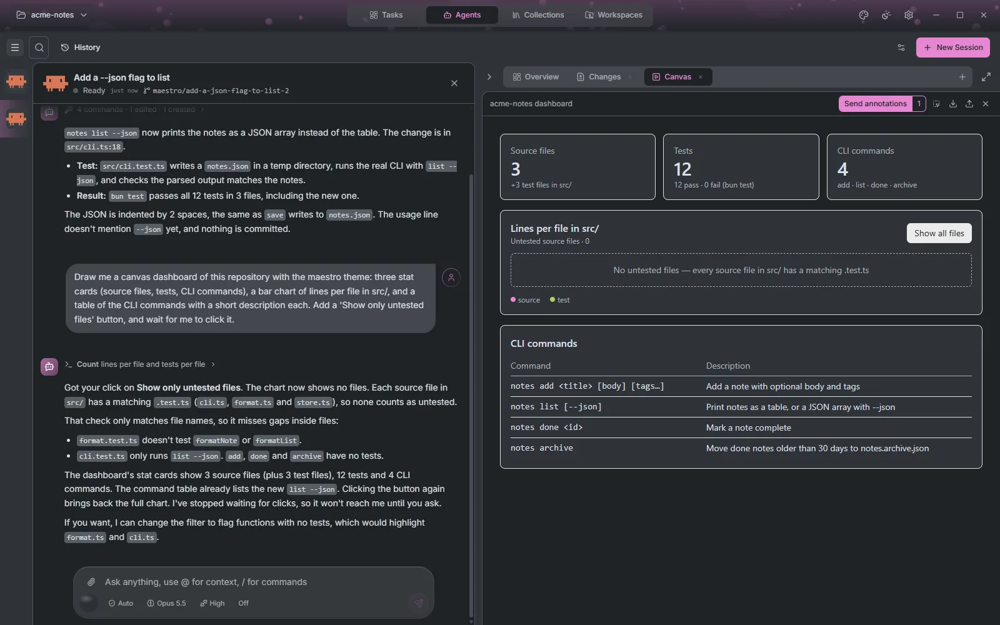
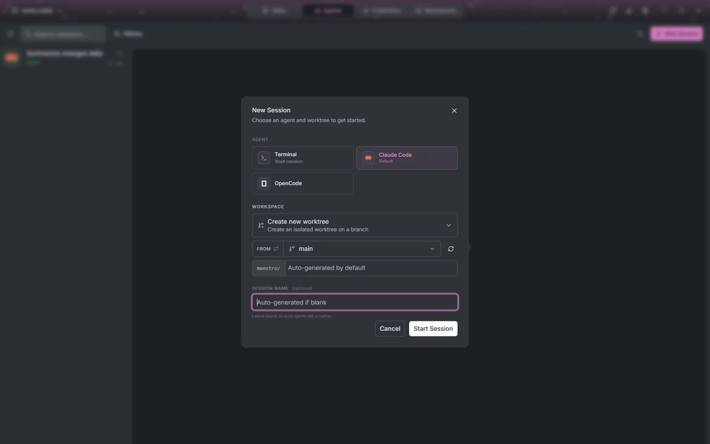
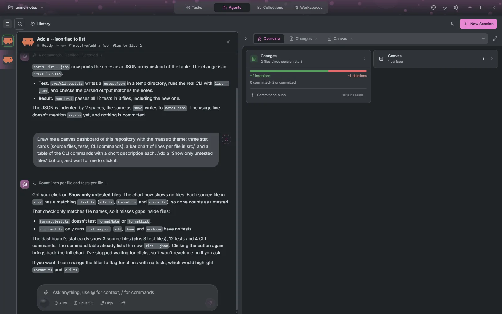
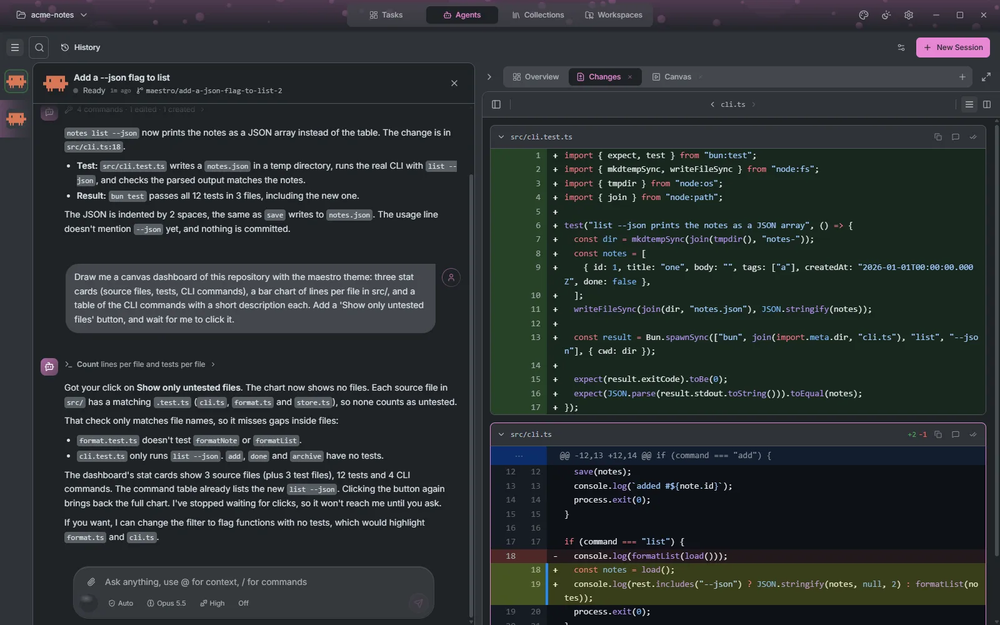
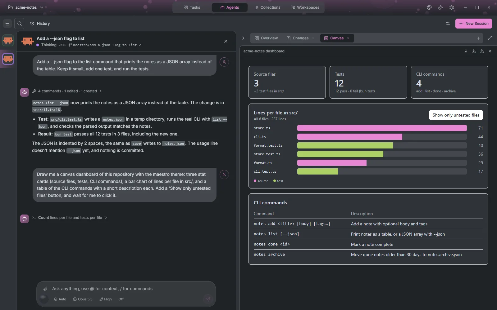
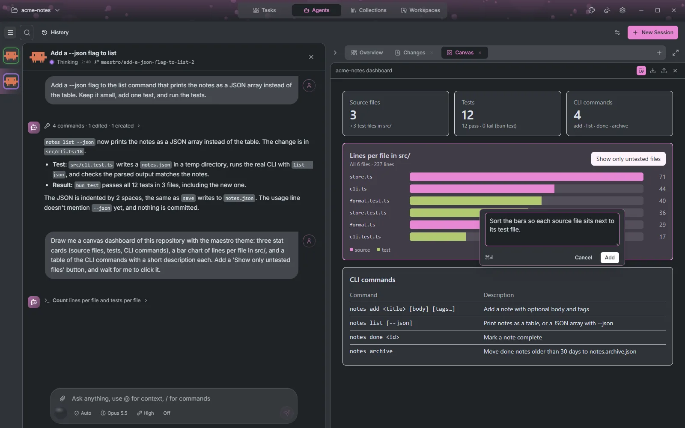
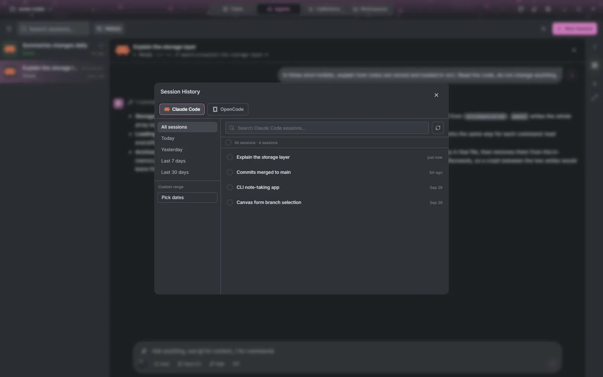

# Agents

The Agents tab (**Ctrl+2**) is where you work with agents. It lists every live session of the project: the ones tasks started, the ones automations started, and the ones you start yourself. Pick one on the left, and the right side shows its stream and a side panel of everything it produced.

## The session list

Each row shows the agent, the session's name and its status: Starting, Thinking, Calling tool, **Needs your input**, Ready, Done or Connection lost. A session a task started carries its role (Refiner, Planner, Coder or Reviewer); one an automation started carries its run number, such as `#3`. **Search sessions...** (**Ctrl+F**) filters by name, and the menu button collapses the list to a strip of icons to give the session more room.

Hover a row and press the **X**, or press **Ctrl+W**, to close a session. If the session made its own worktree and nothing was done in it, the worktree is removed; otherwise it is kept and Maestro says why.

## Starting a session

**New Session** (**Ctrl+N**) starts an agent, or a plain terminal, with no task attached. Pick:

- **Agent**: any agent installed on the connection, or **Terminal** for a shell. An agent that needs a missing tool is greyed out and says which.
- **Workspace** (git projects): **Create new worktree** on a new or existing branch, **Use the repository directory**, or **Reuse an existing workspace**.
- **Session name**: optional, generated when blank.

## Talking to the agent

The composer at the bottom is where you write. Type **@** to attach files from the workspace, and **/** for the commands the agent offers. Attach files with the paperclip or paste an image, when the agent accepts images. The row beneath it switches the agent's model, mode (**Shift+Tab** cycles it), effort and any other option the agent exposes, and a gauge shows how full its context is, with **Compact context** when it gets tight. While the agent works the send button becomes **Cancel**, and **Esc** does the same.

When the agent needs you, the composer is replaced by the question:

- **Permission requests** show the tool, the command and its details, with the agent's own allow and reject options.
- **Plans** come with **Reject** and an accept button that also sets how much the agent may do on its own afterwards, from approving every tool use to trusting the whole session.
- **Questions** (the agent asking you to choose or fill something in) show as a small form, one question at a time, with free text where you need it.

A question survives the window: close Maestro while the agent waits, and it is still there when you come back.

## The stream

The stream is the agent's side of the conversation. Tool calls are grouped into one line per run, such as "4 commands · 1 edited · 1 created", and expand to their output. Thinking blocks can be expanded, collapsed or hidden from **Display settings** (the sliders button), which also hides tool calls or compacts the stream.

Answers render more than text. Mermaid diagrams, SVG, images, KaTeX formulas and chemical structures from SMILES all draw inline and zoom on click, tables sort by any column, and a `file://` link opens the file in the side panel. So an answer can be a flowchart or a formula rather than a description of one.

Every message has **Create task from message**, which turns an answer, or the part of it you selected, into a task on the board.

## The side panel

The side panel sits beside the stream and holds everything the session produced, one tab each. Some tabs open on their own the moment the agent produces something (a plan, a first file change, a canvas, a terminal); **+** adds a terminal or a file browser. Drag the edge to resize it, collapse it to a strip of icons, or maximize it over the stream.

### Overview

A summary of the session in cards, each opening its tab: the plan's progress, the changes (files touched, lines added and removed, committed or not), the pull request on the branch with its CI checks, the canvas surfaces, the artifacts and the subagents.

The changes card also ships the work. **Commit and push** drafts the request to the agent in the composer, for you to send; **Open pull request** opens one on your forge once the branch is pushed. When the pull request's checks fail, **Send failing checks to the agent** drafts the fix request.

### Plan

The plan, when the agent wrote one. Select any passage to comment on it, and **Revise plan** sends every note back at once, each anchored to the text it is about. Accepting or rejecting the plan itself happens in the composer.

### Changes

Every change the session made, as a diff, unified or split, with a file list you can filter or show as a tree. Drag across lines to comment on them, comment on a whole file, and mark files as viewed as you go. **Send annotations** hands all the comments to the agent as one prompt, the same way a review works on the board.

### Files

The workspace as a tree, with an editor. Open any file, edit it, create or rename files and folders, show hidden files, and open a file in its default application. Images, PDFs, audio and video show in place, and Markdown can be edited side by side with its preview. If the agent writes to a file while you are editing it, Maestro asks before overwriting either version.

### Terminal

A shell in the workspace, as many as you want. The agent's own long-running commands open here as their own tabs too, and so does a sign-in prompt an agent needs you to type into.

### Artifacts and subagents

**Artifacts** collects the documents the agent wrote, such as reports, Markdown, JSON or HTML, with a zoomable preview and a button to open each one. **Subagents** lists the helper agents the session spawned, each with its prompt, tool calls, output and status.

## Canvas

A canvas is how an agent shows you something instead of describing it: a dashboard, a chart, a comparison table, a form, a mockup of the screen it is about to build. The agent writes it as a web page and Maestro draws it in the Canvas tab, in the app's own theme and accent colour, light or dark.

### What an agent can draw

Anything a web page can show. Tables, cards and layouts come ready-styled; charts can use any charting library from a CDN; and the agent can push new data into a canvas it already drew, so a table or chart updates in place without being redrawn. A session can hold several canvases, and the arrows in the tab's header page between them.

### A canvas you can use

A canvas is not a picture: its buttons, forms and inputs work, and they answer the agent. When the agent is waiting on a canvas, a click or a submitted form goes to it straight away, with every field you filled in, and it reacts: redraws the chart, runs the next step, asks the next question. A click while the agent is busy is kept and delivered when it is free. That makes a canvas a way to answer an agent with more than a sentence: pick options from a list, adjust values, approve rows one by one.

In the screenshot at the top of this page, the agent drew a **Show only untested files** button and waited. Clicking it sent the click back, and the agent filtered the chart and explained what it found.

### Pointing at things

**Annotate this canvas** (the icon in the tab's header) switches to annotation mode. Click an element to attach a note to it, or drag a rectangle to cover several; a rectangle also sends a screenshot of that region when the agent accepts images. Notes collect in a bar, across every canvas of the session, and **Send annotations** sends them together. The agent receives each note with the exact element it is about, so "make this one red" is unambiguous.

### Keeping and sharing canvases

Every canvas is saved as it is drawn, as a single `.html` file under `.maestro/canvases/` in the workspace, and a reopened session brings its canvases back. **Export as HTML** saves a copy anywhere, and it opens in any browser.

**Import a canvas** (or drop an `.html` file on the tab) brings one back into a session, yours or a colleague's. A canvas Maestro saved comes back live, with the agent listening to it. Any other HTML file can be shown as it is, or handed to the agent to rebuild as an interactive canvas.

### Safety

A canvas runs in a sandbox: it cannot reach Maestro, your files, or the rest of the app. It may load scripts, styles and images from the web, which is how charting libraries work, and it may only read data from the addresses the agent declared, which are listed beside its title. When something in a canvas fails to load or throws an error, Maestro shows it under the canvas and reports it to the agent on its next canvas call, so the agent can fix what it cannot see.

## Session history

**History** (**Ctrl+H**) browses an agent's past sessions, by date or by search, and reopens one where it left off. You can rename sessions there, and delete them when the agent supports it.

## Sessions outlive the window

Agents run in a background Maestro server on each connection, not inside the window. Close Maestro and a running session finishes its turn; reopen it and you pick the session up where it is, including any question the agent was waiting on. A session nobody is watching is closed a minute or two after its turn ends, and reopened from history when you need it.

## Agents that talk back

Every session gets Maestro's own tools. An agent can create and update tasks on your board, read and comment on the task it works on, manage automations, templates and prompts, and draw canvases. Running an automation always asks you first.
