# Collections

The Collections tab (**Ctrl+3**) holds what you reuse across sessions: **Automations** (with their templates), **Prompts**, **Skills** and **MCP servers**. The main button in the toolbar creates a new item of the section you are in.

## Automations

An automation is a prompt, an agent and a workspace that run without you starting them: on a schedule, when a webhook is called (a push, a failed build, an alert), or when you press **Run now**. They run in the background server, so a schedule fires even when no Maestro window has the project open.

### The dashboard

Each automation is a row with a switch that pauses or resumes its trigger. **Run now** always works, paused or not. The row shows the schedule and the next run, the agent, the model and the workspace, and while a run is going, **Join** to watch it, **Answer** when it is waiting on you, and **Stop**. Click the row to see its last runs; the count beside the chevron says how many there are. The **⋯** menu holds **Edit**, **Save as template** and **Delete**.

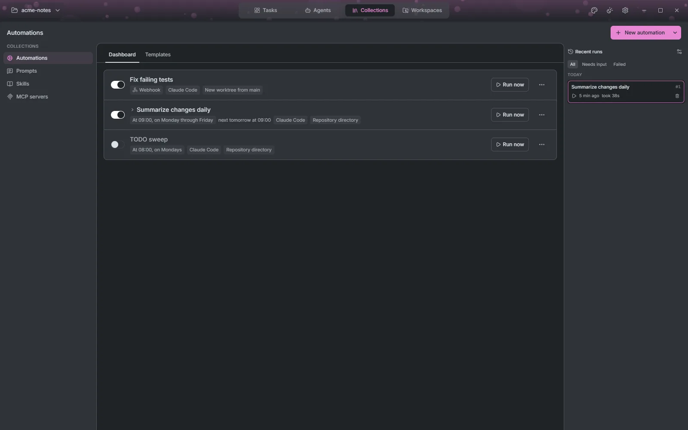

### Creating one

**New automation** opens the editor:

- **Name** and **Prompt**: what the agent should do, and what it should leave behind.
- **Trigger**, one of:
  - **None**: it only runs when you press Run now.
  - **Schedule**: a cron expression, with a plain-English summary, a menu of common schedules, and a preview of the next runs. For a remote connection, choose whether the time is read in this computer's zone or the remote machine's. Runs missed while the machine was off are skipped, not caught up.
  - **Webhook**: runs when a service calls its URL. See below.
- **Agent and workspace**: the agent, model, permission mode and effort, and where it works. With **Create new worktree**, each run gets its own worktree and branch. It is removed when the run ends with nothing to lose, and kept, with a note saying why, when there is.

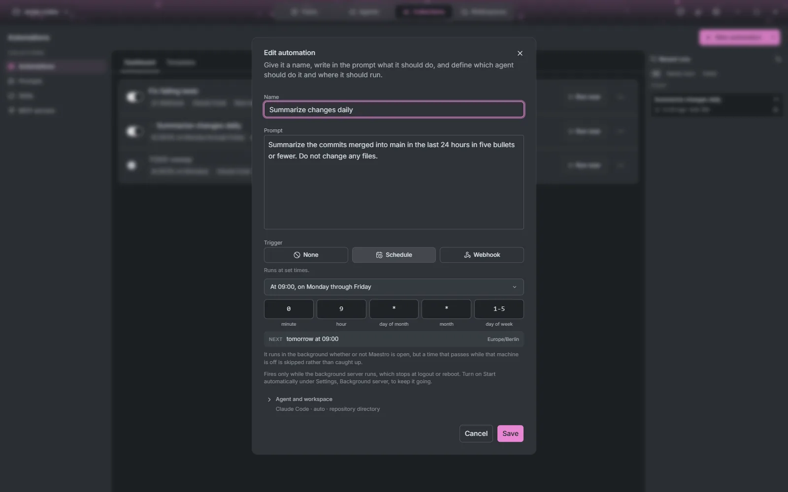

### Webhooks

After saving, a webhook automation shows its URL and a secret. The caller signs the body GitHub-style (`X-Hub-Signature-256`) or sends `Authorization: Bearer <secret>`, and the request body is added below the prompt. Choose what happens when a request arrives while a run is going: refuse it (the sender gets `409 Conflict`), queue it (up to 10 wait), or run it alongside.

The webhook listens on this machine only (`127.0.0.1:7433`) until you change it under [Settings, Webhooks](./settings#webhooks), where you can also set the public URL of a tunnel or reverse proxy. Maestro serves no TLS and runs no tunnel.

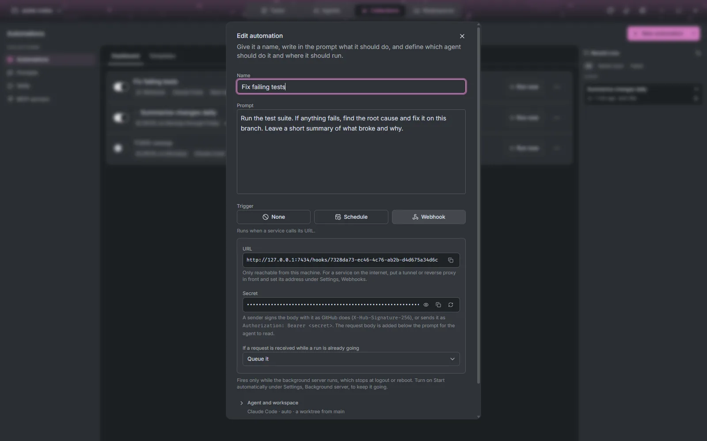

### Run history

**Recent runs** lists every run, filtered to **Needs input** or **Failed** when you want. Clicking a finished run shows what the agent reported, or why it failed, with **Open session** to pick the conversation up. Deleting a run removes its worktree and branch too.

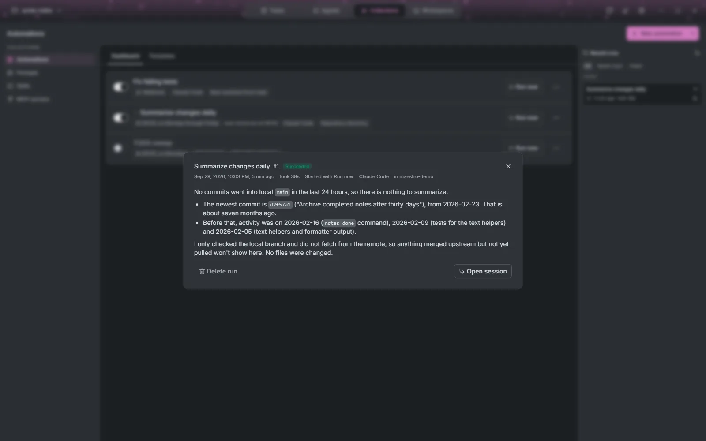

**Run history settings** decide what is kept: the last N runs of each automation, and anything newer than N days. Older runs are deleted with their worktrees. A run that is still going is never deleted.

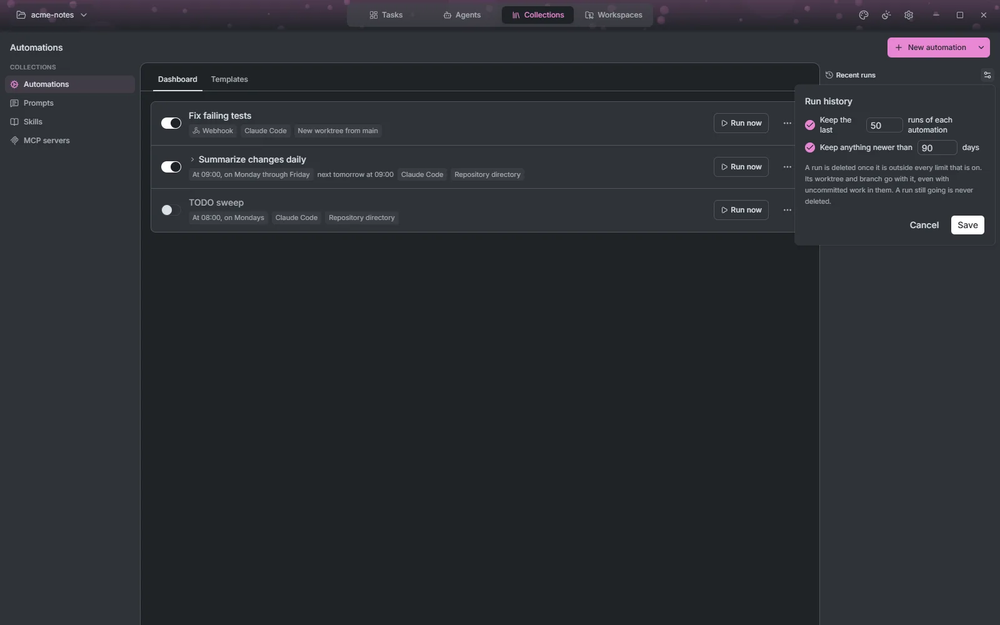

### Templates

The **Templates** tab starts an automation from a ready-made prompt. Twelve are built in, such as **Find critical bugs**, **Summarize changes daily**, **Scan for vulnerabilities**, **Review a pull request** and **Weekly changelog**. Save your own from any automation with **Save as template**. A template keeps the name, prompt and trigger; the agent and workspace are chosen each time, since they belong to the project.

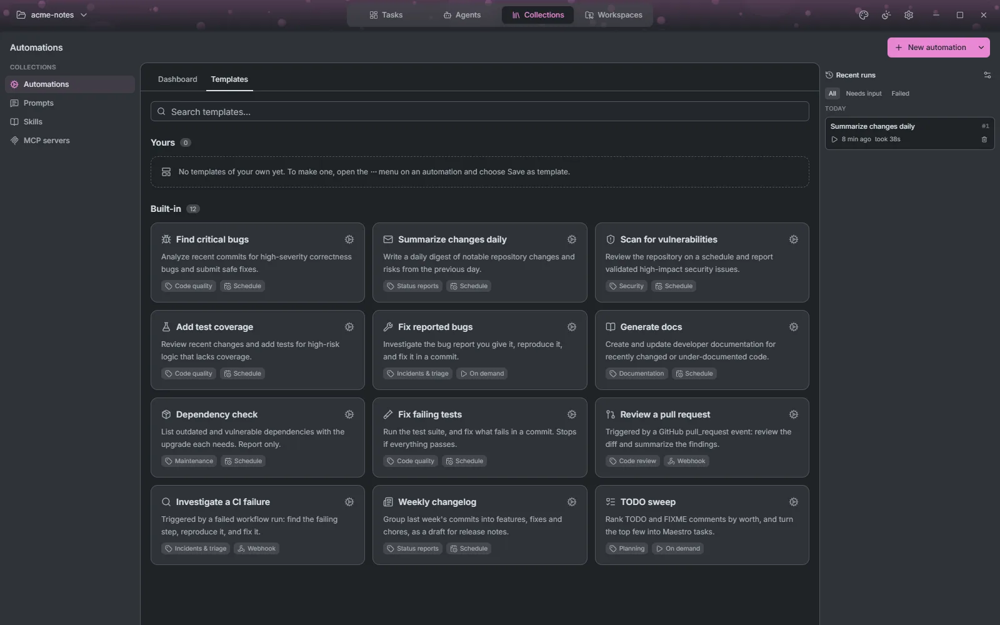

## Prompts

A prompt is text you hand to agents again and again. Click a card to copy it. Star it to keep it at the top, and share it to list it in every project rather than this one alone; deleting a shared prompt removes it everywhere. Filter by **Favorites**, **Shared**, **This project** or by tag.

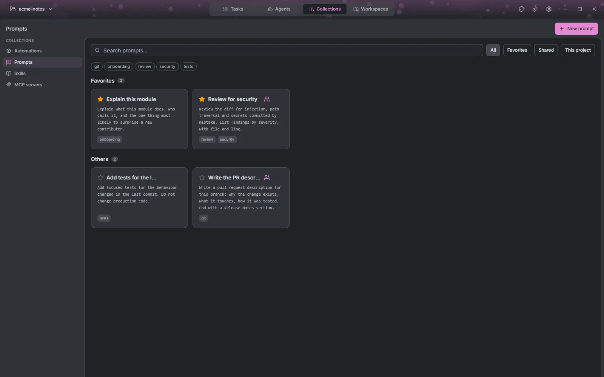

## Skills

Skills extend what an agent knows how to do. The **Installed** section lists the skills Maestro manages on this connection, **In this project** those already in the project's agent folders, and **Most installed** the [skills.sh](https://skills.sh) catalog, searchable from the same box.

**Install** asks which agents should get the skill: every agent, including ones installed later, or a chosen few. Click an installed skill's agent summary to change that. Several agents read the same `~/.agents/skills` folder, so turning a skill off for one can turn it off for its neighbours, and Maestro warns when it does.

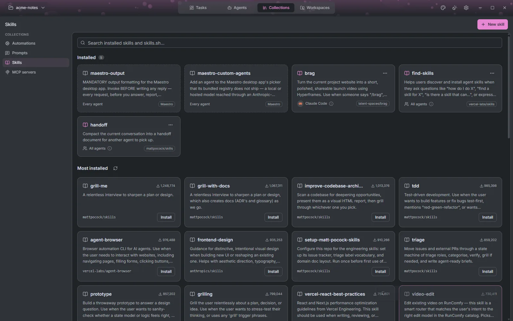

**New skill** writes your own, in a form or as raw `SKILL.md`: name, description, who can invoke it (the agent, you through its `/command`, or both), allowed tools and instructions.

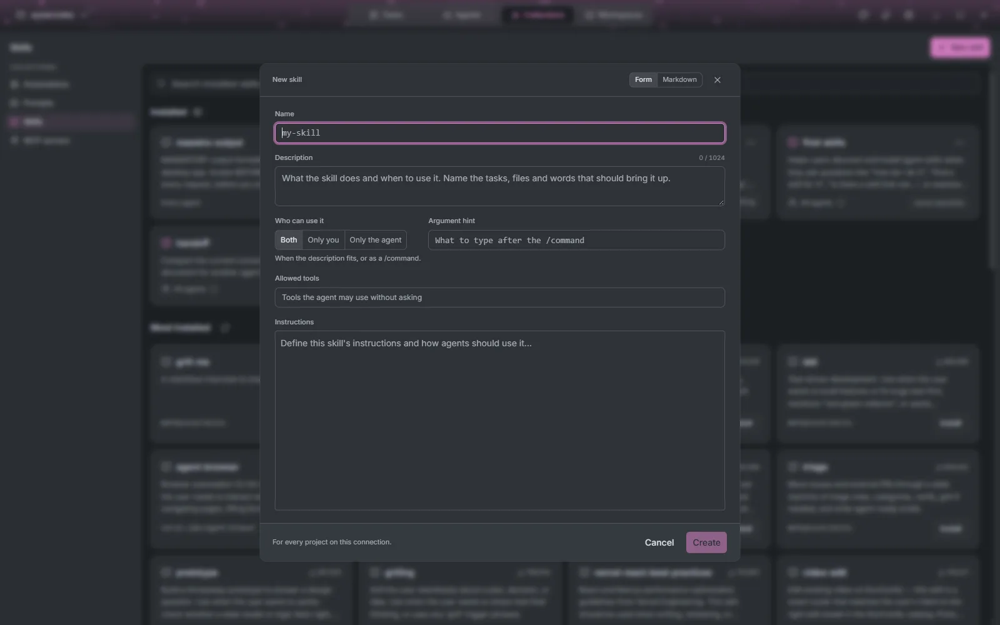

## MCP servers

MCP servers give agents extra tools. The **Installed** section always includes Maestro's own **maestro** server, which every session gets. The **Catalog** is the GitHub MCP Registry.

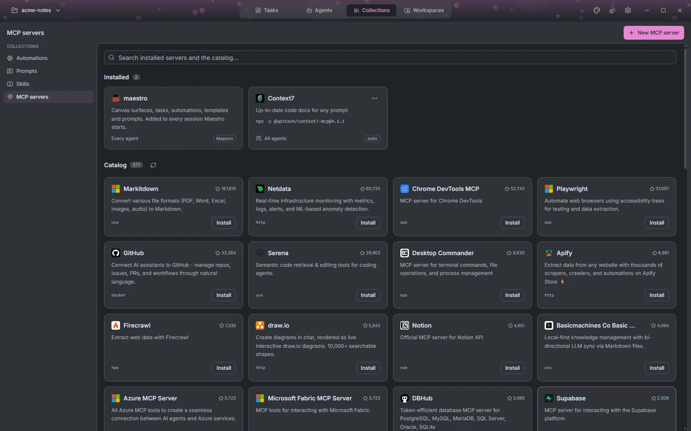

**Install**, or **New MCP server**, opens the editor, as a form or as JSON (you can paste an `mcpServers` block):

- **STDIO**: a command and its environment variables.
- **SSE** or **Streamable HTTP**: a URL and authentication, one of none, OAuth (with **Sign in**), a bearer token or custom headers. Tokens are kept in your keychain.

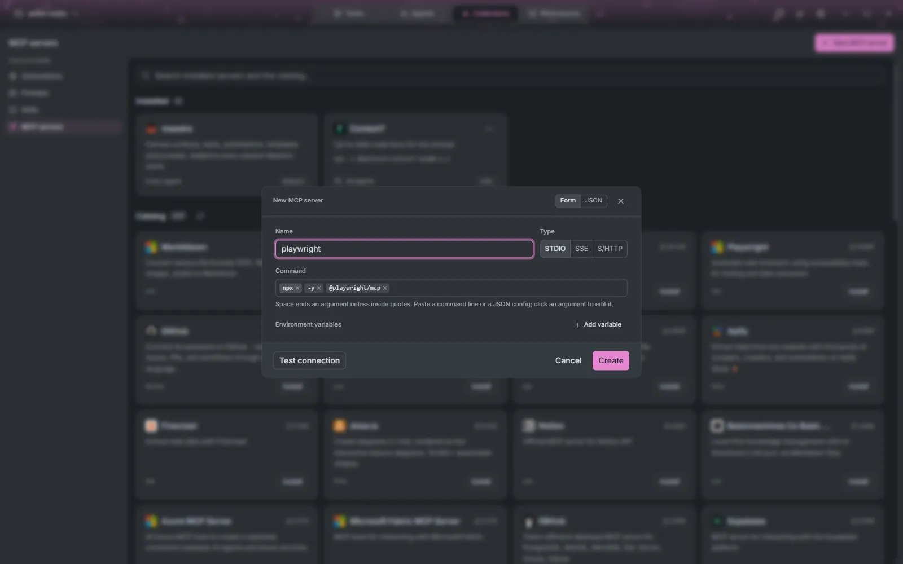

**Test connection** checks the server from the machine the agents run on. Like skills, each server goes to the agents you choose, and a server in the project's own `.mcp.json` is listed but left alone.
