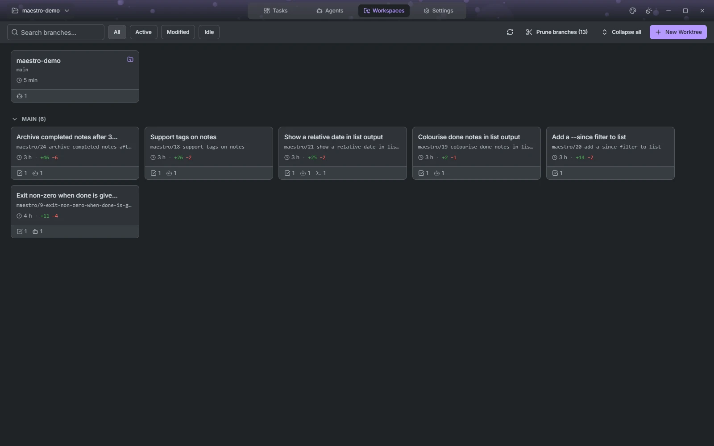
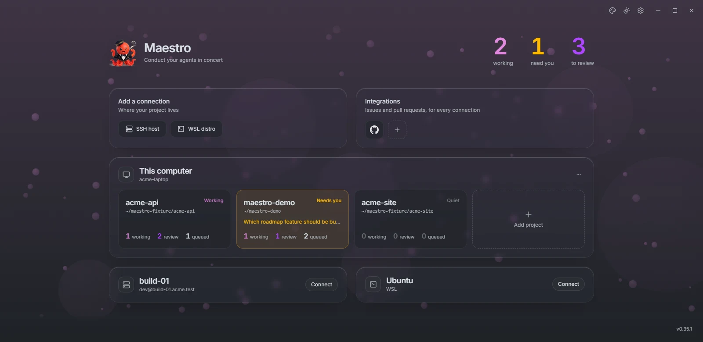
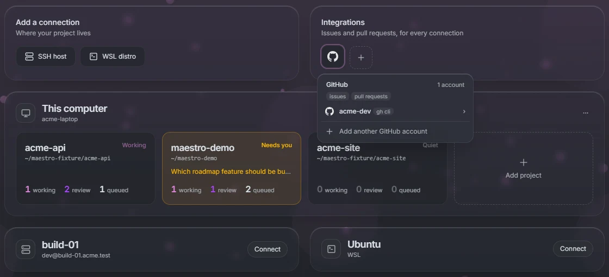
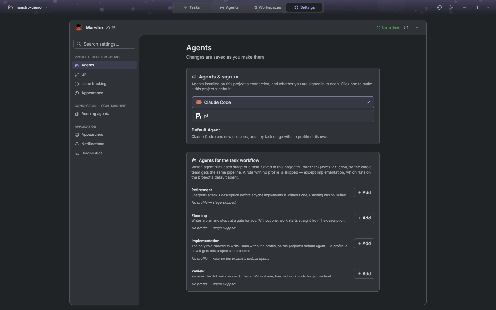

# Around the board

## Worktrees and pull requests

The Worktrees view lists every worktree of the project with what is using it, how far it is ahead of or behind its upstream, and the pull request on its branch. Push and pull are one click on those counts. You can start a session on any worktree card. Open pull requests are listed alongside, so you can start a session on any of them too, including one from a contributor's fork. Stale `maestro/` branches are pruned from here too.

## Automations

An automation is a prompt, an agent and a workspace that run without you starting them: on a schedule, when a webhook is called (a push, a failed build, an alert), or on demand. Start from a built-in template such as a daily summary, or write your own. Each run can get a fresh worktree, and its history keeps what the agent reported, so you can read the result or reopen the session later. Schedules fire even when no window has the project open.

## Collections

Collections gathers what you reuse across sessions:

- **Automations** and their **templates**.
- **Prompts**: text you hand to agents again and again, kept per project or shared with every project.
- **Skills**: install skills from [skills.sh](https://skills.sh) or write your own, and choose which agents get each one.
- **MCP servers**: add servers from the GitHub MCP Registry or by hand, choose which agents see them, and test the connection before a session needs it. Tokens stay in your keychain.

## Agents that talk back

Every session gets Maestro's own tools. An agent can create and update tasks on your board, read and comment on the task it works on, manage automations and prompts, and draw on the canvas. Running an automation always asks you first.

## Sessions outlive the window

Agents run in a background Maestro server on each connection, not inside the window. Close Maestro and a running session finishes its turn; reopen it and you pick the session up where it is, including any question the agent was waiting on. Several Maestro windows can be open on the same machine at once.

## Connections

| Connection | Where the agent runs                                          | Authentication                                   |
| ---------- | ------------------------------------------------------------- | ------------------------------------------------ |
| Local      | Your machine                                                  | —                                                |
| SSH        | A remote Linux host                                           | Key, key with passphrase, password, or SSH agent |
| WSL        | A distro on your Windows machine; stopped distros are started | —                                                |
| Container  | A running Docker, Podman or nerdctl container on your machine | —                                                |

Maestro deploys its own small server binary to the remote on first use, so the remote needs nothing but the agent. Connections are added from the start screen, before a project is chosen.

## Integrations

Issue tracking brings work in; code hosting sends it out. Each is configured per project.

| Provider     | Import issues | Open pull requests                          |
| ------------ | ------------- | ------------------------------------------- |
| GitHub       | ✓             | ✓                                           |
| GitLab       | ✓             | ✓                                           |
| Gitea        | ✓             | ✓                                           |
| Forgejo      | ✓             | ✓                                           |
| Azure DevOps | ✓             | ✓                                           |
| Bitbucket    | —             | ✓ (no CI status or pull-request search yet) |
| Jira Cloud   | ✓             | —                                           |
| Linear       | ✓             | —                                           |

Import is one way: an imported task carries its ticket key, but Maestro does not write status back to the tracker. Credentials are added once, on the start screen's Integrations tab, and every project can then pick a provider.

## Settings

Settings open before a project does, from the sidebar. Project pages cover git and code hosting, issue tracking, agent profiles and the project's own accent colour. App pages cover appearance (theme, scale, reduced motion, terminal colours, and whether to keep the system title bar), running-agent limits per connection, desktop notifications when an agent finishes, needs you or fails, and diagnostics with the log level and directory. Everything saves as you change it.

