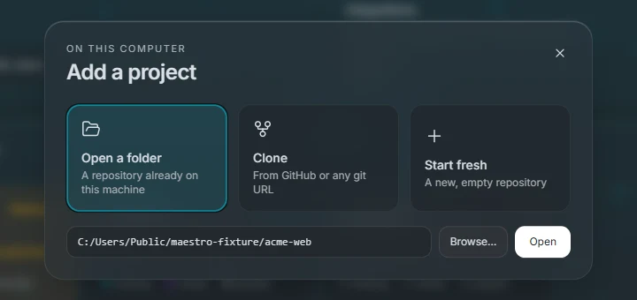
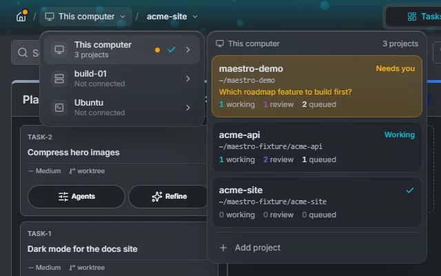

# Home

Maestro opens on Home, a board of every machine your agents run on and every project they work in. Projects keep running in the background server whether or not a window has them open, so Home shows their live state without opening any of them.

At the top, three counts add up every connected machine: agents **working**, things that **need you**, and tasks **to review**. The cog in the corner opens the application settings, and the version in the bottom right corner shows when an update is ready.

## Connections

A connection is the machine your agents run on. **This computer** is always there. **Add a connection** adds the others:

| Connection | Where the agent runs                                          | Authentication                   |
| ---------- | ------------------------------------------------------------- | -------------------------------- |
| Local      | Your machine                                                  | None                             |
| SSH host   | A remote Linux host, given as `user@host` or `user@host:port` | SSH agent, key file, or password |
| WSL distro | A distro on your Windows machine; stopped distros are started | None                             |
| Container  | A running Docker, Podman or nerdctl container on your machine | None                             |

Maestro deploys its own small server to the machine on first use, so the machine needs nothing but the agent. Connecting shows each step in place: reaching the machine, installing the Maestro server, starting it, and reading its projects. When a tool the agents need is missing you can point Maestro at it with an absolute path, or skip it.

Each connection is a panel. Home connects to This computer on its own; every other connection waits for you to press **Connect**. A password is asked for inside the panel, with **Remember in the system keychain**. Once connected, a connection stays connected until you close Maestro.

Hover an SSH connection's name and press the pencil to rename it. Click a connected panel's background to minimize it to one line of project chips, and click again to expand it.

### The connection menu

The **⋯** button on a connected panel holds:

- **Settings**: the [connection's settings](./settings#connection), without opening a project.
- **Change sign-in** (SSH): switch between SSH agent, key file and password.
- **Restart server** and **Stop server**: the background server that runs agents, tasks and automations. Both confirm first and list what they affect: agents stopped mid-task, task pipelines paused, scheduled automations skipped, other windows losing their projects. A stopped server starts again the next time you open a project on it, or from **Start server** in the same menu.
- **Remove connection**: forgets the connection. Its projects and their boards stay on the machine, and adding the connection again brings them back.

A connection that stops answering is marked **Unreachable**, with **Try again** in its menu. Its projects keep their state and come back when it does.

## Projects

A connected panel shows one tile per project. Each tile has:

- the name and path;
- a status: **Working** while an agent runs, **Needs you** when one waits on a permission or a question, **Idle** with open tasks but no agent, **Quiet** with nothing open. A tile that needs you is tinted amber;
- one line of context: what the agent is waiting on, a running automation, or who has the project open;
- how many tasks are working, in review and queued.

Click a tile to open the project. Hover it and press **✕** to remove it from Home; the board stays on the server, a toast offers **Undo**, and opening the folder again brings the tile back.

The **Add project** tile at the end of each panel offers three ways in:

- **Open a folder**: a folder already on that machine.
- **Clone**: from a connected provider or any git URL.
- **Start fresh**: a new, empty repository.

A folder that is not a git repository can be initialised on the spot, or opened without git.

### Moving between projects

Inside a project, the left of the header reads **Home / connection / project**.

- The house goes back to Home and releases the project. An amber dot on it means another project needs you, and its tooltip says which.
- The connection's name opens a menu of every connection, each with its projects beside it. A connection that is not connected yet can be connected from there.
- The project's name opens a menu of this connection's projects, and **Add project**.

Opening a project from these menus switches the window in place and releases the one you were on.

### A project open elsewhere

A project is open in one Maestro window at a time. A project another window holds shows a lock and says where it is open. Clicking it offers **Request takeover**: the other window is asked, and gives the project up when its user agrees or does not answer within ten seconds, counted down on the button. The agent sessions keep running either way.

## Integrations

Integrations connect Maestro to issue trackers and code hosts. You add credentials once, on Home, and every project on every connection can then use them.

| Provider     | Import issues | Open pull requests                          |
| ------------ | ------------- | ------------------------------------------- |
| GitHub       | ✓             | ✓                                           |
| GitLab       | ✓             | ✓                                           |
| Gitea        | ✓             | ✓                                           |
| Forgejo      | ✓             | ✓                                           |
| Azure DevOps | ✓             | ✓                                           |
| Bitbucket    |               | ✓ (no CI status or pull-request search yet) |
| Jira Cloud   | ✓             |                                             |
| Linear       | ✓             |                                             |

The **Integrations** panel shows one tile per provider, with a count when you have several accounts on it. Hover a tile, or click it to keep it open, to see its accounts; click an account for its details, **Edit credentials** and **Disconnect**. An account the `gh` CLI provides is managed there instead. **+** adds an integration, and **Add another account** adds one more of the same provider.

Import is one way: an issue becomes a task, but Maestro does not write status back to the tracker. Each project picks its provider under [Settings, Issue tracking](./settings#issue-tracking) and [Git](./settings#git). Tokens are kept in your operating system's keychain.
