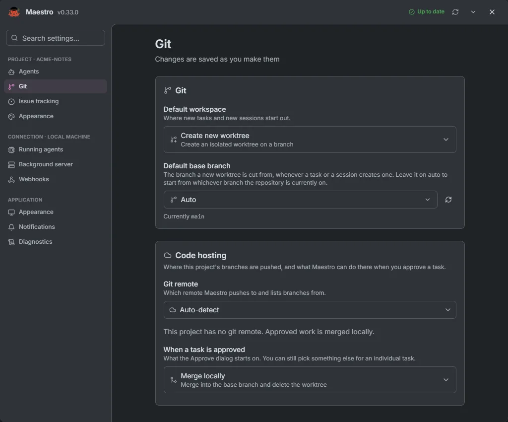
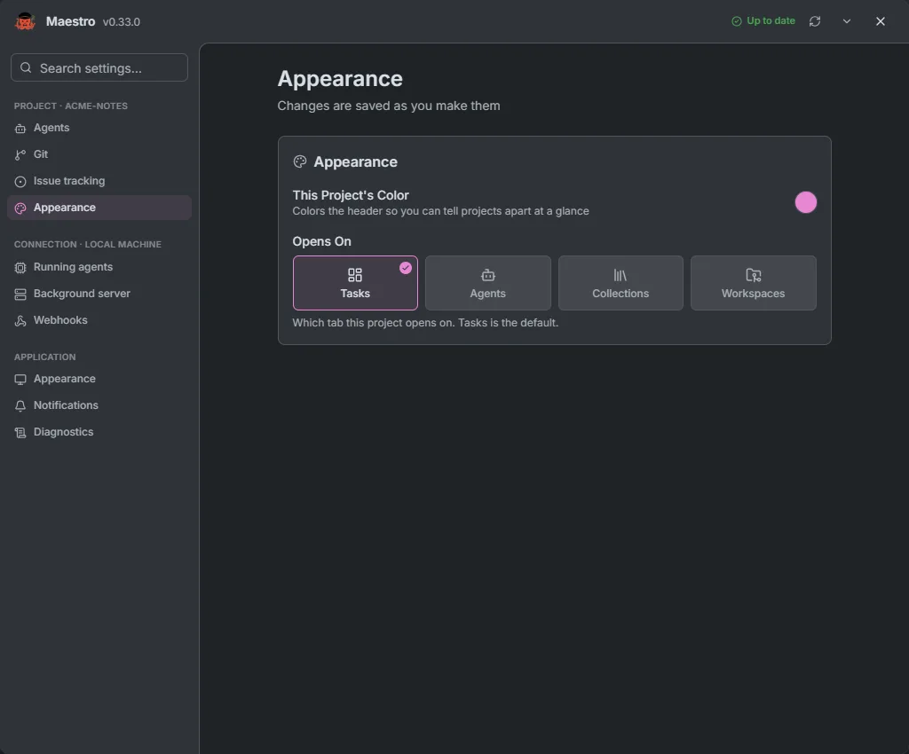
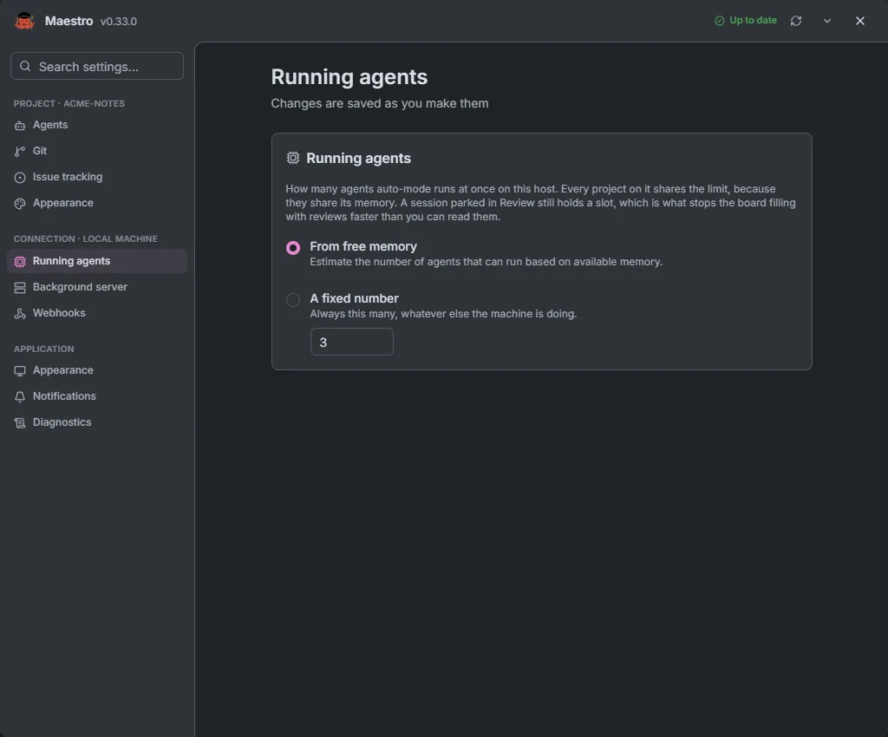
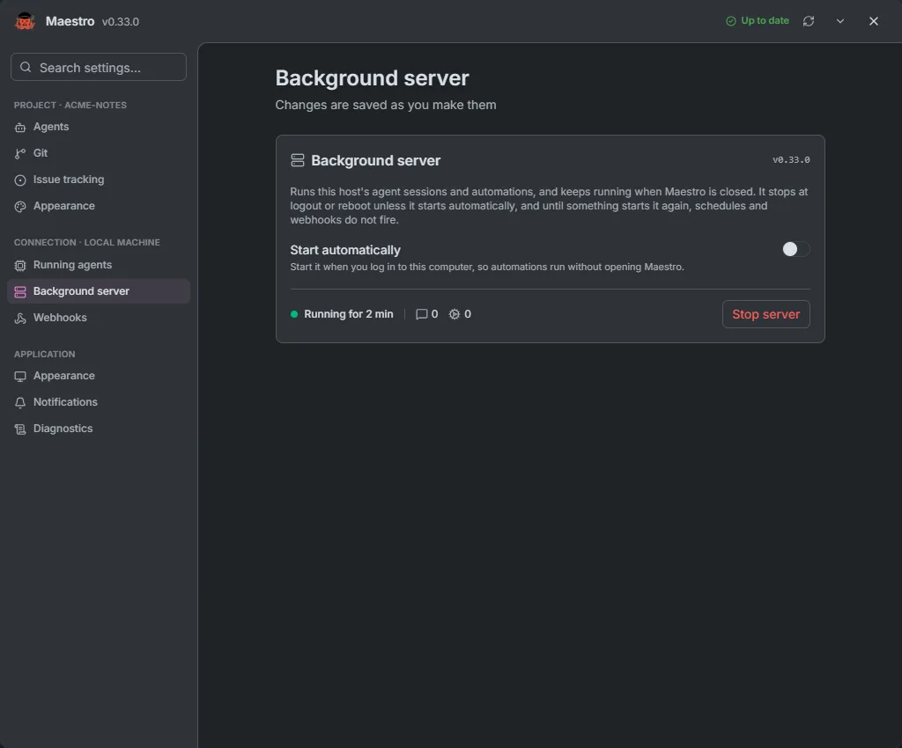
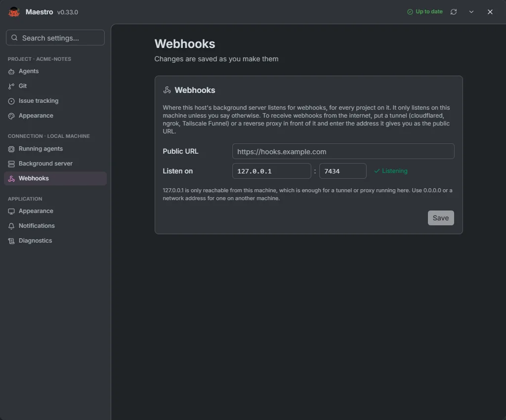
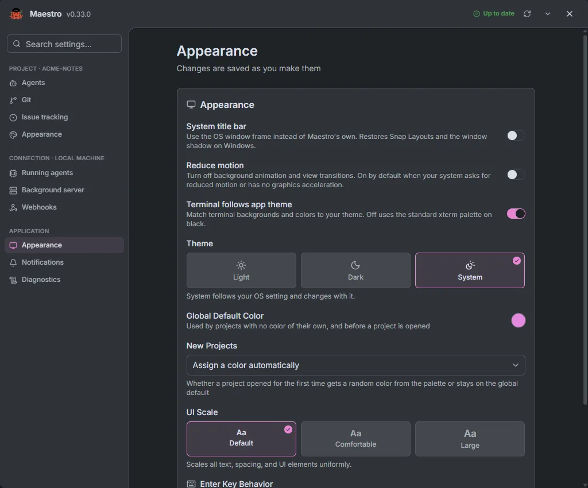
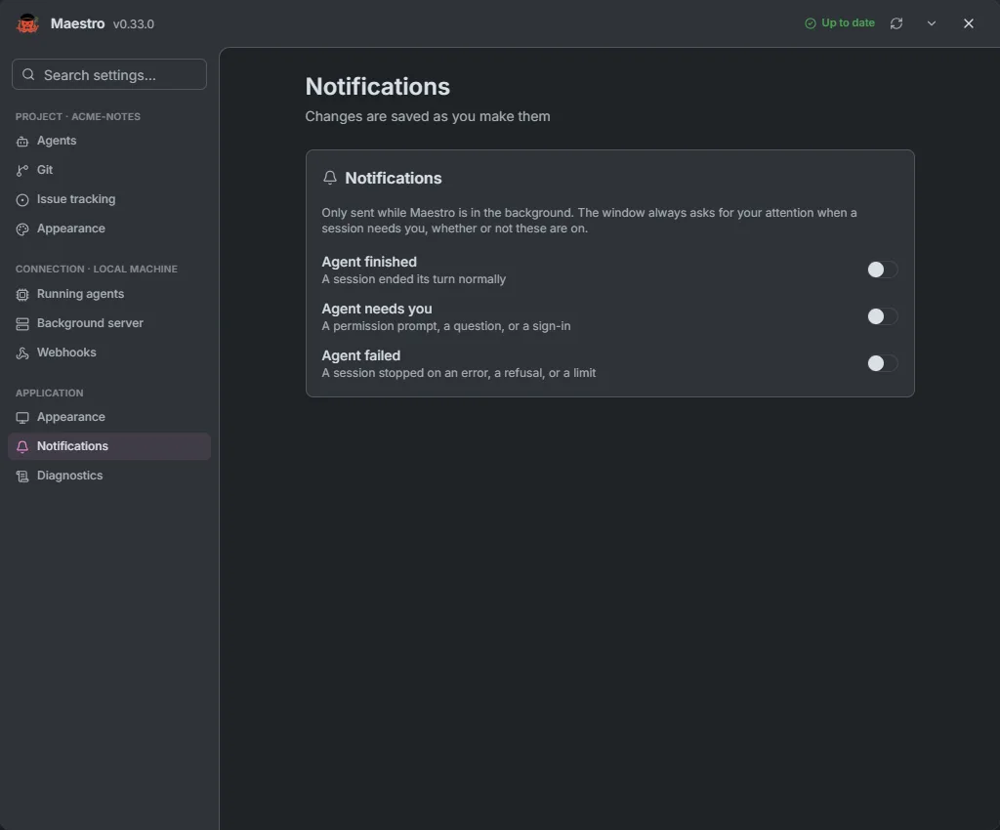
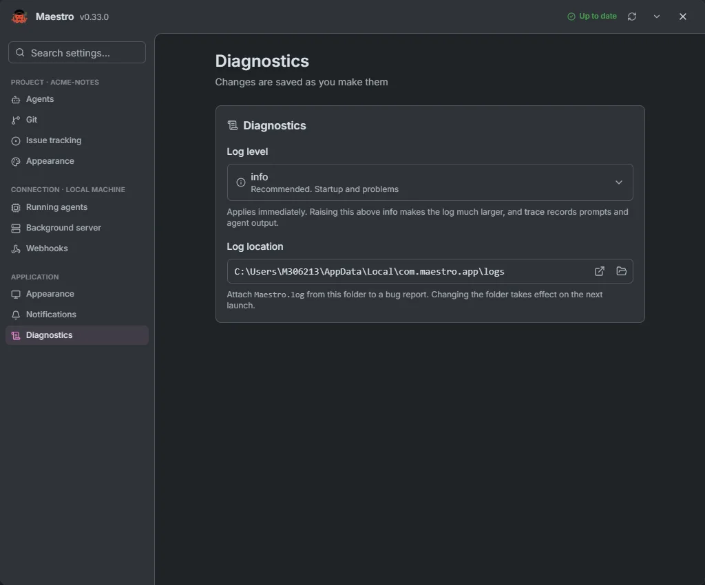

# Settings

Settings open as a dialog over any tab, from the cog in the header or with **Ctrl+,**. **Search settings…** finds a control by name. Everything saves as you change it.

The top strip shows the version, **Check for updates**, and **Install** when an update is ready (installing stops running agent sessions). Its menu turns **Auto-update** on or off.

Pages come in three groups. **Project** pages appear only with a project open. On [Home](./home), the cog opens the **Application** pages, and **Settings** in a connection's **⋯** menu opens that connection's pages too.

## Project

### Agents

**Agents & sign-in** lists the agents installed on the project's connection. Click one to make it the project's default, which runs new sessions and any task stage with no profile of its own. **Logout** signs you out of an agent.

**Agents for the task workflow** sets up the [pipeline](./tasks): one block per stage, **Refinement**, **Planning**, **Implementation** and **Review**. **Add** creates a profile for a stage, with its own agent, model, permission mode, effort and instructions for the role. A stage with no profile is skipped, except Implementation, which falls back to the default agent. Profiles are saved in `.maestro/profiles.json`, so a team sharing the repository shares the pipeline.

### Git

- **Default workspace**: where new tasks and new sessions start out.
- **Default base branch**: **Auto** uses the branch the repository is on.
- **Git remote**: the remote Maestro pushes to and lists branches from, with the code host's status and **Connect** when an [integration](./home#integrations) is missing.
- **When a task is approved**: the default choice in the Approve dialog, one of **Merge locally**, **Open a pull request** or **Push only**.

### Issue tracking

Pick the connected provider to import issues from, with its project fields, such as the repository for GitHub or the team for Linear. When the git remote points at a provider you have not connected, Maestro offers to connect it. **Remove** clears the setup.

### Appearance

The project's own header colour, and the tab it **Opens On**: Tasks, Agents, Collections or Workspaces.

## Connection

These pages apply to the machine the project lives on, and to every project on it.

### Running agents

How many agents Auto mode runs at once on this machine: estimated **From free memory**, or **A fixed number** from 0 to 64.

### Background server

The server that runs agent sessions and automations, and keeps running after Maestro closes. **Start automatically** starts it at login (on a Linux host, at boot through systemd or cron), so schedules keep firing after a restart without opening Maestro. The page counts live sessions and automation runs. **Stop server** ends them all and takes you back to [Home](./home) at once, where the connection reads **Server stopped** when the stop is done. Home's connection menu can also start, stop and restart the server.

### Webhooks

Where [webhook automations](./collections#webhooks) listen: the address and port (default `127.0.0.1:7433`), and the **Public URL** of a tunnel or reverse proxy that webhook URLs are built from. Maestro warns before you bind to an address other machines can reach.

## Application

### Appearance

Theme (Light, Dark or System), the global accent colour and whether new projects get one of their own, UI scale (100%, 115% or 130%), reduced motion, whether the terminal follows the app theme, the system title bar (not on macOS), and whether **Enter** sends a message or adds a new line.

### Notifications

Desktop notifications when an agent finishes, needs you, or fails. They are only sent while Maestro is in the background.

### Diagnostics

The log level, from **error** to **trace**, and where the log is written: open the folder, change it, or reset it. A new folder takes effect at the next launch. Leave the level at **info** unless you are chasing a problem: **trace** records prompts and agent output.

