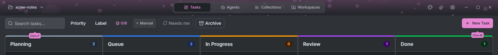

# Keyboard shortcuts

Hold **Ctrl** for about a second to see the shortcuts drawn over the buttons they trigger.

| Where                     | Keys            | Action                                 |
| ------------------------- | --------------- | -------------------------------------- |
| Anywhere                  | Ctrl+1, 2, 3, 4 | Tasks, Agents, Collections, Workspaces |
| Anywhere                  | Ctrl+,          | Settings                               |
| Tasks, Agents, Workspaces | Ctrl+F          | Search                                 |
| Tasks                     | Ctrl+N          | New task                               |
| Task detail               | Ctrl+S          | Save                                   |
| Task detail               | Ctrl+D          | Delete                                 |
| Task detail               | Esc             | Back to the board                      |
| Agents                    | Ctrl+N          | New session                            |
| Agents                    | Ctrl+W          | Close the selected session             |
| Agents                    | Ctrl+H          | Session history                        |
| Workspaces                | Ctrl+N          | New worktree                           |
| Workspaces                | Ctrl+R          | Refresh                                |
