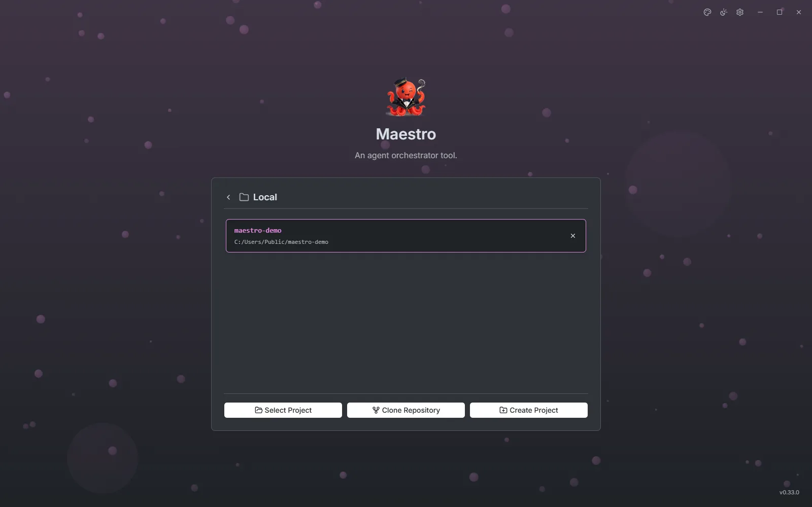

# Start screen

Maestro opens on the start screen. It has two tabs, **Connections** and **Integrations**, and its Settings cog shows only the application pages, since no project is open yet. The version badge in the bottom right corner shows when an update is ready.

## Connections

A connection is the machine your agents run on. **Local** is always there. **Add connection** adds the others:

| Connection | Where the agent runs                                          | Authentication                                   |
| ---------- | ------------------------------------------------------------- | ------------------------------------------------ |
| Local      | Your machine                                                  | None                                             |
| SSH        | A remote Linux host, given as `user@host` or `user@host:port` | Key, key with passphrase, password, or SSH agent |
| WSL        | A distro on your Windows machine; stopped distros are started | None                                             |
| Container  | A running Docker, Podman or nerdctl container on your machine | None                                             |

Maestro deploys its own small server to the machine on first use, so the machine needs nothing but the agent. Opening a connection runs a quick check for the tools agents need. When one is missing you can point Maestro at it with an absolute path, or skip it.

## Projects

Choosing a connection lists its recent projects. From there:

- **Select Project** opens a folder on that machine.
- **Clone Repository** clones from a Git URL or from a connected provider.
- **Create Project** makes a new folder.

A folder that is not a git repository can be initialised on the spot, or opened without git. Hover a recent project and press **Del** to remove it from the list. Click the connection's name to rename it, and use its menu to forget a saved password or remove it.

### A project open elsewhere

A project is open in one Maestro window at a time. A project held by another window is dimmed with a lock and says which machine holds it. Clicking it offers **Request takeover**: the other window is asked, and gives the project up when its user agrees or does not answer within ten seconds. The agent sessions keep running either way.

## Integrations

Integrations connect Maestro to issue trackers and code hosts. You add credentials once, here, and every project can then use them.

| Provider     | Import issues | Open pull requests                          |
| ------------ | ------------- | ------------------------------------------- |
| GitHub       | ✓             | ✓                                           |
| GitLab       | ✓             | ✓                                           |
| Gitea        | ✓             | ✓                                           |
| Forgejo      | ✓             | ✓                                           |
| Azure DevOps | ✓             | ✓                                           |
| Bitbucket    |               | ✓ (no CI status or pull-request search yet) |
| Jira Cloud   | ✓             |                                             |
| Linear       | ✓             |                                             |

Import is one way: an issue becomes a task, but Maestro does not write status back to the tracker. Each project picks its provider under [Settings, Issue tracking](./settings#issue-tracking) and [Git](./settings#git). Tokens are kept in your operating system's keychain.

