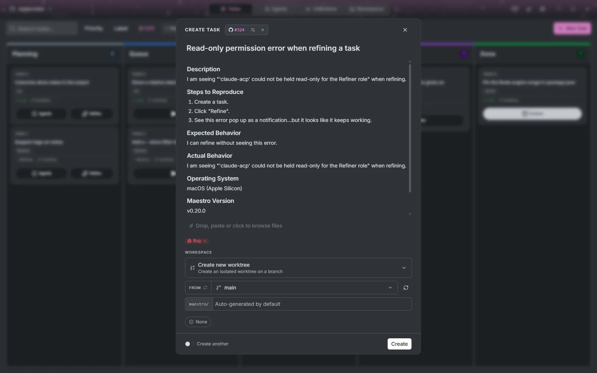
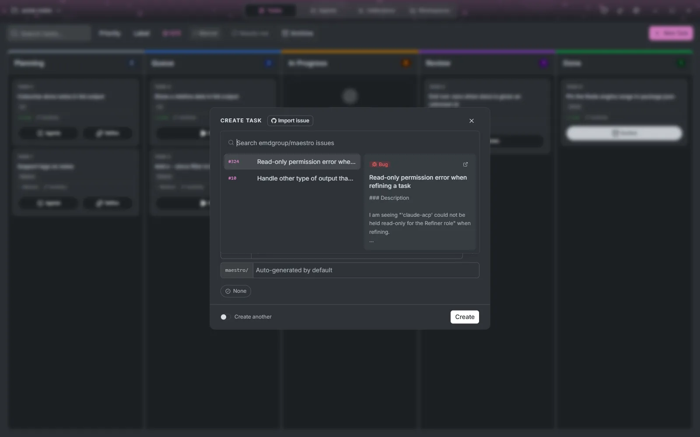

# Tasks

The Tasks tab (**Ctrl+1**) is the Kanban board. Every task crosses it from left to right, and each stage can be handed to a different agent.

## The board

The toolbar above the columns:

- **Search tasks...** (**Ctrl+F**) filters by title, and **Priority** and **Label** filter by those.
- The agent slots badge, such as `2/4`, shows how many agents are running against how many the connection allows. A session waiting in Review still holds its slot.
- **Manual** or **Auto** decides whether tasks in Queue start on their own.
- **Needs me** shows only the tasks waiting on you.
- **Archive** lists finished and cancelled tasks, searchable, and reopens any of them.
- **New Task** (**Ctrl+N**).

## Creating a task

**New Task** opens the task dialog. A task is a title and a description, and everything else has a default:

- **Description**: Markdown, with a small toolbar, rendered when you are not editing it.
- **Attachments**: drop files on the dialog, paste an image, or browse. They are handed to the agent with the task.
- **Workspace** (git projects): where the agent will work. **Create new worktree** gives the task a branch of its own, cut from the base branch you pick; you can also check out an existing branch, **Use the repository directory**, or **Reuse an existing workspace** another task left behind.
- **Priority**: None, Low, Medium, High or Urgent.

Turn on **Create another** to keep the dialog open for the next one.

### From your issue tracker

When the project has issue tracking set up (see [Settings, Issue tracking](./settings#issue-tracking)), the dialog header carries an **Import issue** button with the tracker's logo. It opens a searchable list of the project's open issues, with a preview of the one under the cursor and a link to open it in the browser.

Picking an issue fills the dialog: its title and body become the task's, its type becomes a label, and its priority carries over when it matches one of Maestro's. You can still edit everything before pressing **Create**. **Choose another issue** swaps it, and removing the issue clears what it filled in. Import works with GitHub, GitLab, Gitea, Forgejo, Azure DevOps and Jira Cloud.

An agent's answer can become a task too: every message in a session has **Create task from message**, which takes the first line as the title and the rest as the description. Select part of the message first to use only that.

### Refining a thin description

**Refine** on a Planning card asks a read-only Refiner agent to read the repository and propose a better description. **Read proposal** shows it when it is ready, and **Use this description** replaces yours; nothing changes until you accept. It needs a Refinement profile under [Settings, Agents](./settings#agents).

## How a task moves

Every task crosses the board left to right: **Planning → Queue → In progress → Review → Done**. Each stage can have its own agent, model and permissions, configured once per project as an _agent profile_ (Settings → Agents). Stages without a profile are skipped, and any task can skip Planning or Review individually from its **Agents** button.

### Planning

Nothing runs until you move the card. Refine it, edit it, or pick its agents here.

### Queue

Drag a card to Queue and Maestro starts it as soon as there is room. **Auto** starts everything eligible; **Manual** starts only tasks you start yourself with **Execute**. Room is measured per connection, either from free memory or as a fixed number of agents.

### In progress

If the project has a Planner profile, the Planner runs first, read-only, and stops at the plan gate. You can annotate the plan passage by passage, send the notes back for another round with **Refine plan**, or **Start implementing**. Approving starts a fresh Coder session with the plan text.

The Coder gets the workspace the task asked for. Two tasks running at once are two worktrees, so neither sees the other's edits.

The running card has **Join**, which opens the session in the [Agents tab](./agents): the live stream, the side panel with its diff, files, terminals and canvas, and every question the agent asks. **Abandon** tears the session down, deletes the worktree and its branch, and puts the task back in Planning as if it had never run.

### Review

When the Coder's turn ends with changes, the task moves to Review. If the project has a Reviewer profile, that agent goes first: read-only, with your project's review instructions, and it may send the work back to the Coder for rework up to three times without you.

Then it is your turn. The diff opens unified or split, expands context from any hunk header, and takes comments on a line or a range of lines. **Rework** sends those comments back to the Coder as one prompt. **Approve** asks how the work should land. The push and pull-request choices appear once the project has a remote:

| Choice                     | Result                                                                   |
| -------------------------- | ------------------------------------------------------------------------ |
| Commit + Merge             | Merged into the base branch, worktree removed, task Done                 |
| Commit only                | Committed on its branch, task Done                                       |
| Commit + Push              | Pushed to the remote unmerged, task Done                                 |
| Commit + Open pull request | Pushed and opened on the forge; the task stays in Review until it merges |

A reviewer that can write is not a reviewer, so every role except the Coder runs under a permission mode that refuses writes. That is enforced by the agent's session mode, not by a prompt asking nicely.

### Done

A task is Done with a record of how: merged, merged through a pull request, committed locally, or finished with no changes.

## The task screen

Click a card to open it. **Details** edits the title, description, attachments, labels, workspace and priority while the task has not started. **Outcome** is the task's thread: each agent's closing message when its phase ends (the proposal, the plan, the review verdict, the outcome), and notes you add yourself. Agents can read and comment on this thread too.

**Cancel task** moves it to the archive and keeps its worktree and branch. **Delete task** (**Ctrl+D**) removes it.
