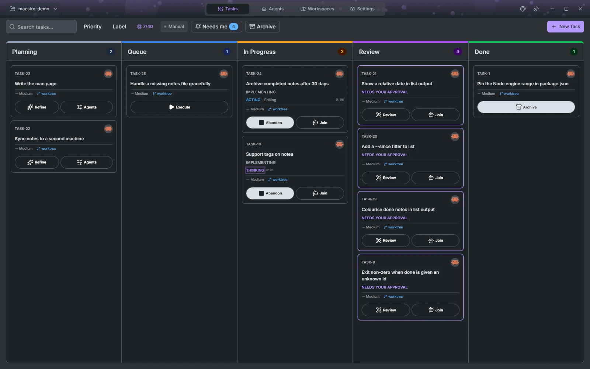
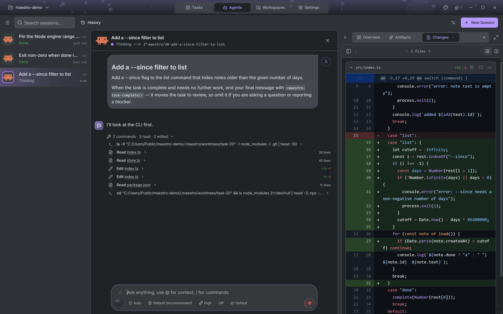
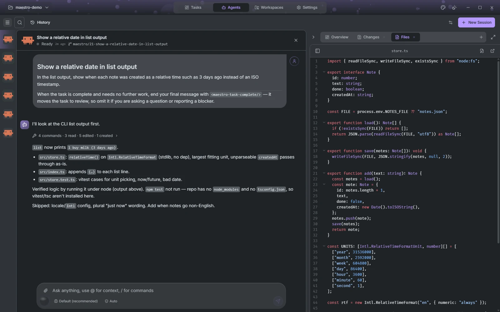
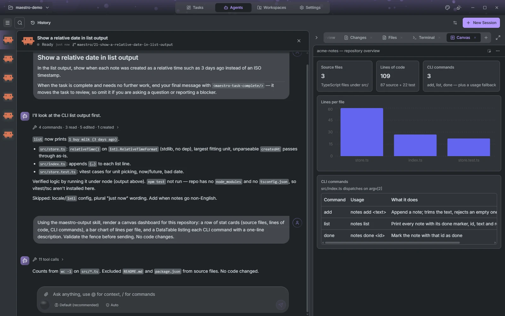
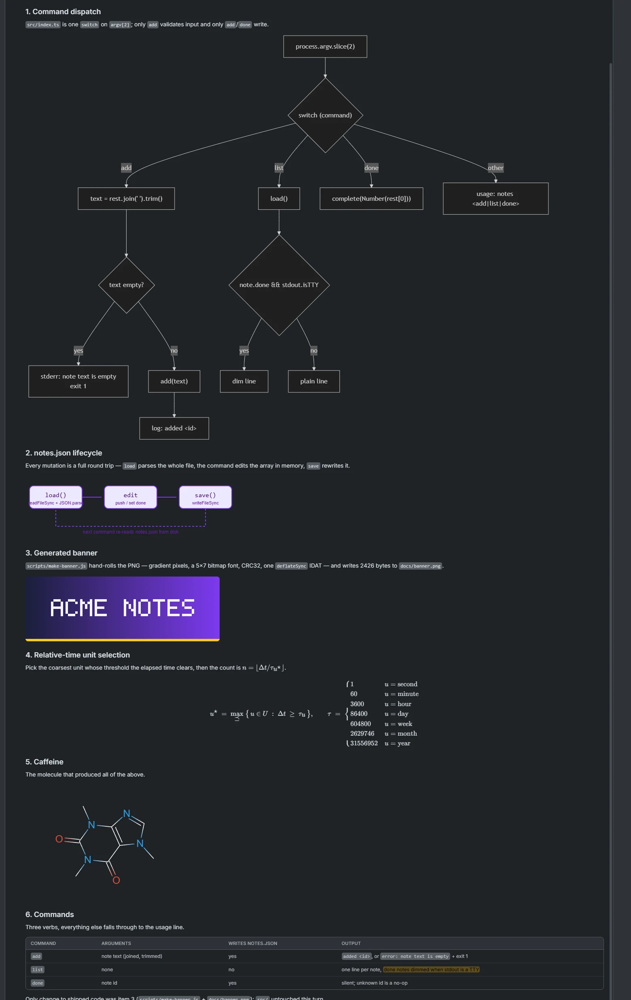
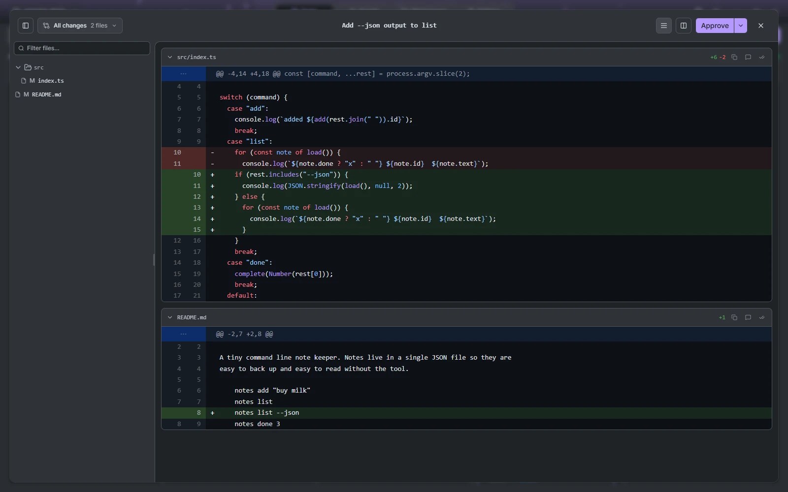

# How a task moves

Every task crosses the board left to right: **Planning → Queue → In progress → Review → Done**. Each stage can have its own agent, model and permissions, configured once per project as an _agent profile_ (Settings → Agents). Stages without a profile are skipped, and any task can skip Planning or Review individually from its **Agents** button.

## Planning

A new task is a title and a description. Pull one in from your issue tracker, or write it by hand. If the description is thin, press **Refine**: a read-only Refiner agent reads the repository and proposes a better one, which you accept or discard. Nothing runs until you move the card.

## Queue

Drag a card to Queue and Maestro starts it as soon as there is room. **Auto** starts everything eligible; **Manual** starts only tasks you deferred yourself. Room is measured per connection, either from free memory or as a fixed number of agents, and a session parked in Review still holds its slot until you deal with it.

## In progress

If the project has a Planner profile, the Planner runs first, read-only, and stops at the plan gate. You can annotate the plan passage by passage, send the notes back for another round, or start implementing. Approving starts a fresh Coder session with the plan text.

The Coder gets a workspace of its own. The default is a new worktree on a new branch; you can instead point a task at the repository directory or reuse a worktree another task left behind. Two tasks running at once are two worktrees, so neither sees the other's edits.

While it runs you see the full session: every tool call, permission prompt and question in the stream, and a side panel beside it.

The side panel is a tab strip. Some tabs open themselves when the agent produces something, the rest you add:

- **Overview** and **Plan**: what the task is, and the plan when a Planner wrote one, with passage-level annotations.
- **Changes**: the diff so far, updating as the agent edits.
- **Files**: the workspace tree with an editor. Change a file yourself, create one, show hidden files, open it in your OS or download it.
- **Terminal**: a shell in the workspace, as many as you want.
- **Subagents** and **Artifacts**: nested agents the main one spawned, and files it handed back.
- **Canvas**: see below.

The canvas is where an agent shows work instead of describing it. A surface is an HTML document the agent writes, rendered in a sandboxed frame with Maestro's own theme — tables, charts, dashboards and real UI controls, in your colours. Click an element or drag a rectangle over it to attach a note, and the note goes back to the agent anchored to what you pointed at. Saved canvases are plain `.html` files that open in any browser.

The stream itself renders more than text. Mermaid diagrams, SVG, images, KaTeX and chemical structures all draw inline, so an answer can be a flowchart or a formula rather than a description of one.

**Abandon** on a running card tears down the session, deletes the worktree and its branch, and puts the task back in Planning as if it had never run.

## Review

When the Coder's turn ends with changes, the task moves to Review. If the project has a Reviewer profile, that agent goes first: read-only, with your project's review instructions, and it may send the work back to the Coder for rework up to three times without you.

Then it is your turn. The diff opens unified or split, expands context from any hunk header, and takes comments on a line or a range of lines. **Rework** sends those comments back to the Coder as one prompt. **Approve** asks how the work should land. The push and pull-request choices appear once the project has a remote:

| Choice                     | Result                                                                   |
| -------------------------- | ------------------------------------------------------------------------ |
| Commit + Merge             | Merged into the base branch, worktree removed, task Done                 |
| Commit only                | Committed on its branch, task Done                                       |
| Commit + Push              | Pushed to the remote unmerged, task Done                                 |
| Commit + Open pull request | Pushed and opened on the forge; the task stays in Review until it merges |

A reviewer that can write is not a reviewer, so every role except the Coder runs under a permission mode that refuses writes. That is enforced by the agent's session mode, not by a prompt asking nicely.

## Done

A task is Done with a record of how: merged, merged through a pull request, committed locally, or finished with no changes.
